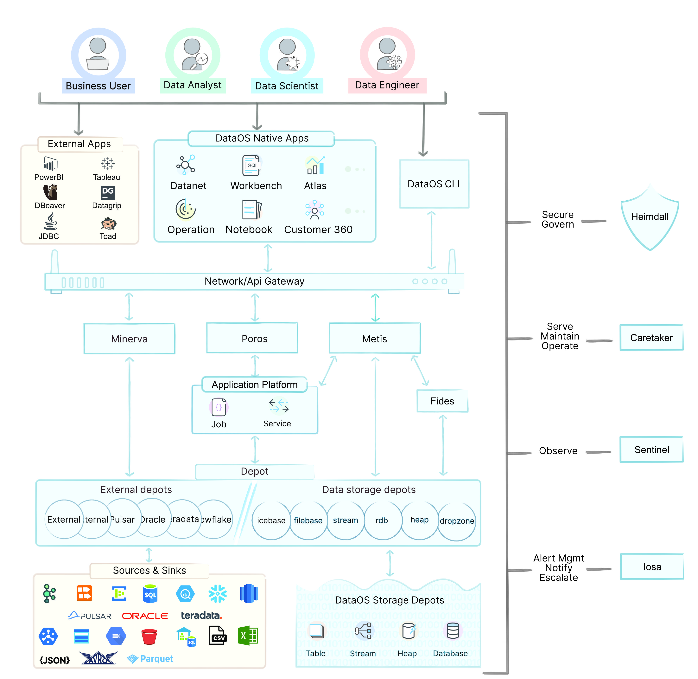

# About DataOS

DataOS, as the name suggests, is a data operating system. It provides you with a modular, composable, and interoperable data infrastructure which is built on open standards, making it extensible, future-proof, and flexible enough to be used with your existing tools and infrastructure while also allowing you to implement new data management frameworks or design patterns like data fabric and data mesh.

The information in the ensuing sections will help you comprehend the way DataOS realizes these capabilities and, as a corollary, solves several of the long-standing problems faced with legacy systems and the point solutions of the modern data stack.

Let’s directly dig into the elephant in the room, or in the present case, the elephant on the page - a data operating system, which so far has been a distant dream for the data community.

## How is it an Operating System?

An operating system, in essence, performs two overarching functions - first, like a *Godfather or the Government*, it allocates and manages resources such as CPU, Memory, Storage & Network Connectivity, but as expected, it is often difficult and tedious to understand and communicate with the government, or as compared in the present simile, even with a Godfather. This is where the second function of an OS becomes essential, which is to act as a *Translator* that can convert machine language into a human-understandable language or programming jargon - an OS must do this by providing a human-computer interface in a consistent manner.

DataOS effectively and efficiently accomplishes both these tasks - it provides you with specific primitives and components to allocate and manage resources, as well as with user interfaces in the form of a Graphical User Interface and, more importantly, a Command Line Interface using which you can manage your applications, processes and services consistently and seamlessly.

Since the essential conditions are met, let us talk about the other key features you would expect, or at least desire, of a modern-day distributed cloud computing system. Go to the page 
[Layered Architecture](./Layered%20Architecture/Layered%20Architecture.md) to read about it.

## Why do we need a data operating system?

In one sentence, it is the way forward to deal with the mess created by the legacy system and point solutions of the modern data stack while ensuring that any future changes in the data landscape do not force you to overhaul your entire data infrastructure. Understanding the need for an OS and the overarching values such a system must profess is quintessential. Read through the page 
[DataOS Philosophy & Values [WIP]](./DataOS%20Philosophy%20%26%20Values%20%5BWIP%5D.md)  to understand the guiding principles of DataOS.

Let us get into the technical details of DataOS. The next section will introduce you to some critical concepts within the operating system, and help you get started on the usage of the system.

## Fundamentals of DataOS

### Primitives

The composability of DataOS is a result of its loosely coupled modular architecture. From a user’s perspective, this is akin to legos where you can fit in different pieces to create a whole system - the pieces could be of different sizes with unique purposes for each.

The primitives, stacks, and core apps of DataOS allow you to do just this. You can choose which components to piece together to solve a particular use case. 

We have explained all the components of the DataOS in different sections of the document. On the page below, the focus is on the Primitives: 
[Primitives / Resources](../Primitives/Primitives.md).

### Stacks

Every data process, policy, or service is executed in DataOS as a Resource. The stacks (to ingest and process data) simply act as secondary extension points which are called and used in other Primitives. It is important to understand the distinction between DataOS Stacks and other Resources - Stacks are only the programming paradigms. As a user, you should think and plan in terms of Resources/Primitives because that is how the system also works; you can add new stacks, or never use some of the existing ones, depending on your requirements.

Check out the following page to familiarize yourself with the concept of Stack in DataOS:
[Stacks](../Stacks/Stacks.md).

The convenience of using an operating system can truly be appreciated when you do not have to worry about the backend or when you do not need to peek under the hood to manage the artifacts and components. Nevertheless, for the curious of mind, it might be worthwhile to gain an introduction to how all the different DataOS Primitives are orchestrated.

### Poros

Poros is basically a custom controller for Kubernetes implemented using the operator pattern. It is responsible for managing the lifecycle of all the DataOS Resources. To orchestrate the Resources, it interfaces with all the other services in DataOS and continuously reconciles the system state with the desired state, as declared in the configuration YAML of the Resource.

Poros interfaces with Kubernetes and the system components through *Poros API* and *Poros Operator*. Apart from these two key parts of Poros, it has separate controllers for each of the resource-type, and every resource is further orchestrated by a manager.

In simple terms, creation, updation, and deletion of any primitive occur through Poros, and all the information as well as runtime status, are logged and stored in Poros DB, which can be accessed by the users.

### High-level Architecture

Apart from the aforementioned Primitives and Stacks, you will come across other tools and features within DataOS. While we have illustrated a high-level design of these components in the image below, their detailed description and usage can be learned by going through the document.
 

<figcaption align = "center">High level Architecture Diagram of DataOS</figcaption>
 

There are several services, operators and programs running behind the scene. As a DataOS user, you will not need to directly interface with such components and for now we will jump through the descriptions of those components.

To start working with DataOS, you should go back to this link: [Getting Started - DataOS Documentation](../Getting%20Started%20-%20DataOS%20Documentation/Getting%20Started%20-%20DataOS%20Documentation.md).