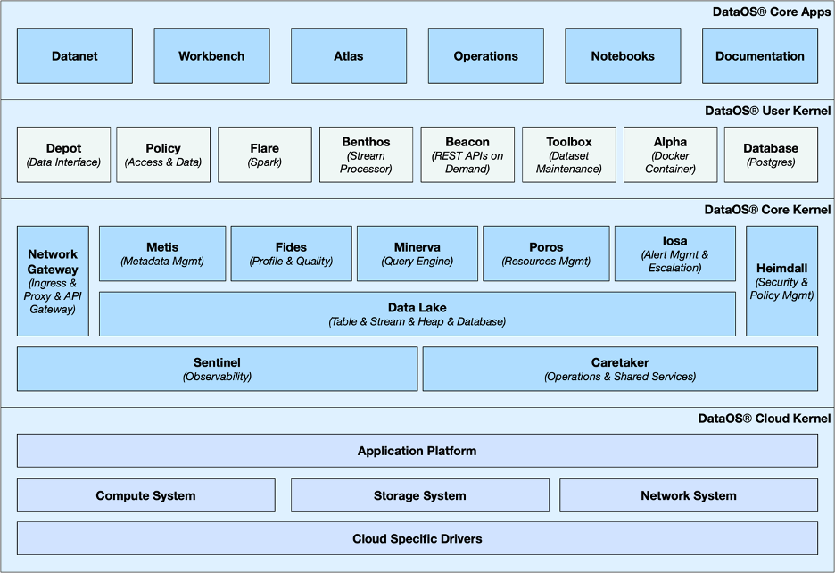

# Layered Architecture

- Multi-layered Architecture: the Kernel of DataOS can be perceived as a logically separated three-tiered design consisting of - Cloud Kernel, Core Kernel & User Kernel. You can get the details of this in the Kernel section elucidated later in the page.
- Loosely coupled & tightly integrated system: DataOS’s architecture has been designed to have low co-dependency between the components & modules so that the changes and updates in one component do not affect the other. Each component has its own ‘database’ to store data which the users can retrieve even in the event of a failure.
At the same time, the tight integration in terms of shared APIs, protocols and data formats ensures that the components can work closely together, making them interoperable while providing a seamless experience to the user.
- Separation of storage & computing: the separation of these two aspects into different layers is of particular significance in a data operating system. It allows you to manage and scale the resources for either independently of the other so that you can optimize storage for high capacity and low cost, while simultaneously optimizing computing resources for high performance and low latency.
- Cloud-agnostic platform: The abstraction layers built as part of our core programs use cloud-agnostic APIs and tools like orchestration, database and storage tools which allow you to run the OS on multiple types of hardwares like physical servers, virtual machines and containers, and is functionally unaffected by your choice of the cloud provider.
- A flexible yet predictable & simple-to-use system: The set of rules and protocols which govern the primitives of DataOS are well defined & structured. You can interact with the entire system through a YAML-based declarative programming paradigm. The command terminal uses a standard command syntax which does not require fastidious training.

As you go through the documentation you will come across several other important capabilities of DataOS which make it an epitome of a data operating system; such as scalability, distributed data management, automated resource management, communication/network management, fault tolerance and composable architecture which does not force you to replace your existing infrastructure, rather augments it.

Let us talk about some crucial components and programs of this operating system.

## Kernel

A multilayered kernel allows us to make updates and changes to the system’s core parts without affecting the user’s day-to-day operations. Like the kernel of any operating system, it facilitates inter-communications between users and components of the operating system on one hand, and the binary world of the machines on the other. Each layer is an abstraction which translates low level-APIs (low level in terms of the communication and function) into high level-APIs for usage by the different layers, components or users of DataOS. DataOS Kernel can logically be separated into three layers. 
 

<figcaption align = "center">Logical Structure of DataOS Kernel</figcaption>
 

### Cloud Kernel

It is the abstraction layer over a variety of cloud APIs which presents a consistent set of higher-level APIs to us. Cloud Kernel makes it possible for DataOS to work with multiple cloud platforms without requiring specific integrations for each one.

DataOS uses Kubernetes and several custom-built Operators to abstract the VMs and network systems provisioned by the cloud provider. This allows you to not worry about the underlying protocols of the cloud provider and only communicate with the APIs provided by the cloud kernel.

### Core Kernel

This layer provides another degree of abstraction by further translating the APIs of cloud kernel into higher order functions. From a user’s perspective, core kernel is where the activities like resource allocation, orchestration of primitives, scheduling and database management occur. The cluster and compute that you need to carry out processes are declared here; core kernel then communicates with the cloud kernel on your behalf to provision the requisite VMs or node-pools and pods. 

### User Kernel

The user kernel is another layer of abstraction over the APIs of the core and cloud kernel. The secondary extension points and programming paradigms of DataOS, like the various Stacks and certain Primitives can be envisioned to be working at this level.

While you can directly communicate with the cloud kernel APIs, as a DataOS user, you can choose to rather work with core and user kernel alone. The distinction between core and user kernel is fluid; you can, if you must, envisage the difference in terms of DataOS’s core offerings - core kernel is where we work with essential features like Security (Heimdall), Metadata management (Metis) and Resource orchestration (Poros); in contrast, user kernel can be thought of as the layer where the users have complete flexibility in terms of which components or primitives they want to leverage and which they do not require.

## Interface

DataOS provides you with both a Graphical User Interface and a Command Line Interface.

The GUI allows you to access all of our core apps which have been designed to cater to different processes within the data-management lifecycle. Check out the [GUI](../../GUI/GUI.md) for more information.

The CLI allows you to perform CRUD operations on all the primitives and modules of DataOS; giving you complete control of the entire platform. Check out the [CLI](../../CLI/CLI.md) for more information.

As mentioned earlier, the essential aspect of the DataOS interface is that it allows you to communicate with all the parts and components of the system in a simple, consistent and predictable manner.