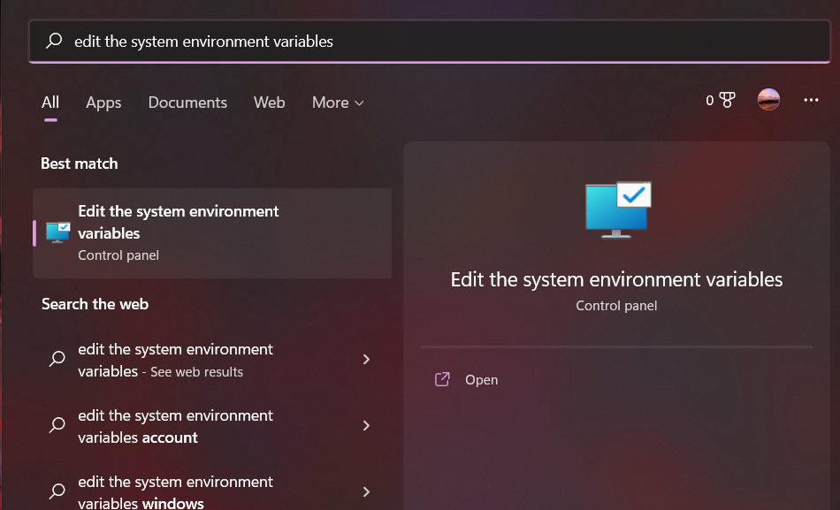

# Setting the Path and Variables in Windows

To access the DataOS CLI via Command Prompt from anywhere in the system, add the path of the extracted folder in the environment variable. The steps are listed below:

## Step 1: Search for ‘Edit the System environment variable’

From the Windows Start Bar, search for ‘Edit the system environment variable’, you will find the result located in the Control Panel. Open it.
 

## Step 2: Open the Environment Variable Window

A System Properties window will pop up where you will find the Environment Variable button on the bottom right corner. Hover over to the button highlighted in blue in the below picture and press it.
 

## Step 3: Navigate to the Path in System variables

An Environment Variables window will open which has a sub-window by the name System variables located on the bottom part. Within the System variables scroll over to the ‘Path’ section.
 

## Step 4: Open the Path variable for editing

With the ‘Path’ section selected, click on the ‘Edit’ button located on the bottom part as highlighted in the below picture, and click it.
 

## Step 5: Add a New environment variable

An Edit environment variable window will open which has various paths listed in it. Click on the ‘New’ Button in the upper right corner.
 

## Step 6: Add the Path of the Extracted .tar folder

Copy the Path of the folder where you have extracted the file. And just added it in the list and click OK.
 

## Step 7: Verify using the Command Prompt

Now open the Command Prompt and type `dataos-ctl` in the command line, you should get the following output.
 

Yey!! You have successfully added DataOS to the PATH variable and now it can be accessed from the command line from anywhere in the system.