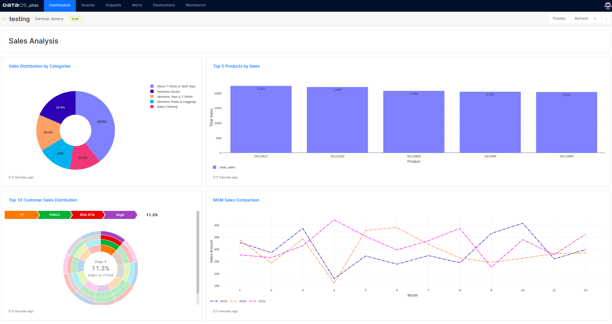
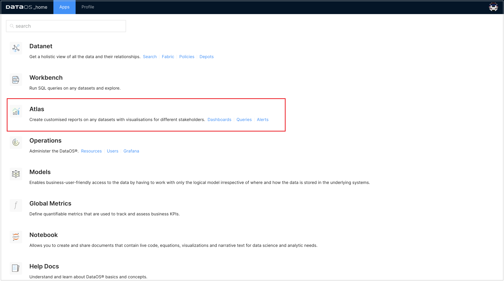
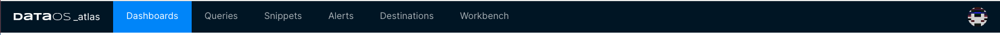

# Atlas

Atlas is an in-built BI solution that enables you to create customized reports/dashboards on any datasets with visualizations. The intuitive visualizations supported in DataOS help you understand complex data and derive insights to make important decisions. Choosing the right visualization helps you represent and interpret your data effectively. You can generate reports, visualize and track key KPIs, etc., to make informed marketing decisions that will eventually aid in campaign optimization, enhanced conversions, etc.

DataOS lets you supercharge your data with several other BI tools. To learn more about it, refer to [Integration and Ingestion](../../../Integration%20%26%20Ingestion/Integration%20%26%20Ingestion.md).

An example of a dashboard created in Atlas,

<figcaption align = "center">A Sales-Analysis dashboard in Atlas</figcaption>
 

## Highlights

- Create 20+ different visualization types, including Sankey, Sunburst, Map Choropleth, Cohort, etc.
- Create unlimited shareable dashboards
- One responsive dashboard for all screen sizes
- Share your dashboards with multiple users through the ‘Manage Permissions’ option or through the 'Dashboards Sharing Option'; you can allow public access to everyone.
- Create deterministic alerts and send notifications to 10+ destinations, including Slack, MS teams, Pager Duty, etc.

## Launching Atlas

Sign in to your DataOS instance with your username and password. On the DataOS home page, click on Atlas.

<figcaption align = "center">‘Atlas’ option on DataOS Home page</figcaption>
 

On the app’s landing screen, you will see the following tabs (Dashboards, Queries, Snippets, Alerts, Destinations, and Workbench). 

<figcaption align = "center">Various Tabs on Atlas</figcaption>
 

Let us explore each of them:

- [Dashboard](./Dashboard/Dashboard.md)

- [Queries](./Queries/Queries.md)

- [Snippets](./Snippets/Snippets.md)

- [Alerts](./Alerts/Alerts.md)

- [Destinations](./Destinations/Destinations.md)

## Creating Visualizations

To learn more about how to create and add visualization to your dashboard, refer to
[Adding Visualizations to Dashboards](./Dashboard/Adding%20Visualizations%20to%20Dashboards/Adding%20Visualizations%20to%20Dashboards.md).

To learn how to create the various visualizations, refer to these:

- [Sankey](./Sankey/Sankey.md)

- [Sunburst](./Sunburst/Sunburst.md)

- [Treemap](./Treemap/Treemap.md)

- [Cohort](./Cohort/Cohort.md)

- [Funnel](./Funnel/Funnel.md)

- [Map (Choropleth)](./Map%20(Choropleth)/Map%20(Choropleth).md)