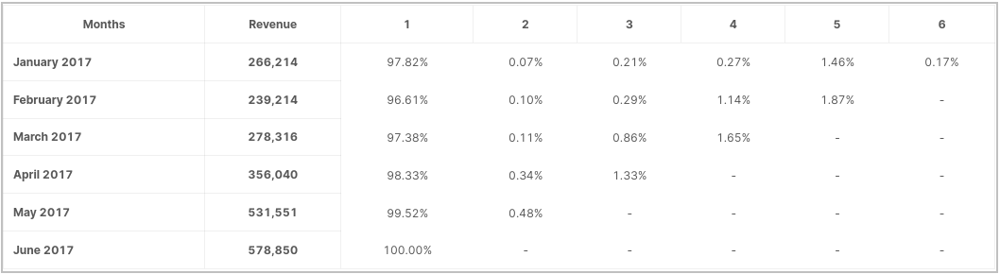
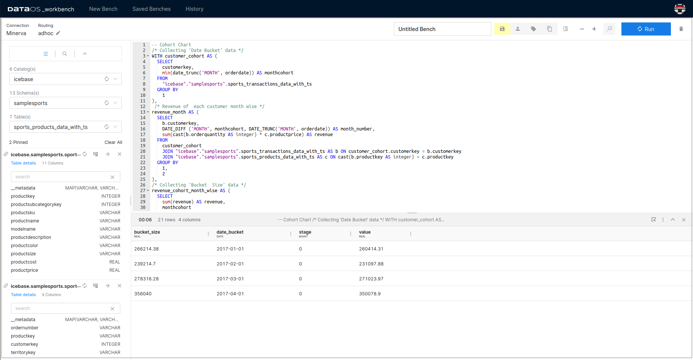
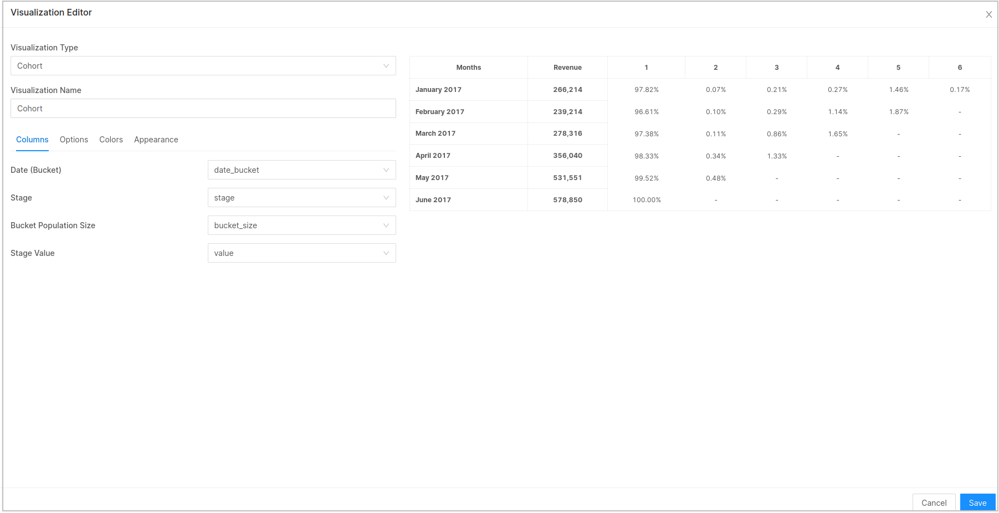
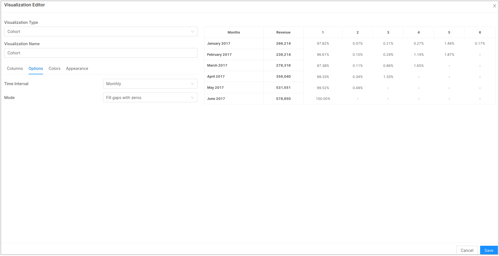
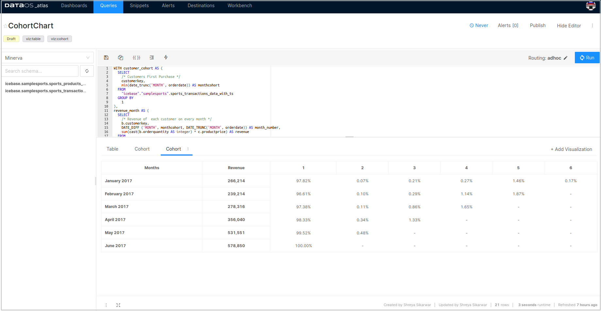

# **Cohort**

Cohort analysis is a kind of behavioral analytics that breaks the data in a data set into related groups before analysis. These groups, or cohorts, usually share common characteristics or experiences within a defined time-span.

For instance, users acquired on the same date can belong to a cohort. Likewise users living in a specific region, can also belong to a cohort. Cohort analysis, or a cohort chart helps compare behaviors and metrics of different cohorts over time. It is easy to identify highest performing and lowest performing cohorts.



# **Example query**

```yaml
-- Cohort Chart
/* Collecting 'Date Bucket' data */
WITH customer_cohort AS (
  SELECT
    customerkey, 
    min(date_trunc('MONTH', orderdate)) AS monthcohort
  FROM
    "icebase"."samplesports".sports_transactions_data_with_ts
  GROUP BY
    1
),
 /* Revenue of  each customer month wise */ 
revenue_month AS (
  SELECT
    b.customerkey,
    DATE_DIFF ('MONTH', monthcohort, DATE_TRUNC('MONTH', orderdate)) AS month_number,
    sum(cast(b.orderquantity AS integer) * c.productprice) AS revenue
  FROM
    customer_cohort
    JOIN "icebase"."samplesports".sports_transactions_data_with_ts AS b ON customer_cohort.customerkey = b.customerkey
    JOIN "icebase"."samplesports".sports_products_data_with_ts AS c ON cast(b.productkey AS integer) = c.productkey
  GROUP BY
    1,
    2
),
/* Collecting 'Bucket  Size' data */
revenue_cohort_month_wise AS (
  SELECT
    sum(revenue) AS revenue,
    monthcohort
  FROM
    customer_cohort
    JOIN revenue_month ON customer_cohort.customerkey = revenue_month.customerkey
  GROUP BY
    2
),
   /* Retention value */
retention_value AS (
  SELECT
    monthcohort,
    sum(revenue) AS revenue,
    month_number
  FROM
    revenue_month
    JOIN customer_cohort ON revenue_month.customerkey = customer_cohort.customerkey
  WHERE
    year (monthcohort) = 2017
  GROUP BY
    1,
    3
)
SELECT
  revenue_cohort_month_wise.revenue "bucket_size",              /* Bucket Population Size */
 revenue_cohort_month_wise.monthcohort "date_bucket" ,          /* Date Bucket */
 retention_value.month_number "stage" ,                         /* Stage */
  retention_value.revenue as "value"                            /* Stage Value*/
FROM
  revenue_cohort_month_wise
  JOIN retention_value ON revenue_cohort_month_wise.monthcohort = retention_value.monthcohort order by 3;
```

The query above describes the steps/ stages in which a cohort chart generating query is structured.



The query written for generating a cohort chart is divided into 4 parts:

1. Date (Bucket)

2. Stage

3. Bucket Population Size

4. Stage Value

The results of the above query have been exported to Atlas and plotted into a Cohort chart as follows.



You also need to select time interval under **Options**.



This is how the Cohort chart will look like:

