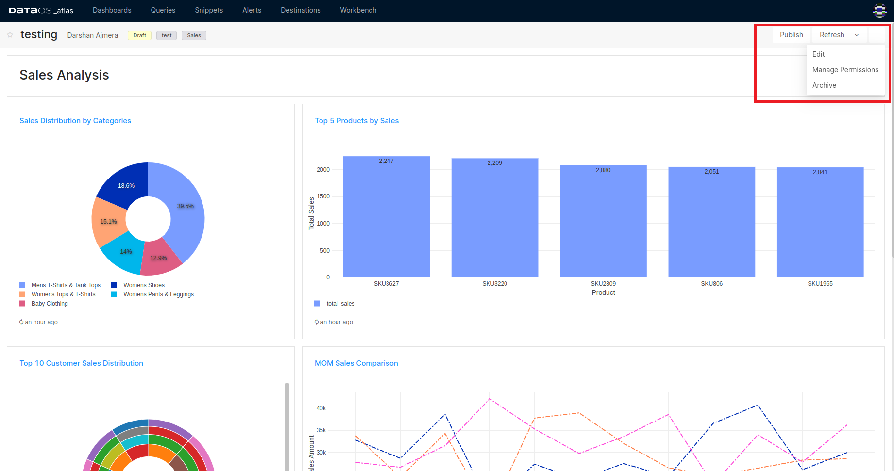

# **Dashboard**

On the landing page of the Atlas app, dashboard names are listed along with tags, creator, and time of creation. It also lists dashboards that have been shared with you.

<figcaption align = "center">All your dashboards</figcaption>
 

### **Create Dashboard**

Atlas lets you create a dashboard with a collection of different visualization charts that help you to track KPIs and get your insights at a glance. 

When you run your queries, you get the output in tabular form. You can create various visualizations like Sankey, Sunburst, Treemap, Bar, etc.,  from the query output.  Create new dashboards and start adding visualizations to them. You can add tags to your dashboards for quick discovery and also mark them as favorites.

To learn more about how to create and add visualization to your dashboard, refer to
[Adding Visualizations to Dashboards](Dashboard/Adding%20Visualizations%20to%20Dashboards.md).

### **Manage Dashboard Permissions**

Any dashboard created by a user can be shared with another user via the 'Manage Permissions' option. Any user added can edit the Dashboard, i.e., add/edit and delete visualizations, rearrange the windows, etc. However, the author of the dashboard reserves the right to share the dashboard and add other users.

<figcaption align = "center">Sharing a dashboard</figcaption>
 

### **Dashboard Refresh**

To force a refresh, click the **Refresh** button on the upper-right of the dashboard editor. This runs all the dashboard queries and updates its visualizations.

<figcaption align = "center">Refresh schedule options</figcaption>
 