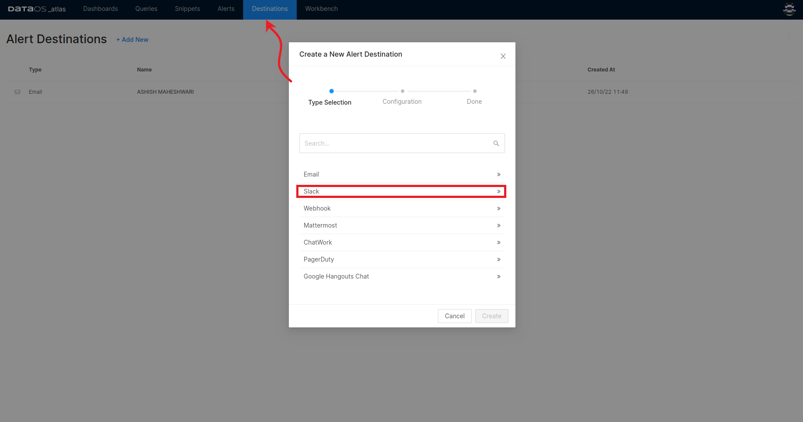
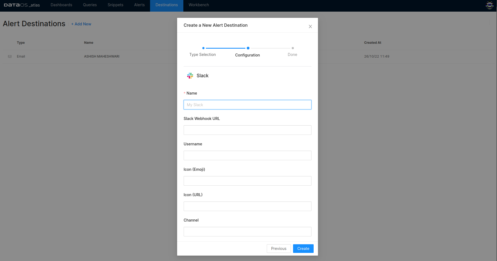

# **Destinations**

Atlas allows you to set up destinations separately, which you can use while configuring your alerts for sending notifications.

### **Configure Destination**

Clicking on +Add New will give you the following screen to add a new alert destination.

<figcaption align = "center">Destination options</figcaption>
 

Clicking on the destination from the list will open the dialog box for entering the configurations for the desired destination.

<figcaption align = "center">Configuring destination for alert messages</figcaption>
 
