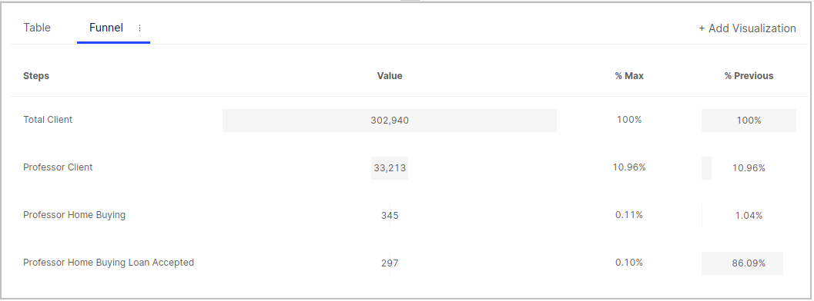
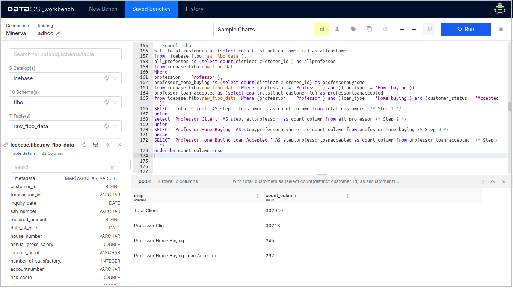
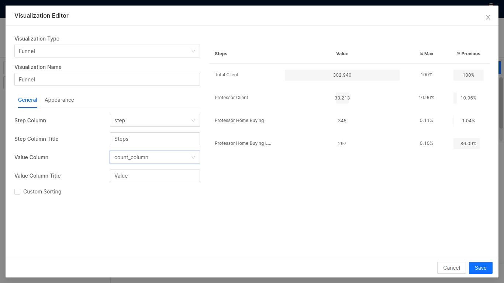

# **Funnel**

A funnel chart is a specialized chart type that demonstrates the flow of data through a business or sales process. The chart takes its name from its shape, which starts from a broad head and ends in a narrow neck.

For instance, let the data be number of users going through different stages/ processes. The number of users at each step of the process are indicated from the funnel’s width as it narrows.



A simple funnel chart above describes users going through a process of loan approval. The steps depict the dipping loan approvals, or a user drop in general at different steps.

# **Example SQL query**

```yaml
with total_customers as (select count(distinct customer_id) as allcustomer 
from  icebase.fibo.raw_fibo_data ),
all_professor as (select count(distinct customer_id ) as allprofessor 
from icebase.fibo.raw_fibo_data 
Where 
profession = 'Professor'),
professor_home_buying as (select count(distinct customer_id) as professorbuyhome 
from icebase.fibo.raw_fibo_data  Where (profession = 'Professor') and (loan_type  = 'Home buying')),
professor_loan_accepted as (select count(distinct customer_id) as professorloanaccepted
from icebase.fibo.raw_fibo_data  Where (profession = 'Professor') and (loan_type  = 'Home buying') and (customer_status = 'Accepted'))
SELECT 'Total Client' AS step,allcustomer   as count_column from total_customers  /* Step 1 */
union
select 'Professor Client' AS step, allprofessor  as count_column from all_professor /* Step 2 */
union
SELECT 'Professor Home Buying' AS step,professorbuyhome  as count_column from professor_home_buying /* Step 3 */
union
SELECT 'Professor Home Buying Loan Accepted ' AS step,professorloanaccepted as count_column from professor_loan_accepted  /* Step 4 */
order by count_column desc
```

The above query produces the following results.



The results of the above query have been exported to Atlas and plotted into a Funnel chart as follows.



This is how the Funnel chart will look like:


The above query funnels the orders for loan approvals out of all loan requests.