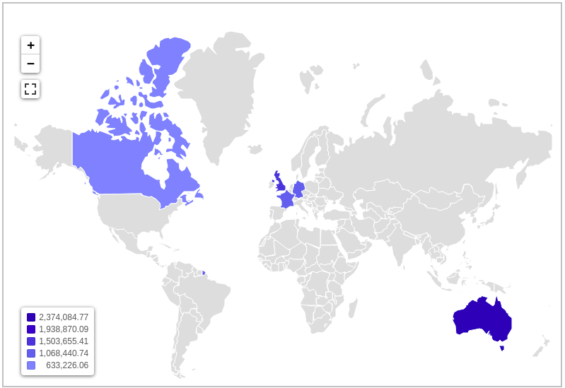
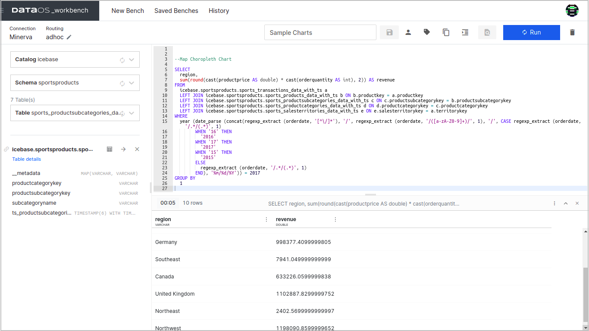
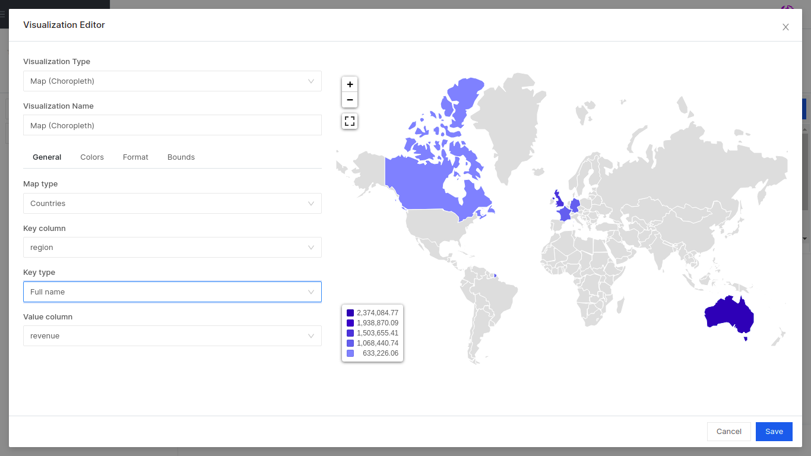
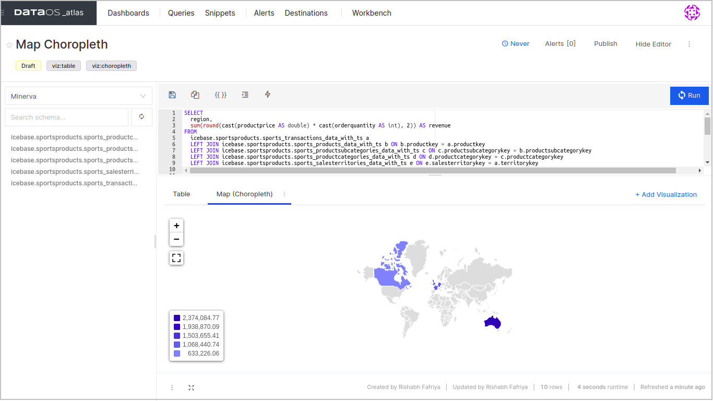

# Map (Choropleth)

Choropleth Maps display colored, shaded, or patterned geographical areas or regions that conform to a data variable. This provides a way to visualize trends over a geographical area.

Colour variance and progression (dark to light and vice versa) show the data value measure. Typically, this can be a blending from one color to another, a single hue progression, transparent to opaque, light to dark, or an entire color spectrum.


<center>



</center>

## Example Query

```yaml
SELECT
  region,
  sum(round(cast(productprice AS double) * cast(orderquantity AS int), 2)) AS revenue
FROM
  icebase.sportsproducts.sports_transactions_data_with_ts a
  LEFT JOIN icebase.sportsproducts.sports_products_data_with_ts b ON b.productkey = a.productkey
  LEFT JOIN icebase.sportsproducts.sports_productsubcategories_data_with_ts c ON c.productsubcategorykey = b.productsubcategorykey
  LEFT JOIN icebase.sportsproducts.sports_productcategories_data_with_ts d ON d.productcategorykey = c.productcategorykey
  LEFT JOIN icebase.sportsproducts.sports_salesterritories_data_with_ts e ON e.salesterritorykey = a.territorykey
WHERE
  year (date_parse (concat(regexp_extract (orderdate, '[^\/]*'), '/', regexp_extract (orderdate, '/([a-zA-Z0-9]+)/', 1), '/', CASE regexp_extract (orderdate, '/.*/(.*)', 1)
        WHEN '16' THEN
          '2016'
        WHEN '17' THEN
          '2017'
        WHEN '15' THEN
          '2015'
        ELSE
          regexp_extract (orderdate, '/.*/(.*)', 1)
        END), '%m/%d/%Y')) = 2017
GROUP BY
  1
```
<br>

<center>



</center>

The results of the above query have been exported to Atlas and plotted into a Choropleth Map as follows.

<center>



</center>

This is how the Choropleth Map will look like:

<center>



</center>