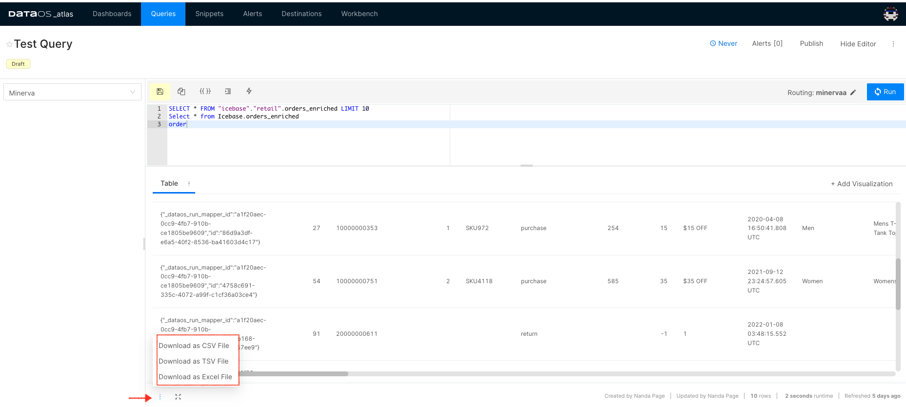
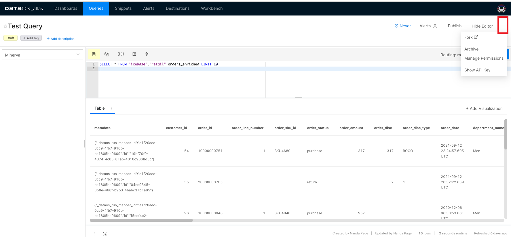
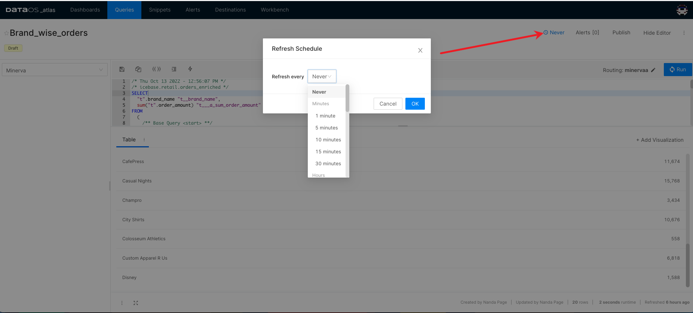

# Queries

This tab on Atlas shows all the queries you have written while exploring data and saved them for creating visualizations. You can also view the queries shared with you.

## Edit a Query

Click on the specific query to view/edit the SQL statement. 

Query editor allows you to format your query and enable/disable the live auto-complete feature. To save a query, press Ctrl+ S (or Cmd +S)/ click Save. Once you finish editing, you can click on ‘Run’ to view the query result. From here, you can also build visualizations based on the results returned from queries.

> 🗣 To run your queries, you might want to change the selected cluster. To learn more about clusters, click here.

<figcaption align = "center">Query editor options</figcaption>
 

## Query Parameters

Atlas allows you to write parameterized queries. A query parameter lets you substitute values into a query at runtime. Any string between double curly braces `{{ }}`
 is treated as a query parameter. Clicking on the double curly brackets, the Add Parameter
 dialog appears where you set the parameter and its type. The parameter is inserted at the text caret in your query. While running your query, you will get the option to provide the value for the defined parameter(s).

.png)

<figcaption align = "center">Adding query parameters</figcaption>
 

Query Parameter Types

- Text- Provide a text value
- Number- Provide a numeric value
- Dropdown List- You can restrict the parameters by creating a drop-down. You have to enter the values manually.
- Query Based Dropdown List- The options in the drop-down can be tied to the results of an existing query. You need to publish the query that will generate the options.
- Date & Time related options-You have several options to parameterize date and timestamp values, including their ranges.
    
    To learn more about the parameter types and how to add parameters to the queries, refer to
    [Tutorial - Writing Parameterized Queries](../Queries/Tutorial%20-%20Writing%20Parameterized%20Queries/Tutorial%20-%20Writing%20Parameterized%20Queries.md).
    

### Download Query Result

Click on the three dots to download a query result as a CSV, TSV, or Excel file.

<figcaption align = "center">Download option for query output</figcaption>
 

> 🗣 Note about the size limit to be inserted

### Fork a Query

Sometimes you want to duplicate a query. You can do so by using the Fork option given in the menu, which appears by clicking on the three dots in the extreme right corner. The menu also contains options- [Archive](./Queries.md), [Manage Permissions](./Queries.md), and [Show API Key](./Queries.md).

<figcaption align = "center">Three dots menu</figcaption>
 

### Archive a Query

Deleting a query may break down your existing dashboards, so Atlas gives you the option to archive your query instead of deleting it.  Existing dashboards continue to point to this query, but you can not use it further. 

### Manage Permissions for a Query

By default, the queries can only be edited by the user who created them. But you can provide edit permissions to other users using the Manage Permissions option.

### Show API Key

This option will provide a URL you can share or download the query result. 

### Refresh Schedule

You can customize the refresh schedule for the execution of the query. Scheduling query executions will help in keeping your dashboards updated and in generating routine alerts. By default, your queries do not have a schedule.

Click on the default settings ‘Never’ to customize it. 

A pop-up will appear with the scheduling options. Select the cadence and configure the corresponding settings that will appear on the screen, such as the end date for the scheduled execution or which day of the week to run the query. That’s pretty easy to do once you have this dialog box open. Once you set the schedule, your query will run automatically.

<figcaption align = "center">Refresh the schedule for query</figcaption>
 

### View Alerts

Here, you can view all the alerts set for the query. 
To learn more, refer to [Alerts](../Alerts/Alerts.md).

### Publish Query

By default, the query will be in draft mode initially. You can not use it in the dashboard or alerts until you publish it. You can toggle the status published/unpublished. Unpublishing a query will not remove it from existing dashboards or alerts. But you will not be able to add it to any other dashboard/alert.