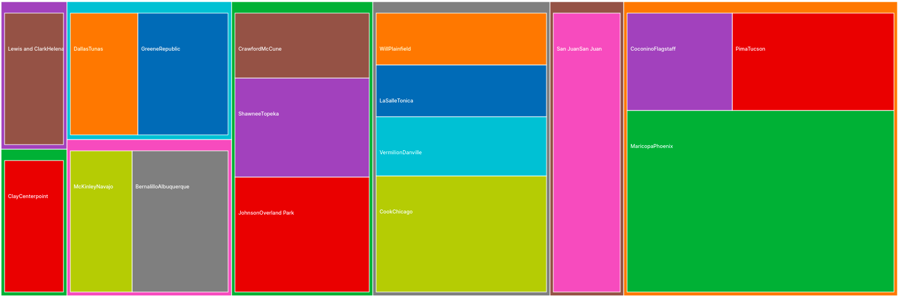
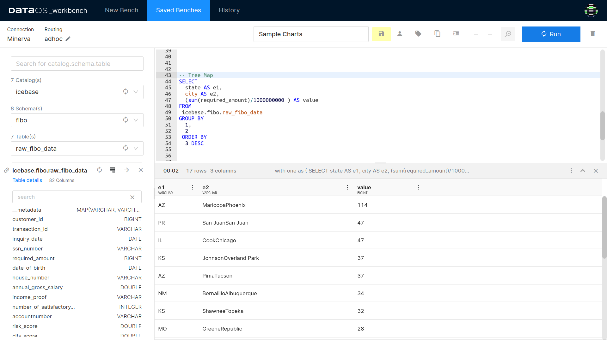
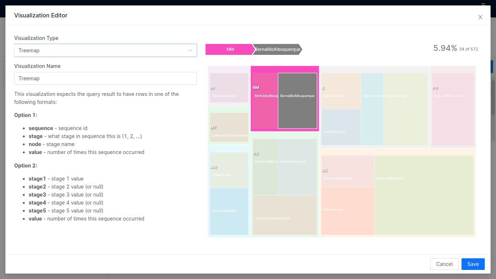
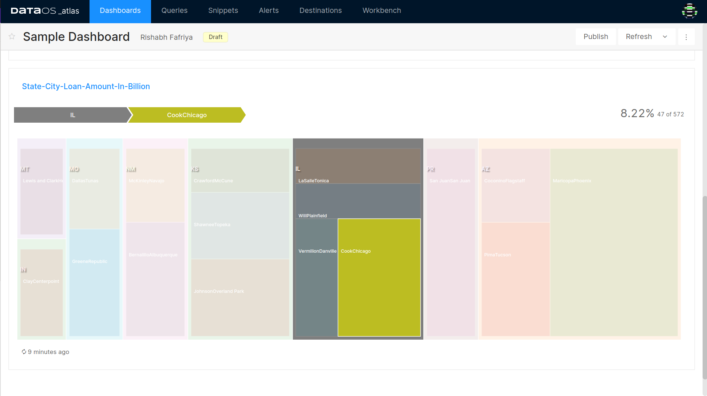

# Treemap

Treemap charts are good for comparing proportions within the hierarchy, however, treemap charts aren't great at showing hierarchical levels between the largest categories and each data point. A sunburst chart is a much better visual chart for showing that. The treemap chart is used for representing hierarchical data in a tree-like structure. Data, organized as branches and sub-branches, is represented using rectangles and the dimensions which are calculated w.r.t the quantitative variables associated with each rectangle—each rectangle represents two numerical values. This makes the at-a-glance distinguishing between categories and data values easy.
 
<center>



</center>

## Example query

```yaml
SELECT
  state AS e1,
  city AS e2,
  (sum(required_amount)/1000000000 ) AS value
FROM
 icebase.fibo.raw_fibo_data 
GROUP BY
  1,
  2
 ORDER BY
  3 DESC
```
 
<center>



</center>

To generate the chart, you have to write the query in a specific pattern.

- Stage 1 Value: `e1 (state)` in the example
- Stage 2 Value: `e2 (city)` in the example
- Value: `value (Sum of required_amount)` in the example

The results of the above query have been exported to Atlas and plotted into a Treemap chart as follows.
 
<center>



</center>

Here the aliases (e1, e2 and value) should always be named like such shown in the query. There should be at least two stages to generate a Treemap chart. It determines the number of time 'Stage 1 - Stage 2 - Stage 3 - (and so on)' pattern is repeated.

This is how the Treemap chart will look like:
 
<center>



</center>

In the above example, you can see the contribution of loan amount requirements in different cities in a state.