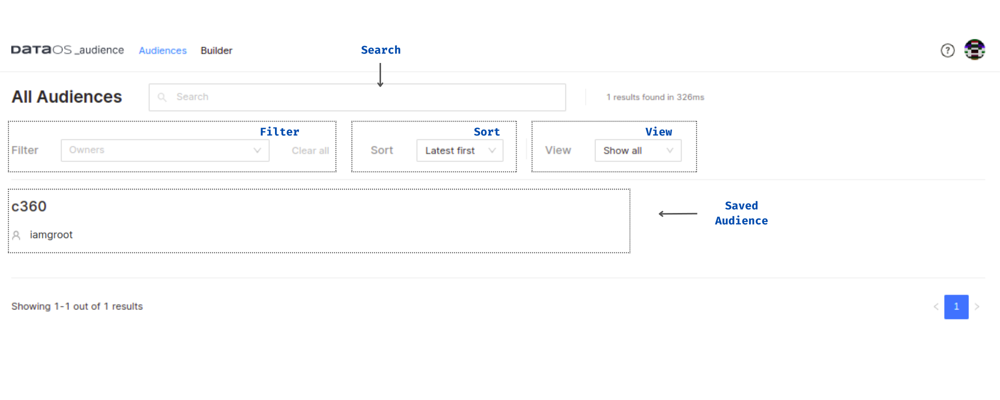

# Audience UI

## DataOS Audience on Home Page
 

.svg)

<figcaption align = "center">Audiences App on the DataOS Home Page</figcaption>
 

## Audience Builder
 

<figcaption align = "center">Audience Builder Graphical User Interface</figcaption>
 

## Saved Audiences
 

<figcaption align = "center">Saved Audiences (or specific cohorts) within the Audience App</figcaption>
 