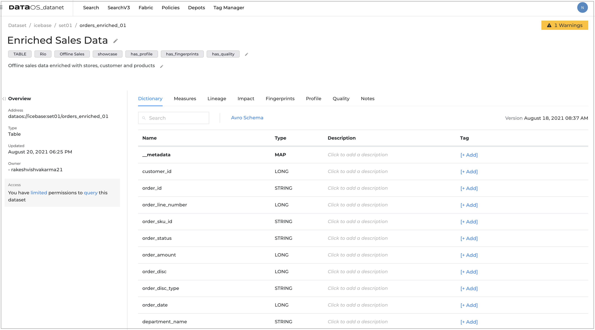

# **Datanet**

Datanet maintains an organized inventory of data assets in the organization. It uses metadata to help organizations manage their data. This metadata helps in data discovery and governance. 

Datanet application consists of majorly five components -

## **Search**

This component helps you to search across different entities like- datasets, jobs, workflows, services, functions, queries, dashboards, etc.  It gives us the ability to filter out the result as well as facets based on the search criteria. You have the option to navigate the respective detail page. 

Here is the Datanet UI. 

You can see the detailed information for the dataset.

## **Fabric**

It is a graphical representation of a search page. It also helps us to know the relationship among different nodes. You can also get primary information related to the node.

## **Policies**

DataOS policies allow organizations to authorize users, employees and third parties to access company data in a manner that meets security, privacy, and compliance requirements. You can get the information of the applied policies on Datanet.

## **Depots**

This component shows the list of depots available in the system. This shows high-level info about a depot, like- name, type, description, catalog, etc. 

## **Tag Manager**

This component displays a list of tags available in the system. You have the functionality to create a new tag, and you can update an existing tag also in the system.

- **Depots**
- **Tag Manager**

To learn more, click here.

[Getting Data Profile Information](Datanet/Getting%20Data%20Profile%20Information.md)

[Getting Assertions](Datanet/Getting%20Assertions.md)

[Getting Fingerprinting](Datanet/Getting%20Fingerprinting.md)

[Getting policy details](Datanet/Getting%20policy%20details.md)