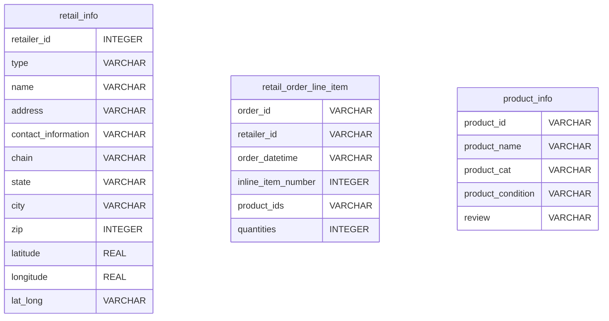
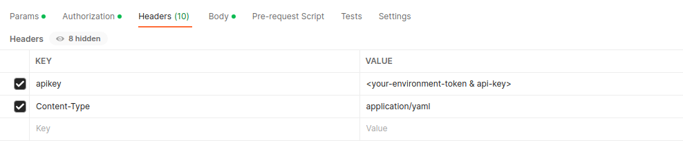

# Getting Started with Lens

Let's explore how we can model our organizational data to answer critical business questions.

> Understanding what metrics and questions need to be answered before modeling Lens is crucial. An outcome-oriented framing helps us choose a suitable contract based on our needs.


## Understanding Lens with a Use Case

Let’s take a scenario, where you are a product lead of a retail supply chain and want to drive revenue by increasing cart value and to achieve the goal, you need answers to the following questions-

```
1. Which products do users prefer in a particular city or state?
2. In which state is this product sold the most?
3. Who are the top users of these products? 
2. Which type of retailers sold which category of products?
6. What are the most recent orders?
```

And more questions that can help drive marketing and operational decisions… 

---

The data for the above use case resides in the `icebase` depot in the form of three separate tables stored in three separate locations having the following attributes  



## Let’s Start Modelling

To begin modeling the Lens, we need to define two crucial concepts.

- The following table summarizes all the entities, relationships, fields, dimensions, and measures for our use case

## Creating a Data Contract

The Thumb rule for data modeling is first to define what your model would look like, what entities you need, and how different entities would relate to each other. We need a generalized contract that we can interface to create our use case-specific Lens. The contract is organized as a collection of entities and relationships between these entities. 

> Don’t know what these entities and relationships are!!! Let’s learn a bit about them
> 

## Data Elements: The Building Blocks of Lens

Lens and contract are composed of elements such as entities, relationships, fields, dimensions, and measures. The objective of these elements is to define the structure and logic of data models. 

- Entities are logical representations of an organization’s widely referred to and analyzed business concepts. They are the subject, or actors in the data. In our use cases, Retailer, Order, and Product are three entities.
- Relationships between two entities can be - one-to-one, one-to-many, or many-to-one. A defined relationship simplifies querying dimensions and measures from multiple entities. Entities would be joined based on the defined keys and relationships. In our use case, there are two relationships
    - Retailer and Order Entity are joined on `retailer_id` in a one-to-many relationship
    - Order and Product Entity are joined on `product_id` in a many-to-one relationship
- Fields are columns that uniquely identify an entity while Dimensions are categorical or qualitative data describing measures at different granularity levels. In our use case, `retailer_id` and `product_id` are fields, while `order_line_no` is a dimension
- Measures are aggregated numerical values derived from quantitative columns. To solve our use case, we need to define measures like `total_retailers`, `total_order_quantity`, etc.

> To learn more about Data Elements, refer to 
[Elements of Lens](../Elements%20of%20Lens/Elements%20of%20Lens.md)
> 

The following table summarizes all the entities, relationships, fields, dimensions and measures for our use case

| Entity | Related To | Relationship | Fields and Dimensions | Measure |
| --- | --- | --- | --- | --- |
| Retailer | Order | 1:N | retailer_id, type, name, chain, state, city | total_retailers |
| Order | Product | N:1 | order_id, retailer_id, order_date, inline_item_number, product_id, quantities, order_line_no | total_orders, total_order_quantity, recency |
| Product |  |  | product_id, product_name, product_category, disease_name |  total_products |

## Defining Contract

```yaml
contract:
  name: supply_chain
  description: Contract for the supply chain model to explore specific business use cases
  tags:
    - supply_chain
  entities:
    - name: retailer
      description: This entity captures details of the retailer.
      schema:  
        fields:
          - name: retailer_id
            description: Unique identifier of a retailer
            type: string
            primary: true
          - name: type
            type: string
          - name: name
            type: string
          - name: chain
            type: string
          - name: state
            type: string
          - name: city
            type: string
        measures:
          - name: total_retailers
            type: count
        relationships:
          - type: 1:N
            field: retailer_id
            target:
              name: order
              field: retailer_id

    - name: order
      description: This entity captures all the orders placed for a product.
      schema:
        fields:
          - name: order_id
            type: string
            primary: true
          - name: retailer_id
            type: string
          - name: order_date
            type: date
          - name: inline_item_number
            type: number
          - name: product_id
            type: string
          - name: quantities
            type: number
        dimensions:
          - name: order_line_no
            type: string
        measures:
          - name: total_orders
            type: count_distinct
          - name: total_order_quantity
            type: sum 
          - name: recency
            type: min
        relationships:
          - type: N:1
            field: product_id
            target:
              name: product
              field: product_id

    - name: product
      description: All details related to a product
      schema:
        fields:
          - name: product_id
            type: string
            primary: true
          - name: product_name
            type: string
          - name: product_category
            type: string
          - name: disease_name
            type: string
        measures:
          - name: total_products
            type: count
```

## Defining Lens

Once your data contract is in place, data engineers can start referring data contracts to construct Lens. Lens maps the attributes to the physical data. 

Let's create the ‘Retail Supply Chain’ Lens to power our use case. We will reference the previously created ‘supply_chain’ contract. 


> 🗣️ Ensure your entities are related to at least one entity within a Lens.


```yaml
name: retail_supply_chain
description: Data Model to get started with lens
contract: supply_chain
owner: TMDC
tags:
  - supply_chain
entities:
# Let's create our first entity 'retailer'
  - name: retailer
    sql:
      query: 
      >
        SELECT
          cast(retailer_id as varchar) as retailer_id, 
          type,
          name,
          case when chain is null then 'Independent' else chain end as chain,
          state,
          city
        FROM
          icebase.supply_chain.retailer_info
      columns:
        - name: retailer_id
        - name: type
        - name: name
        - name: chain
        - name: state
        - name: city
      verified: true
      tables:
        - icebase.supply_chain.retailer_info
    fields:
      - name: retailer_id
        type: string
        description: unique identifier of the retailer
        column: retailer_id
        primary: true

      - name: type
        type: string
        description: retail format
        column: type

      - name: name
        type: string
        description: name of the retailer
        column: name

      - name: chain
        type: string
        description: corporate chain of the retailer
        column: chain

      - name: state
        type: string
        description: name of state where the retailer is located
        column: state

      - name: city
        type: string
        description: name of city where the retailer is located
        column: city
    measures:
      - name: total_retailers
        sql_snippet: ${retailer.retailer_id}
        type: count
        description: total retailers
    relationships:
      - type: 1:N
        field: retailer_id
        target:
          name: order
          field: retailer_id
# Let's jump on to creating the second entity 'product'
  - name: product
    sql:
      query: >
        SELECT
          product_id,
          product_name,
          product_cat as product_category,
          product_condition as disease_name
        FROM
          icebase.supply_chain.product_info
      columns:
        - name: product_id
        - name: product_name
        - name: product_category
        - name: disease_name
      verified: true
      tables:
        - icebase.supply_chain.product_info
    fields:
      - name: product_id
        type: string
        description: unique identifier of the product
        column: product_id
        primary: true

      - name: product_name
        type: string
        column: product_name
        description: name of the product

      - name: product_category
        type: string
        column: product_category
        description: name of the product category

      - name: disease_name
        type: string
        column: disease_name
        description: disease or health symptom for which the product is being used
    measures:
      - name: total_products
        sql_snippet: ${product.product_id}
        type: count
        description: count of total products
# You there...... Let's move onto the final entity 'order'
  - name: order
    sql:
      query: >
        SELECT
          order_id,
          cast(retailer_id as varchar) as retailer_id,
          from_unixtime (round(cast(order_datetime AS double) / 1000, 0)) AS order_date,
          inline_item_number,
          product_ids as product_id,
          quantities
        FROM
          icebase.supply_chain.retail_order_line_item
        where order_datetime is not null
        
      columns:
        - name: order_id
        - name: retailer_id
        - name: order_date
        - name: inline_item_number
        - name: product_id
        - name: quantities
      verified: true
      tables:
        - icebase.supply_chain.retail_order_line_item
    fields:
      - name: order_id
        type: string
        column: order_id
        primary: true
        description: unique identifier of the order

      - name: retailer_id
        type: string
        column: retailer_id
        description: unique identifier of the retailer

      - name: order_date
        type: date
        column: order_date
        description: date of the order placement

      - name: inline_item_number
        type: number
        column: inline_item_number
        description: order line sequence number

      - name: product_id
        type: string
        column: product_id
        description: unique identifier of the product

      - name: quantities
        type: number
        column: quantities
        description: total quantities of the product ordered
    dimensions:
      - name: order_line_no
        type: string
        sql_snippet: concat(${order.order_id},'-',${order.inline_item_number})
        description: unique identifier of the order line number
    measures:
      - name: total_orders
        sql_snippet:  ${order.order_id}
        type: count_distinct
        description: total distinct orders
      
      - name: total_order_quantity
        sql_snippet:  ${order.quantities}
        type: sum
        description: total order quantity
      
      - name: recency
        sql_snippet: day(current_date - ${order.order_date})
        type: min
        description: days since last order was placed

    relationships:
      - type: N:1
        field: product_id
        target:
          name: product
          field: product_id
        verified: true
```

To know more about Lens syntax, refer to
[Lens Syntax](../Lens%20Syntax.md).

## Deploying Lens on environment

### Prepping Up

You can start exploring Lenses by deploying them to the environment. To get started, follow the steps -

#### Step 1: Get the Environment Token or API Key

- Get the environment token or API Key from the profile section of the current environment. If you already have one proceed to Step 2. To get API Key from DataOS, click the below link
- To get or create API Key from DataOS, follow the steps -
    - Login to the DataOS CLI using the `login` command
    
    ```yaml
    	dataos-ctl login
    ```
    
    - Run the create `apikey create` command
    
    ```bash
    	dataos-ctl user apikey create
    ```
    
    - To get an existing apikey run the `apikey get` command
    
     
    
    ```bash
    dataos-ctl user apikey get
    ```
    
    Output
    
    ```bash
    INFO[0000] 🔑 user apikey...                             
    INFO[0002] 🔑 user apikey...complete                     
    
           TOKEN    |  TYPE  |      EXPIRATION      |                 NAME                   
    ----------------|--------|----------------------|----------------------------------------
    <api-key-token> | apikey | 2022-09-21T12:00:00Z | token_monthly_ghastly_related_grizzly
    ```
    
    - Copy the `<api-key-token>` from the output into the Postman

#### Step 2: Install Postman

- Install Postman from the following [Link](https://www.postman.com/downloads/).
- If you already have Postman. Navigate to Step 3. Once you are done with the installation you can start building and exploring Lenses on Postman.

#### Step 3: Building and exploring Lenses

Upsert Lens

(Create a lens or update an existing Lens)

- In the header section add the following headers
 
<center>



</center>

- Write Lens in the ‘Body’ Section. Choose ‘raw’ as the text format
- Once done with writing Lens, you can deploy it. To upsert Lens -
    - Select PUT
    - Add the following URL - `https://enough-kingfish.dataos.app/lens/api/v1/lenses?dryrun=false`
 
<center>


</center>

## Querying Lens

Once you have the data model, you can start querying and exploring Lens. You can either use Lens Explorer to explore modeled ontologies through a low code interface or use Lens Query(an abstracted SQL) using WorkBench

Let’s explore a few analytical questions through Lens Query

## Question

*Explore the states where the total order quantity was more than 100 thousand in the disease product category*

Using Lens Explorer

- Select the Lens and navigate to the Explorer Section
- Within the Lens Explorer choose the State from Retailer and total order quantity measure from Order Entities.
- To add a filter, open the Filter Pane and Add a new rule to the Dimensions and select `product.product_category` and select the ‘==’ symbol, and type disease in the adjacent box (REMEMBER: though its a string don’t use single or double quotes while typing disease)
- To narrow down to states with more than 10000  orders, add a rule to the Measures section and choose the measure `order.total_order_quantity` then select the ‘>’ symbol and type 100000 in the adjacent box (don’t use quotes)
- Now select Run Query
 
<center>


</center>

This table in the above diagram shows the states with more than a hundred thousand total order quantities, along with a bar chart at the bottom, you can configure or export the chart as per your need

Using Lens Query in Workbench

- Open the Workbench from the Main Menu and execute the below Lens Query

```sql
SELECT * FROM LENS (SELECT "order.total_order_quantity","retailer.state" FROM retail WHERE "product.product_category" = 'disease') WHERE "order.total_order_quantity" > 100000
```

- You will get the table showing states with a total order quantity of more than 100 thousand in the disease product category.

You can answer many more use cases using the pre-modeled Lens. If the above Lens doesn't suffice the current need, you can model a new lens or add new entities when necessary.

## So finally……
 
<center>


</center>

 After long coding hours, we have at last created a LENS. You must be so proud! Hats off to you 👏👏👏👏

But was it worth it, let’s explore….

The Lens Query that you wrote in the Workbench was just one line  

```sql
SELECT * FROM LENS (SELECT "order.total_order_quantity","retailer.state" FROM retail WHERE "product.product_category" = 'disease') WHERE "order.total_order_quantity" > 100000
```

*What if*, you went the traditional way… how would that pan out….

```sql
SELECT * FROM ( /* (retail) */ 
SELECT order__total_order_quantity as "order.total_order_quantity", 
retailer__state as "retailer.state" 
FROM 
(SELECT
 "retailer".state "retailer__state", 
sum("order".quantities) "order__total_order_quantity"
 FROM
      (/* (retail.retailer) */ 
SELECT   cast(retailer_id as varchar) as retailer_id,    
type,   
name,   
case when chain is null 
then 'Independent' else chain end as chain,   
state,   
city 
FROM   icebase.supply_chain.retailer_info  /* ____ */) AS "retailer"
LEFT JOIN (/* (retail.order) */ 
SELECT   order_id,   
cast(retailer_id as varchar) as retailer_id,   
from_unixtime (round(cast(order_datetime AS double) / 1000, 0)) 
AS order_date,   
inline_item_number,   
product_ids as product_id,   
quantities 
FROM   
icebase.supply_chain.retail_order_line_item 
where order_datetime is not null  /* ____ */) 
AS "order" 
ON "retailer".retailer_id = "order".retailer_id 
LEFT JOIN (/* (retail.product) */ 
SELECT   product_id,   
product_name,   
product_cat as product_category,   
product_condition as disease_name 
FROM   icebase.supply_chain.product_info  /* ____ */) AS "product" 
ON "order".product_id = "product".product_id   
WHERE ("product".product_category = 'disease') 
GROUP BY 1 ORDER BY 2 DESC) /* ____ */ ) 
    WHERE "order.total_order_quantity" > 100000 limit 50000
```

## 😰 😰😰

I suppose you got the point…. 

Modeling via Lens might seem a lengthy process at first but once that lens is properly mapped and deployed it could save you hundreds of hours of SQL Coding.  It prevents the need to understand the relational structure of the physical table and makes analytics accessible to everyone, not just data engineers or analysts with niche SQL skills.