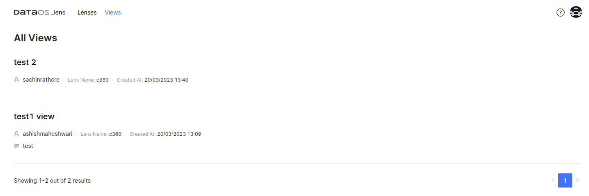

# Lens Ecosystem

Besides the absence of congruity between data producers and data consumers, the lack of well-defined APIs allows data definitions to be siloed within the tool, preventing data sharing between teams using different BI tools to model metrics. The Lens Ecosystem enables the assignment of semantic meaning to low-slung raw data and exposure of these ontologies to all downstream consumers(tools, applications, users). The Lens Ecosystem comprises -

- [Lens Service](./Lens%20Ecosystem.md)
- [Lens Utilities](./Lens%20Ecosystem.md)
- [Lens Applications](./Lens%20Ecosystem.md)

Together these applications and services deliver a robust platform supporting operational and analytical use cases. 

## Lens Service

Lens Service is a transpiler. It converts Lens Query to SQL Query. Currently, one can access the Lens service via Gateway. Queries from various interfaces like Lens Explorer, Workbench, Atlas, Tableau, Power BI, etc., land on Gateway. Gateway analyses each incoming query and decides whether to invoke Lens Service or not. If the service has to be used, Gateway will send the query text to Lens Service, and the transpiler within the Lens Service will return the expanded SQL query to the Gateway. After receiving the expanded SQL query, Gateway sends it to Minerva for execution. Minerva, with the help of Heimdall, implements policies and returns the governed result to the Gateway.
 

<figcaption align = "center">Lifecycle of a Lens Query</figcaption>
 

## Lens Utilities

### Lens Explorer

Lens Explorer is an intuitive graphical user interface (GUI) that empowers organizations to achieve semantic access to their data, making it possible for everyone to derive insights from it. With Lens Explorer, users can effortlessly explore business ontologies, create visually appealing charts, and generate deep insights using a user-friendly interface.

Thanks to Lens Explorer's drag-and-drop interface, users can easily build customized segments, generate insights, and create a comprehensive customer 360 view. Additionally, they can independently query modeled ontologies to get answers to complex data questions. In addition to helping the below personas move faster in their data journey, Lens Explorer can also assist other types of personas including Business Analysts, Product Managers, Product Analysts, and many more. To learn more about Lens Explorer, refer to
[Lens Explorer](./Lens%20Explorer/Lens%20Explorer.md).

### Lens Views

The Lens Views utility encompasses readily-shareable views formulated atop Lenses. This tool enables users to store their crafted views while exploring Lenses, and seamlessly retrieve them at their convenience. These views include a diverse array of use cases ranging from Audiences and Metrics to Lens Explorer scenarios. Every view listed an owner’s name, Lens name, and associated time of creation.
 

<figcaption align = "center">Graphical User Interface of the Lens Views</figcaption>
 

## Lens Derivative Applications

### Metrics

Consolidated metrics let you observe and measure them whenever needed without spending time writing roll-ups and building incremental time series queries. Users whose primary focus is observing metrics and KPIs can access and monitor defined metrics using Metrics Explorer. To know more about Metrics, refer to
[Metrics ](../Lens%20Ecosystem//Metrics.md).

### Audiences

The Audience app is a decision product for businesses looking to thrive in today's rapidly evolving and competitive marketplace. This application provides business users with the ability to create and view customer segments, journeys, activities, and behaviors using a simplified drag-and-drop interface. For a comprehensive understanding of the audience, refer to
[Audiences](../../Audiences/Audience%20UI//Audience%20UI.md).