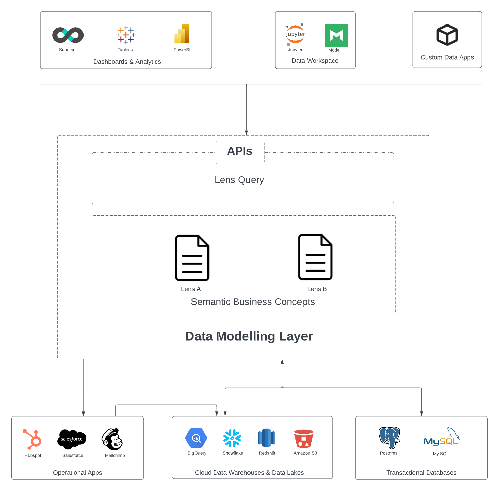
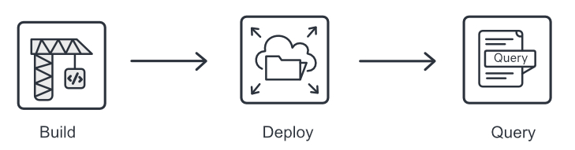

# Lens

Lens is a consistent modeling layer capable of accessing and modeling data from disparate sources. It not only supports the ability to connect underlying data to real-world business objects but also enables you to formulate and delineate measures, KPIs, and relationships between different business concepts, thereby facilitating data-driven decision-making. 

> A data modeling layer is an interface that lays over the underlying data and consistently exposes commonly understood business terms (such as product, customer, or revenue) to the end consumers. It allows business users to consume the data how they understand it, get what they need, and realize self-service without constantly relying on data engineers for data requests.
 

<figcaption align = "center">Placement of Lens Ecosystem between Sources and Data Consumers</figcaption>
 

Lens fosters data definition sharing and brings consensus among teams around data definitions, creating a unified and consolidated view of data across the organization. To know more about Lens, navigate to
[Lens: Right-to-Left Data Engineering Approach](./Lens%20Right-to-Left%20Data%20Engineering%20Approach.md).

## Supported Data Sources in Lens

You can build Lens on all sources that Depots support. Lens lets you connect to and access data from managed and unmanaged object storage like CSV, parquet, Amazon S3, Azure Blob Storage, streaming sources like Pulsar, and relational and non-relational databases like PostgreSQL, MySQL, BigQuery, etc. 

## Lens Structure

Lens obviates the need to understand the relational structure of the physical table to access semantically dynamic objects (entities). All these constructs effectively bring related business concepts (entities) together. These enable users to frame their business models and data questions. Lens translates all incoming data questions into SQL and issues these SQL queries to Minerva to execute them against the customer’s data stores. 

## Syntax of a Lens

When structurally defining a lens, the following constructs come into play.
[Lens Syntax](./Lens%20Syntax.md).

## Elements of a Lens

The fundamental constituents of Lens encompass an amalgamation of data elements: fields, entities, dimensions, and measures. These elements collectively serve the purpose of outlining the composition and logic of data models. To know more about these elements, refer to
[Elements of Lens](./Elements%20of%20Lens/Elements%20of%20Lens.md).

## Getting Started with Lens

Lens, being an ontological layer, offers its users the independence to ask diverse analytical questions. By leveraging Lens, one can accomplish a wide range of use cases, such as building audiences, creating segments, detecting anomalies, and much more.
 

Embark on an exhilarating voyage with Lenses by building your first Lens, deploying it on the DataOS environment, and querying it to answer critical business questions. To get started, simply refer to the page
[Getting Started with Lens](./Getting%20Started%20with%20Lens/Getting%20Started%20with%20Lens.md).

## Lens Query

Utilizing Lens Queries, end-users can seamlessly access a Lens by executing abstracted SQL queries. To know more about Lens Queries and Query Grammar, refer to
[Lens Query](./Lens%20Query/Lens%20Query.md).

## Lens Ecosystem

Besides the absence of congruity between data producers and consumers, a dearth of well-defined APIs can lead to siloed data definitions within the tool, impeding collaboration among teams that use various business intelligence tools to model metrics. 

The Lens Ecosystem addresses this challenge by enabling the association of meaningful semantics to low-slung raw data and subsequently exposing these ontologies to all downstream consumers, including applications, tools, and users. Please refer to
[Lens Ecosystem ](./Lens%20Ecosystem/Lens%20Ecosystem.md) to discover further details regarding the Lens Ecosystem.

## Lens Recipes

Explores best practices of using Lens.
[Recipes](./Recipes/Recipes.md).