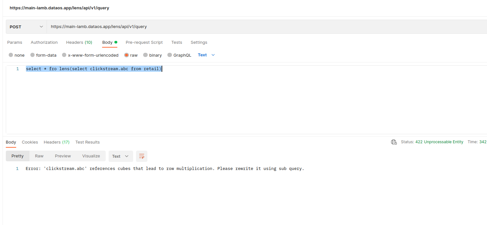

# Handling Row Multiplication

Relationship handles the complexity of joining, but to get good results, we must ensure we define it correctly. When we define a many-to-one relationship within the main entity, where the main entity has many rows corresponding to a single row of the target entity, we might get multiple rows. 

For instance, let’s say we have an order entity with an N:1 relationship with the clickstream entity. 

```yaml
name: retail
----
entities:
  - name: order
    sql:
    ----
    ----
    fields:
      - name: order_id
        type: string
        column: order_id
        primary: true
      ----
      ----
    dimensions:
      - name: year
        type: number
        sql_snippet: year(${transaction.created_on})
      - name: month
        type: number
        sql_snippet: year(${transaction.created_on})
      - name: duration
        type: number
        sql_snippet: day(current_date - ${transaction.created_on})
      - name: received_any_campaign
        type: string
        sql_snippet: case when created_on not  between current_date and current_date + interval '-2' month and campaign_id is null then true else false end
    measures:
      - name: avg_order_amount
        sql_snippet: ${transaction.saleprice}*${transaction.quantity}
        type: avg
      - name: order_count
        sql_snippet: ${transaction.order_id}
        type: count_distinct
      - name: user_count
        sql_snippet: ${transaction.customer_index}
        type: count_distinct
      - name: last_purchase
        sql_snippet: (day(current_date - ${transaction.created_on}))
        type: min
    relationships:
      - type: N:1
        field: order_id
        target:
          name: clickstream
          field: order_id
        verified: true
```

We need to define a dimension ‘order_id_clickstream’ within the clickstream entity that refers to a field ‘order_id’ from the orders entity. 

```yaml
  - name: clickstream
    sql:
      query: >
        SELECT
        *,
        max(order_id) OVER (PARTITION BY session_id) AS order_id_session_wise,
        row_number() over(partition by session_id order by created_on) as row_num,
        lag(created_on) over ( partition by session_id order by created_on ) last_act_time
        FROM
        icebase.campaign.click_stream
      columns:
      -----
      -----
    fields:
      - name: created_on
        type: date
        primary: true
        column: created_on
      - name: sku_id
        type: string
        column: sku_id
      - name: customer_index
        type: number
        column: customer_index
      - name: session_id
        type: string
        column: session_id
      - name: order_id
        type: string
        column: order_id
    dimensions:
      - name: order_id_clickstream
        sql_snippet: ${transaction.order_id}
        type: string
    measures:
      - name: abc
        sql_snippet: ${clickstream.order_id_clickstream}
        type: count
```

```sql
select * from lens(select clickstream.abc from retail)
```

While querying ‘order_id_clickstream,’ we will get a row multiplication error.
 
<center>



</center>

A clickstream entity is called in the query results in row multiplication as multiple rows are generated for the ‘order_id_clickstream’ column instead of a single unique row. Since clickstream’s dimension is referencing the order entity, which has multiple rows corresponding to each row of clickstream.

## One possible solution

To deal with the row multiplication problem, we can change the relationship from N:1 to 1:1. Essentially, we are explicitly stating to assume there is a single row of order’s entity corresponding to clickstream.

```sql
relationships:
      - type: 1:1
        field: order_id
        target:
          name: clickstream
          field: order_id
        verified: true
```