# Metis UI

Metis UI is a collaborative interface for diverse data users to navigate through the data ecosystem in an enterprise. Metis UI helps users search, discover, understand, and trust data assets that exist for the entire organization. Data assets include datasets, tables, columns,  dashboards, workflows, etc. Users can easily collaborate with other team members, inform them about the updates on the data assets, observe the changes in the metadata through versions and accomplish more. 

## Metis UI Homepage

Metis UI homepage displays all the activities around your data assets. You can navigate to the different pages by clicking on the Tabs given at the top. You can explore the data assets listed on the left panels.
 

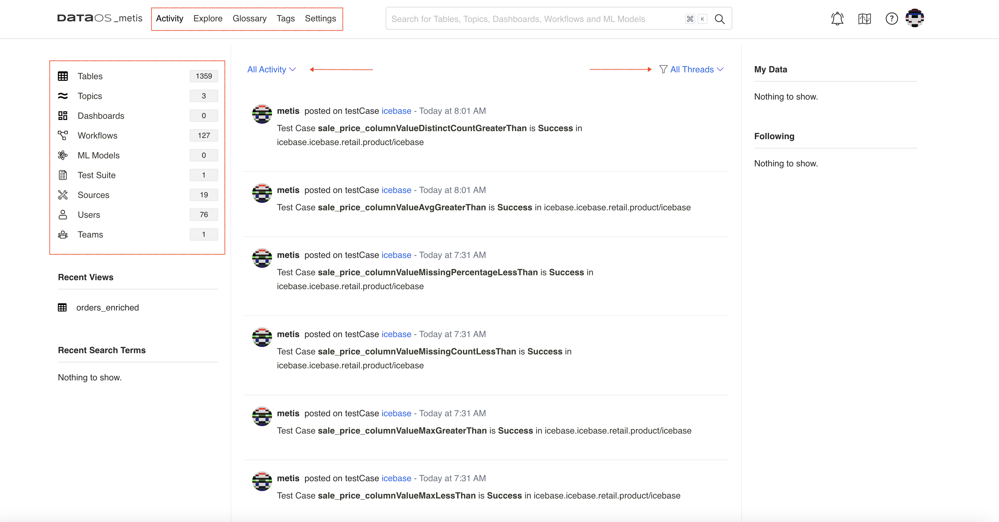

        
<figcaption align = "center">Metis UI - landing page</figcaption>
 

Metis includes a rich set of features to address all your metadata needs to facilitate discovery, governance, observability, and collaboration.

To learn more about Metis, its features, and how it works, refer to [Metis](../Metis.md).

This document will cover the essential details about the Metis UI and tutorials on how to perform various functionalities, such as adding a glossary, starting conversations for collaboration, and many more.

## How to Define Tag Categories

1. On Metis UI, click on the Tags tab. You will see the following.
     
    

    .png)

    

        
    <figcaption align = "center">Adding tag category</figcaption>
     
    
2. Clicking on the + Add Tag will open up the following screen to add a new tag category. Select the tag category as Descriptive or Collaborative.
    
    

    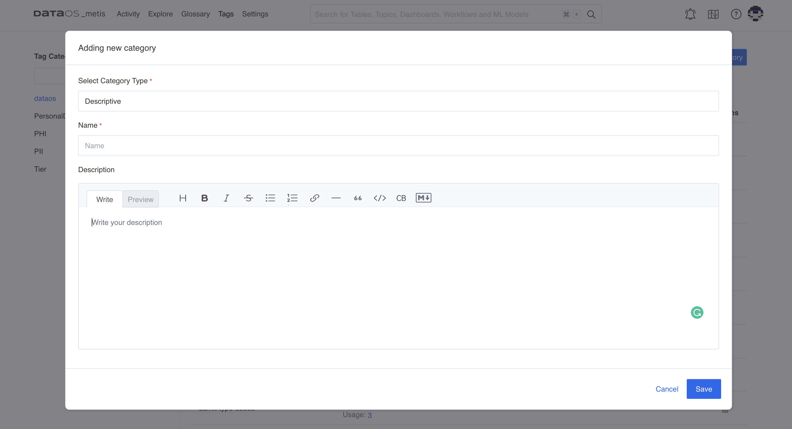

    

        
    <figcaption align = "center">Tag category description</figcaption>
     
        
    The following screen shows the new tag category created. 
    
    

    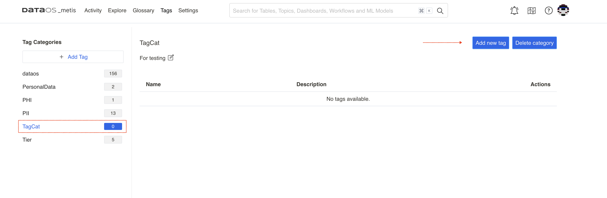

    

    <figcaption align = "center">Adding a tag in the new category</figcaption>
     
    
3. For the newly added category, add the new tags by clicking on Add New Tag. Provide a proper description for the tags. 
     
    

    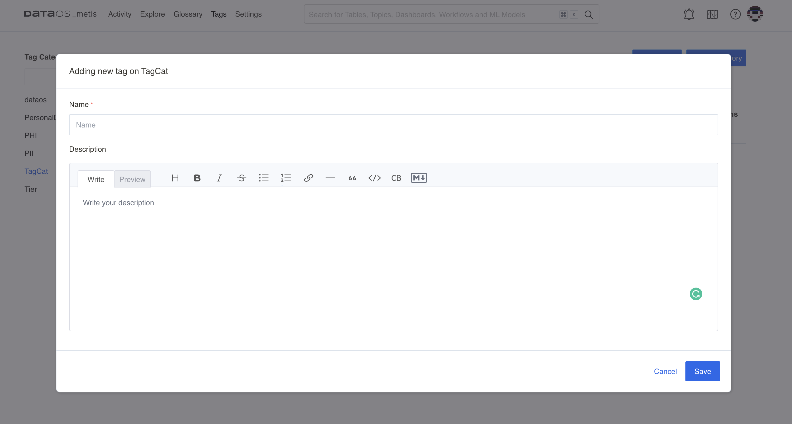

    

        
    <figcaption align = "center">New tag description</figcaption>
     
    
    
    
4. Clicking on the Save button, tags for the new tag category will be created. Now, these tags can be added to the user assets. 
    
    

    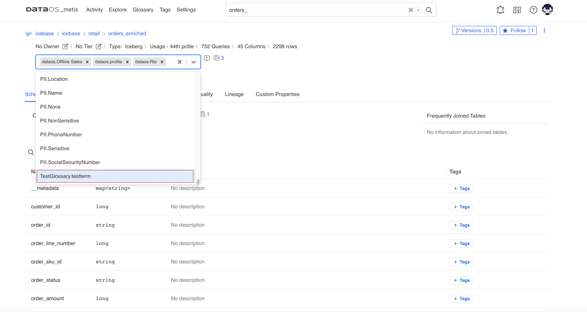

    

        
    <figcaption align = "center">tag in the new category available</figcaption>
         
        
    

> 🗣 You can define new tag categories as per business requirements, but some of the default tag categories, such as tag tiers, are pre-defined by the Metis administrator with special business importance terms, Gold, Silver, etc. Refer to [Metis Features](../Metis%20Features/Metis%20Features.md) to learn more about it.

## How to Add Tags

1. On the data asset information page, click on the highlighted Edit icon.
        
    

    

    

        
    <figcaption align = "center">Adding tags to data asset</figcaption>
         
    
    
2. You will see a list of tags defined in Metis for various categories; choose from them.
     
    

    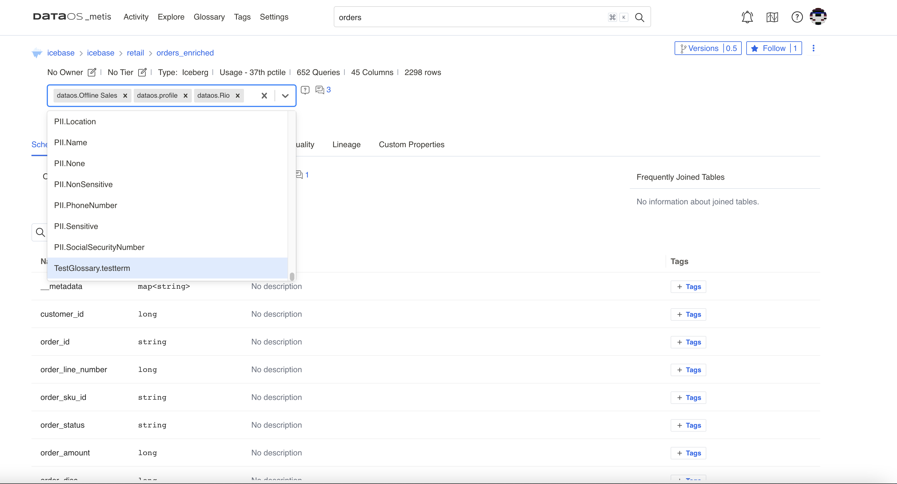

    

        
    <figcaption align = "center">Choosing a tag from the available tags</figcaption>
     
    
    
    

## How to Add Tag Tiers

On the data asset information page, click on the edit icon next to the Tag Tier.
     

        
<figcaption align = "center">Edit tag tier</figcaption>
 
    
    
    

## How to Collaborate with Team Members

### Start Conversations

You can collaborate with your team by starting Conversation Threads around the description, column description, or tags of an entity by clicking the chat icon. Metis enables you to easily ask any questions that you might have about a data asset.

You can create and reply to entire conversation threads around all the various activities across any data asset. You can also add reactions with emojis.

1. On the data asset information page, click on the highlighted icon for conversations. The number on it denotes the messages in the conversation thread. The right pane will show the conversations.
     
    

    

    

        
    <figcaption align = "center">Conversations around data asset</figcaption>
     

1. Clicking on the + sign will open the editor for the new conversation.
    
    
    > 🗣 Metis enables you to add rich formatting to conversations. For example, you can add bold, underline, or italic formatting to the text. You can also create tables, bulleted lists, or hyperlinks to external resources.
     
    

    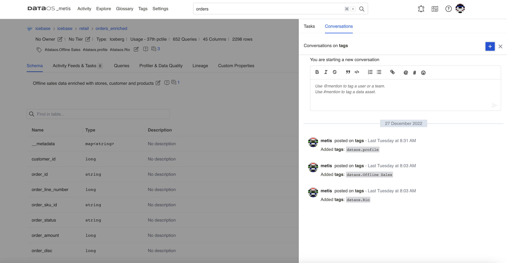

    

        
    <figcaption align = "center">Adding conversation threads on data asset</figcaption>
     

2. You can also add conversation threads on the columns of your dataset.
     
    

    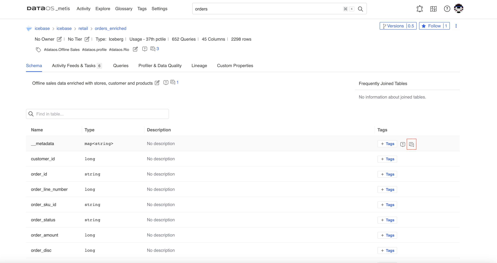

    

        
    <figcaption align = "center">Conversation thread on the column</figcaption>
     

### Create Announcements

This feature helps in Informing the entire team (or other users) about the changes to the data, such as deprecation, deletion, or schema changes, so that other team members are prepared to handle the impact. 

These announcements can be scheduled with a start date and an end date. All the users following your data are notified in Activity Feeds about the announcement.

1. On the data asset information page, click on the vertical three dots menu to get the option to add an announcement for the asset.
 
    

    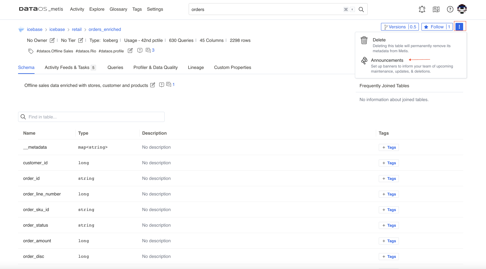

    

            
    <figcaption align = "center">Creating announcements to inform team members about data asset updates</figcaption>
     

1. Clicking on the Add Announcements button will open the following dialog box to enter the details.
     
    

    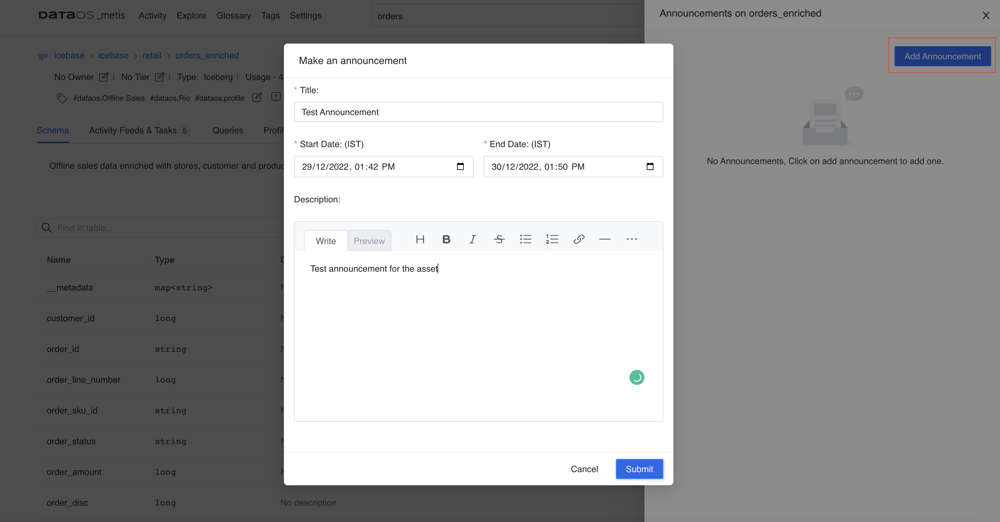

    

        
    <figcaption align = "center">formatting text options</figcaption>
     

1. On Metis UI, under ‘Activities’, users can view the announcements. Users can add reactions using emojis and reply to the announcement.
 
    

    

    

    <figcaption align = "center">Announcements in user’s activity</figcaption>
     

### Create Tasks for Team Members

You can create tasks for requesting updates on data assets, such as creating tags or updating the description of a data asset and assigning the task to an appropriate user or team.

1. On the data asset information page, click on the highlighted icon to get the option to add a task.
     
    

    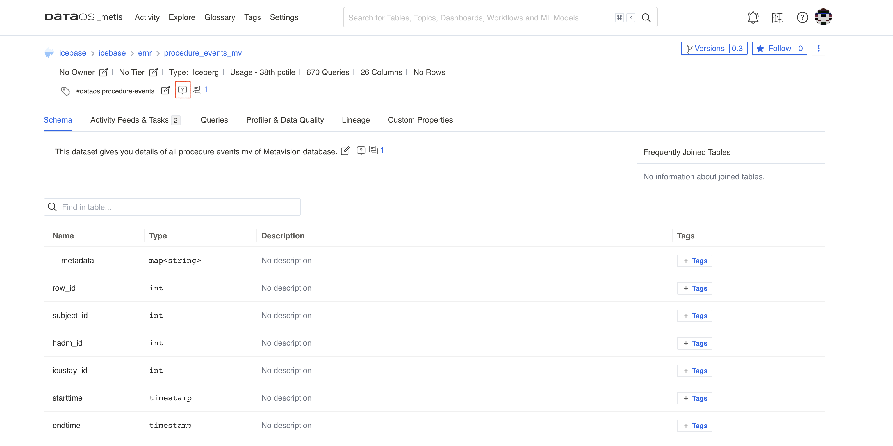

    

        
    <figcaption align = "center">Create task option</figcaption>
     

2. Create the task and provide the description for it. You also need to assign team members by adding @ symbol. 
 
    

    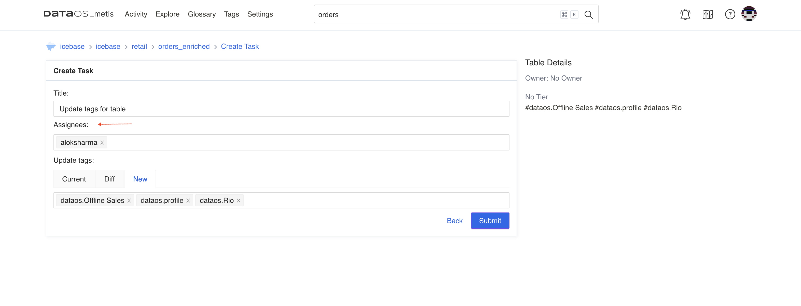

    

            
    <figcaption align = "center">Creating a task and assigning it to a team member</figcaption>
     

1. This task will appear in Activities for the assignee.

## How to Create a Glossary of Terms

1. On Metis UI, navigate to the Glossary Tab.
2. Clicking on + Add Glossary will open up the following form.
 
    

    .png)

    

            
    <figcaption align = "center">Adding glossary</figcaption>
     

1. Add reviewers.
     
    

    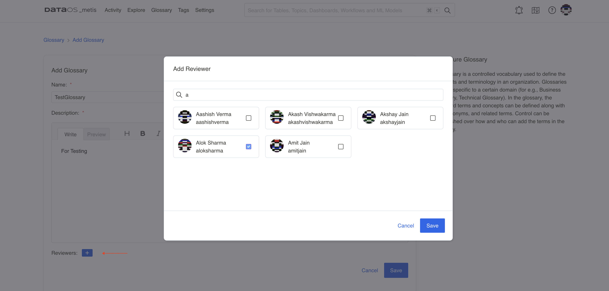

    

        
    <figcaption align = "center">Adding reviewer</figcaption>
     
        
2. Click on Save. Your glossary will appear on the left pane.

### Create a Glossary Term

To create a glossary term, follow these steps:

1. On the Metis UI, select the newly added Glossary on the left pane, and then select the Add term button on the page.
 
    

    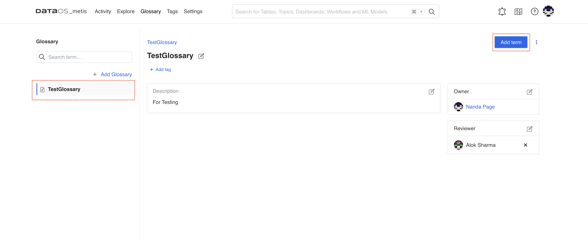

    

            
    <figcaption align = "center">Adding glossary term</figcaption>
     

1. Give your new term a name, which must be unique in the glossary. 
    
    
    > 🗣 Metis enables you to add rich formatting to term definitions. For example, you can add `bold`, `underline`, or `italic` formatting to the text. You can also create tables, bulleted lists, or hyperlinks to external resources.
        
 
    

    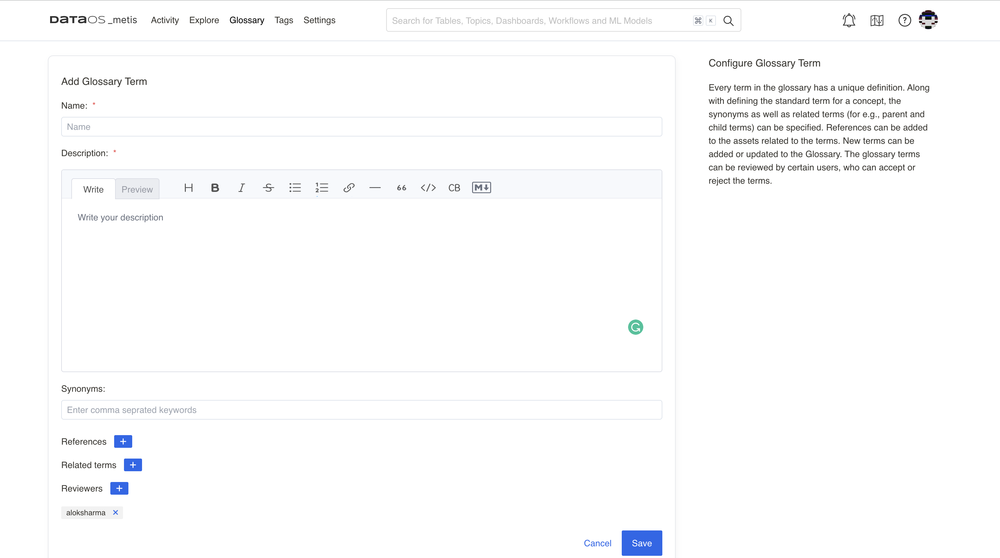

    

        
    <figcaption align = "center">Adding references and synonyms for the glossary term</figcaption>
     

1. You can add synonyms, the other terms used for the same term, such as for customer, you can add client, buyer, etc.
2. You can add related terms for the term, such as for customer, you can add related terms ‘loyal’, ‘preferred’, ‘high-importance’, etc
3. A term also has a set of Reviewers who review and accept the changes to the Glossary for Governance. This is to ensure the consistent use of terms across the organization.
4. On saving and reviewing, glossary terms can be added to the user assets as tags.

## How to Manage Ownerships

On the data asset information page, click on the edit icon next to No Owner. You can add the team or individual person as an owner of the data asset.
 

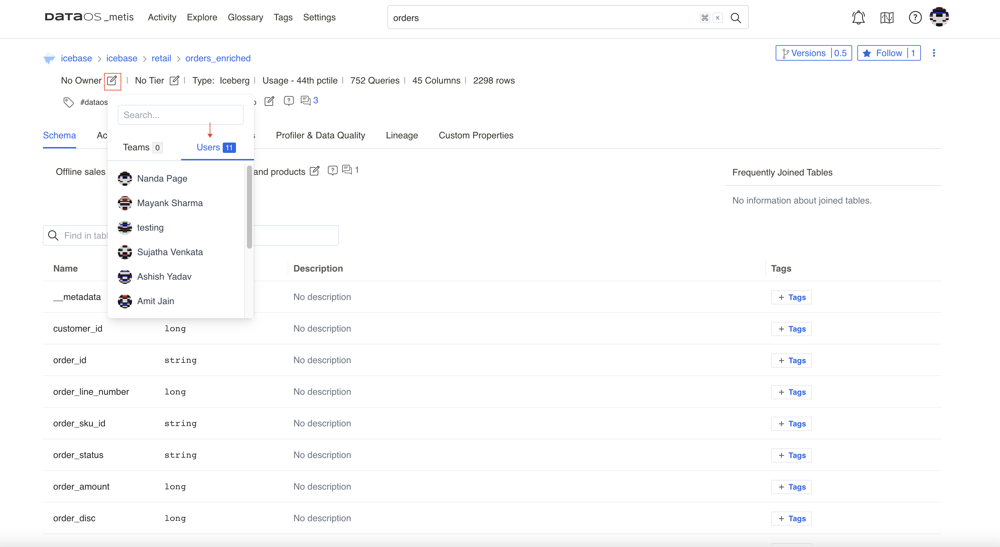

            
<figcaption align = "center">Ownership of data asset</figcaption>
 

## How to create Roles and Policies?

The Metis administrator has to decide on the roles users must be given along with the set of permissions for the roles. Permissions are a set of rules pertaining to various metadata operations that can be performed using Metis UI and APIs. These permissions are part of the policies corresponding to each role. When users are assigned roles, they automatically get the permissions defined for the roles. To know more, refer to
[Pre-defined Roles and Policies](../Architecture/Pre-defined%20Roles%20and%20Policies.md).

> 🗣 Metis Admins have access to define new roles and their associated permissions. Once roles and permissions are in line with organization/business requirements, Metis admin can assign Roles to Users.

## How to Add Configured Roles for Users

Roles can be assigned from the user profile on Metis UI.

1. On the Metis UI page, navigate to the Settings tab.
     
    

    

    

        
    <figcaption align = "center">Metis settings page</figcaption>
     

2. Click on Users in the left pane. You will get the following list of users.
     
    

    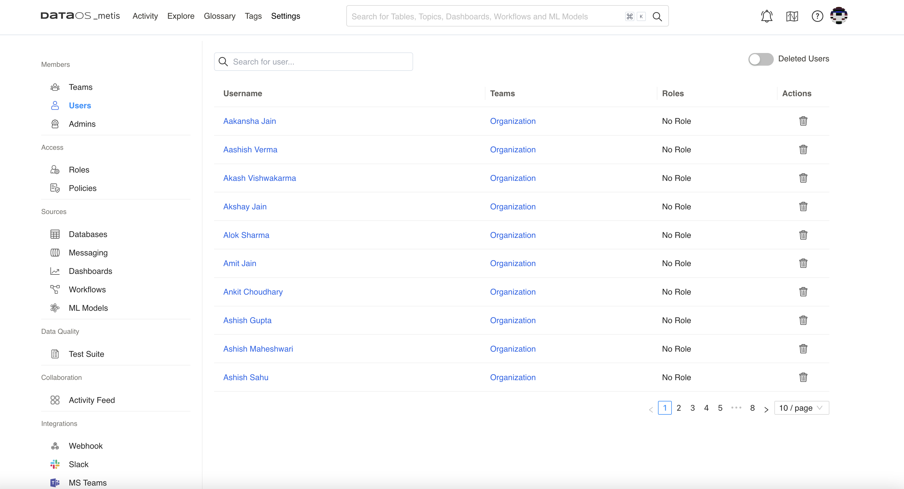

    

        
    <figcaption align = "center">Users info</figcaption>
     
        
3. Clicking on the user name will open the user profile. In the left pane, edit the roles given to the user. Click on the edit icon, and a drop-down list will show the configured roles to choose from.
 
    

    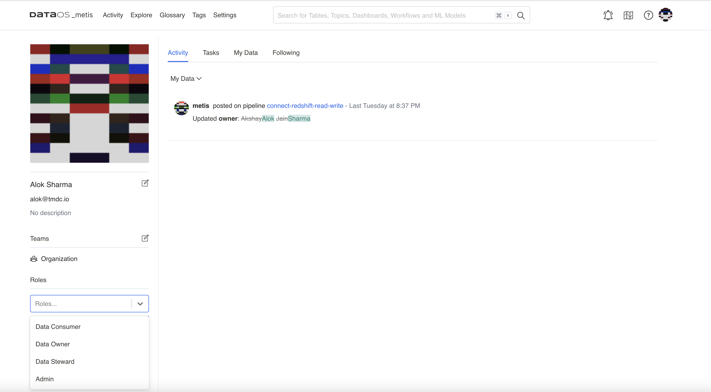

    

    <figcaption align = "center">Adding roles to the user</figcaption>
     

> 🗣 Metis Admin role can be given from the Metis UI by a user with ‘Admin’ privileges. You can also contact the DataOS system administrator to assign you the ‘Admin’ role by adding the `roles:direct:metis` tag to your DataOS user profile.

## How to Get Data Profile Information

Data profiling workflow analyzes the valid formats, null and inconsistent values within data to uncover anomalies and redundancies to achieve higher data quality. It uses basic statistics to gain insight about the validity of the data. The Data Profile scan workflow reads data profiling statistics and saves this information into Metis DB, which can be accessed on Metis UI.

1. Search the dataset for which you want to view the data profiling results.
2. On the data asset information page, click on the Profiler & Data Quality tab.
     
    

    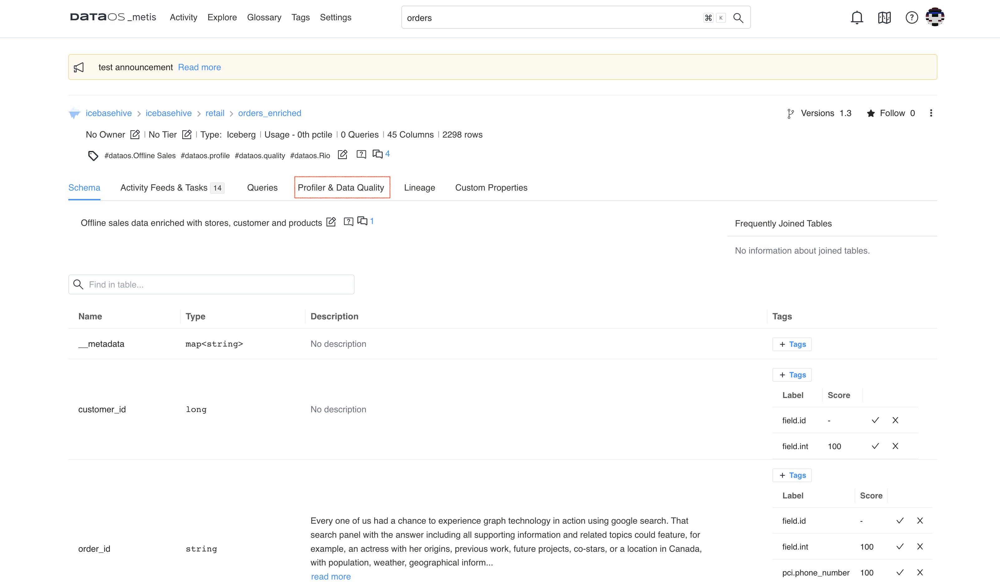

    

        
    <figcaption align = "center">Asset information page</figcaption>
     
    
3. You will see the data profiling statistics for the columns. It gives data types, null values %, distinct value %, and unique values % for each column. It also shows you ‘value count’, which helps you to know the completeness and missing values for the column before you use the data for critical business use cases.
     
    

    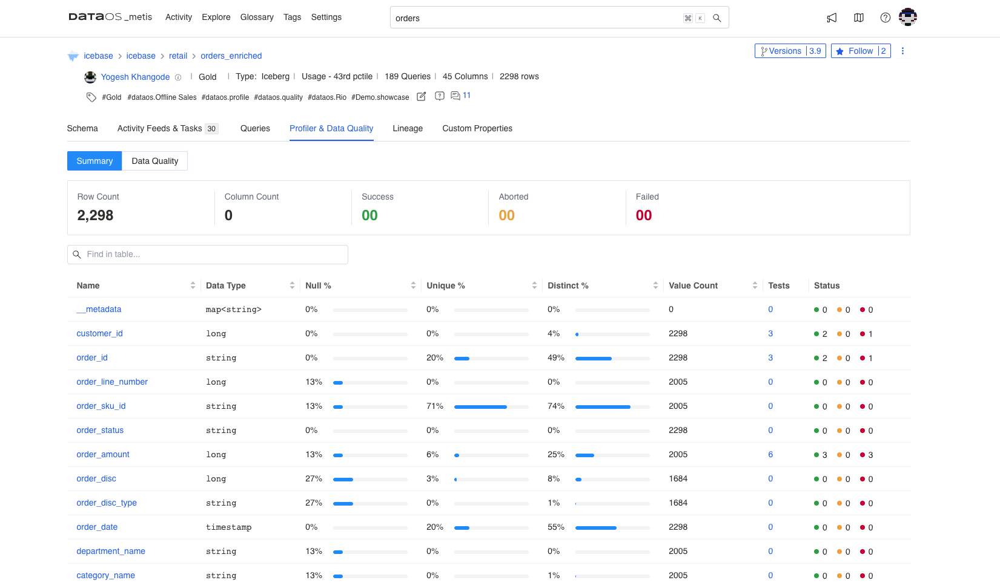

    

        
    <figcaption align = "center">Profiling and quality summary</figcaption>
         
    
4. Click on a column to see more details on the statistical distribution of its values.  You need to select the time period to see all the test results run for the particular column of the dataset.
 
    

    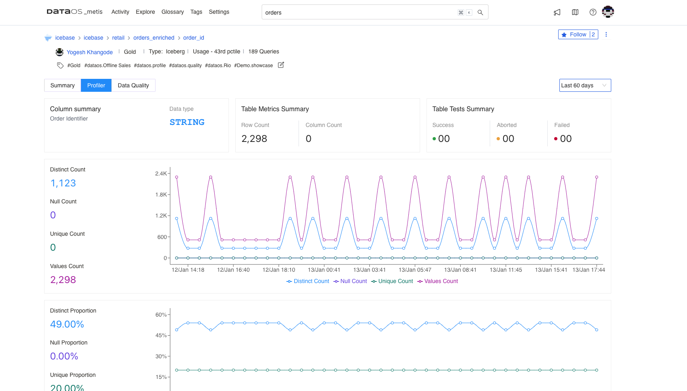

     

    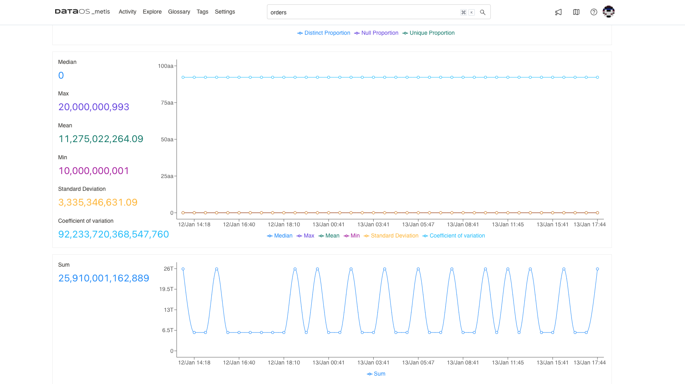

    

            
    <figcaption align = "center">Data Profiling statistics</figcaption>
     

## How to Get Fingerprinting Information

Fingerprinting analyzes the data to know that a column of data has a signature or a pattern. By examining the data values in a column, it can identify what type of data is there and determine what business terms or labels can be attached to this data. Fingerprinting automates identifying sensitive data (PII tag)that needs to be secured and to comply with government regulations like the GDPR. 

This information is shown on the Metis UI for your dataset.

On the data asset information page, you will see the following fingerprinting data.
    - Column names for which fingerprinting is performed.
    - Label showing the labels identified in the data. These labels are defined as system labels or according to business value.
    - For each label, you will get an option to accept the label to tag the fingerprint to the column or discard the label.
    - The confidence score reflects the system's degree of certainty that the identified label/classification is correct.
    - Once you accept the label, it will be added as a tag to the column.
     

    
<figcaption align = "center">Automatically identified columns</figcaption>
 

## How to Visualize Data Quality Tests

You can view the list of quality tests (assertions)created for the columns of your dataset to monitor the data quality and trends charts for each run. The trend charts also show whether the checks are passed or failed.

### Test Suite View

1. On the Metis UI page, navigate to the Settings tab.
     
    

    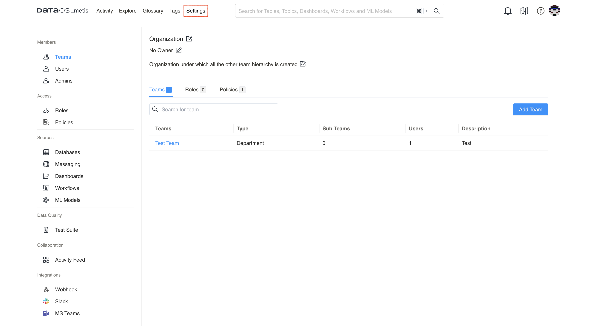

    

        
    <figcaption align = "center">Metis Settings page</figcaption>
     

 2. Click on Test Suits in the left pane. You will get the following list of test suits.
 
    

    

    

            
    <figcaption align = "center">Test suits</figcaption>
      

1. Select the test suit for which you want to see quality test results. The list shows the latest test run results for all the datasets and their columns. 
     
    

    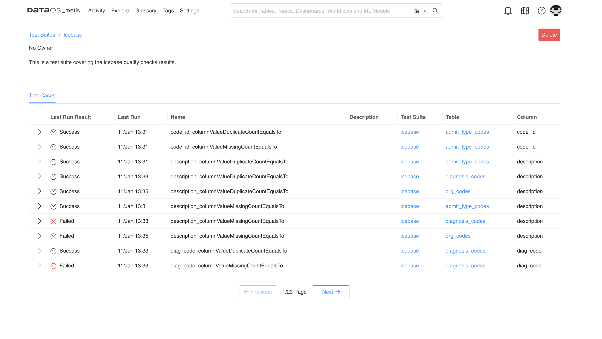

    

        
    <figcaption align = "center">Latest test runs for datasets</figcaption>
     

2. Expand to see all the test results for a dataset column for the particular time period.
    
    

    

    

        
    <figcaption align = "center">Test results for the dataset for selected time period</figcaption>
     

### Dataset View

1. Search the dataset for which you want to view quality tests result.
2. On the data asset information page, click on the Profiler & Data Quality tab.
     
    

    .png)

    

        
    <figcaption align = "center">Profile and data quality option for the dataset</figcaption>
     
    
3. You will see the summary for quality test runs for the columns.
     
    

    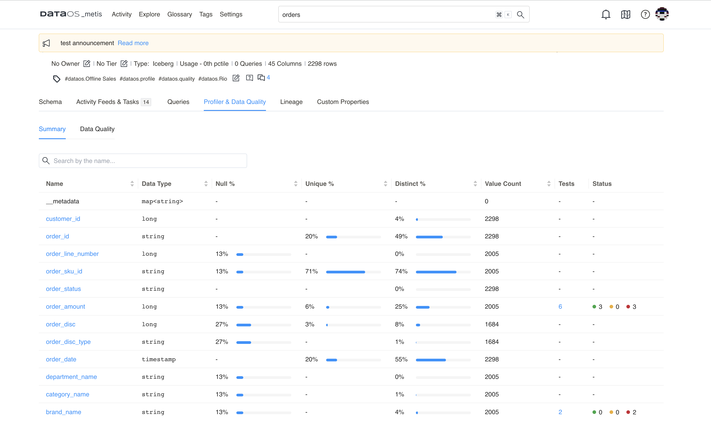

    

    <figcaption align = "center">Summary of quality tests run</figcaption>
     
    
4. Click on the Data Quality tab. You will see a list of results of the last test run for the dataset. You can expand and select the time period to see all the test results for the particular column of the dataset.
     
    

    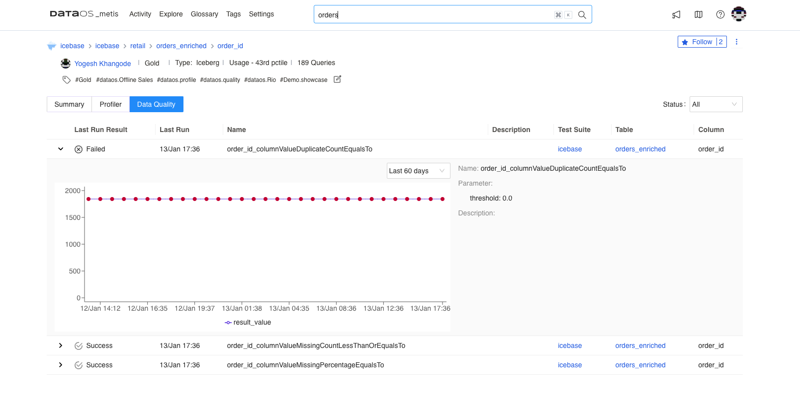

    

            
    <figcaption align = "center">Test results for the selected time period</figcaption>
     
        
        