# Operations

Using Operating Center, you can monitor the following:

- [Resources](./Operations.md)
- [Users](./Operations.md)
- [Grafana](../../../Observability/Grafana%20Dashboard/Grafana%20Dashboard.md)

Sign in to your DataOS instance with your username and password. On the DataOS home page, click on 'Operations'.
 

You can monitor the following type of resources related to:

- User Kernel - Here, you can monitor the resources that DataOS users can create, such as primitives(Workflows, services, secrets, depots, clusters, computes) and the resources used while running data processing jobs /services and performing analytics workloads.
- Core Kernel - This shows the resources used by the core components of the DataOS platform to keep it running.  You can access the logs to keep track of the proper functionality of these components.
- Cloud Kernel -  Here, you can see the resources/VMs, monitor their health, and keep a watch on their usage.
- Product- Here, you will get the release name and version of the DataOS products.

## User Kernel- Resources

Click on the ‘Resources’ tab to get the information about the user-created DataOS primitives such as workflows, services, secrets, depots, clusters, compute, etc, their running status, and owner.
 

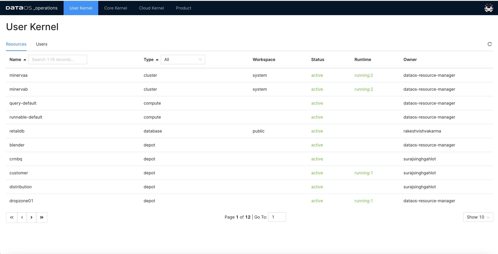

Select the  ‘type’ from the drop-down to see the specific resource. 
 

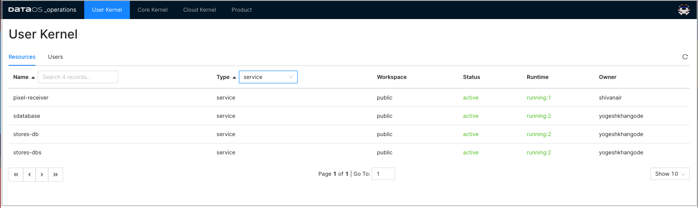

### Resource Details

Click on the resource to get its details, YAML, and runtime information. 
 

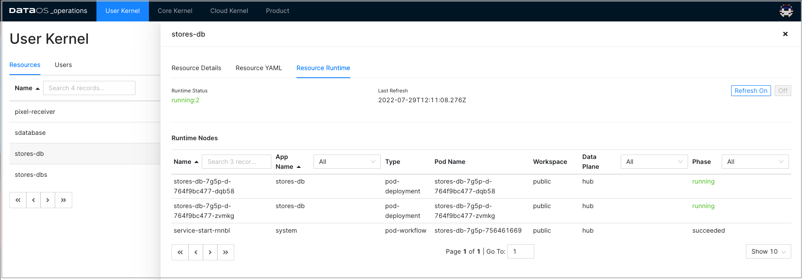

### Resource YAML

The following image shows the YAML of the selected resource. This YAML file is created by the user. This resource was created in the DataOS environment using the DataOS CLI command `apply` command. You can see the details like the type of resource, Its metadata, and resource-specific properties. For example, for Workflow type of resources,  you can see dag with data processing activities; for Clusters type of resources, you can see compute, replicas, resources, depots, catalogs, etc.

In all these YAMLs, you can also see the auto-generated section ‘status’ that conveys information about the build state, runtime state, and the required cloud kernel resources and web resources.
 

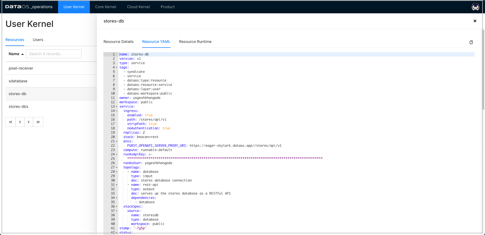

### Resource Runtime

Here you will get the details of the pods and the nodes selected for running these pods.
 

#### Runtime Node Details

Under Runtime Nodes, click on a node to get the runtime YAML, Logs, and Runtime Node Usage. Here you will get the container details, their state, and pod lifecycle conditions(Ready, PodScheduled…) with a status (True, False or Unknown) that make up the ‘computed state’ of a pod at any time.
 

#### Runtime Node YAML
 

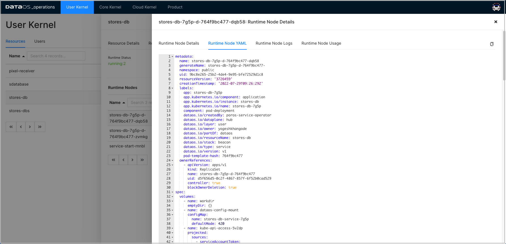

#### Runtime Node Logs

Runtime Node Logs provide a near real-time view. These logs provide insights into the current health of the node environment and can be helpful for debugging issues.
 

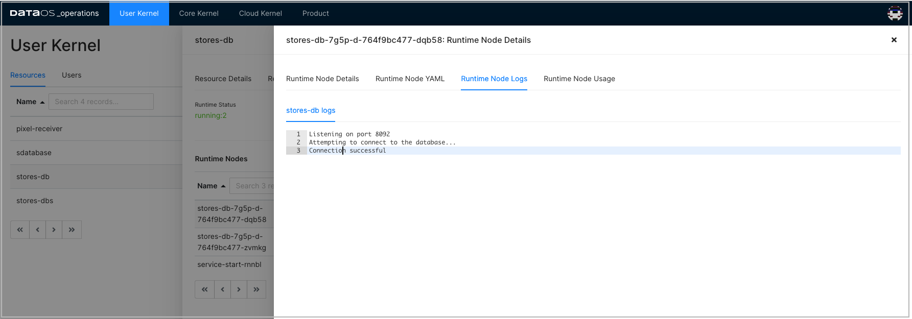

> Note: Logs are not guaranteed to persist for any length of time and may be cleared as needed.
> 

#### Runtime Node Usage
 

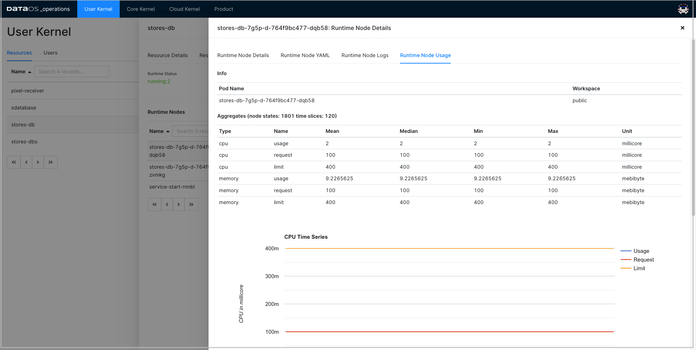

## User Kernel- Users

Click on the User tab under the ‘User Kernel’ tab.

Here you can see the list of all the DataOS users and their details such as ID, email, tags, etc.
 

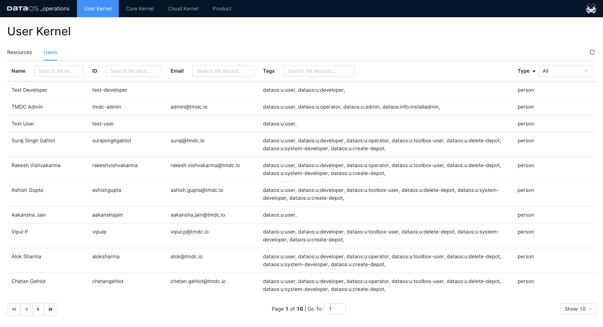

The users can be application component that uses the system resources.
 

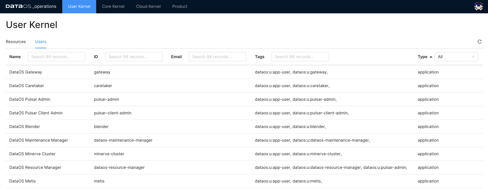

## Core Kernel- Resources

Here you will get the resource details responsible for running the core components. These resources are isolated in groups as namespaces within a single cluster. These namespaces
 help different projects, teams, or customers to share a Kubernetes cluster. Names of resources need to be unique within a namespace but not across namespaces. Namespace-based scoping is applicable only for name-spaced objects *(e.g. Deployments, Services, workloads, etc).* 

*DataOS components are deployed in separate namespaces.* After selecting the namespace, you can see components deployed in that namespace.

### Pods

When DataOS components are deployed in Kubernetes, that Deployment creates Pods with containers inside them  Each Pod is tied to the Node where it is scheduled and remains there until termination or deletion. In case of a Node failure, identical Pods are scheduled on other available Nodes in the cluster.

Here you will get the pod details for the  DataOS components for the selected namespace and the phase. 

The phase of a Pod is a simple, high-level summary of where the Pod is in its lifecycle.

Here are the possible values for `phase`.

| Value | Description |
| --- | --- |
| Pending | The Pod has been accepted by the Kubernetes cluster, but one or more of the containers has not been set up and made ready to run. This includes the time a Pod spends waiting to be scheduled as well as the time spent downloading container images over the network. |
| Running | The Pod has been bound to a node, and all of the containers have been created. At least one container is still running or is in the process of starting or restarting. |
| Succeeded | All containers in the Pod have terminated in success, and will not be restarted. |
| Failed | All containers in the Pod have terminated, and at least one container has terminated in failure. That is, the container either exited with non-zero status or was terminated by the system. |
| Unknown | For some reason, the state of the Pod could not be obtained. This phase typically occurs due to an error in communicating with the node where the Pod should be running. |
 

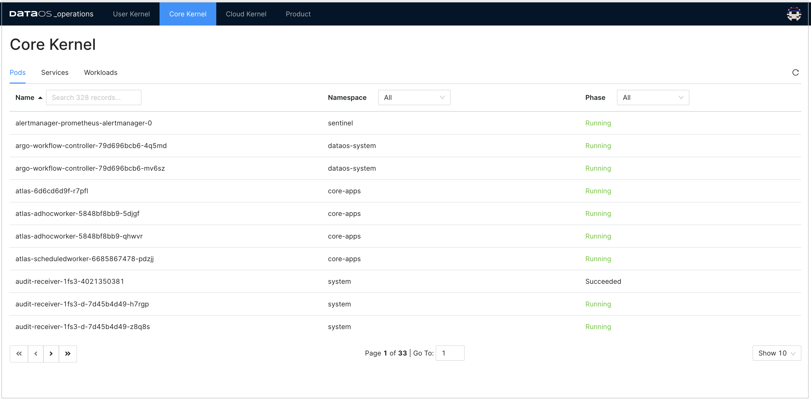

Clicking on a particular pod will give you pod details, Pod YAML, Pod logs, and Pod usage.

#### Pod Details

This gives you pod and container details and container status. You will also get pod lifecycle conditions(Ready, PodScheduled…). A Pod has a PodStatus, which has an array of PodConditions through which the Pod has or has not passed:

- `PodScheduled`: the Pod has been scheduled to a node.
- `ContainersReady`: all containers in the Pod are ready.
- `Initialized`: all init containers have completed successfully.
- `Ready`: the Pod is able to serve requests.

The pod lifecycle conditions are with a status (True, False, or Unknown) that makes up a pod's ‘computed state’ at any time. You can track the state of each container inside a Pod.
 

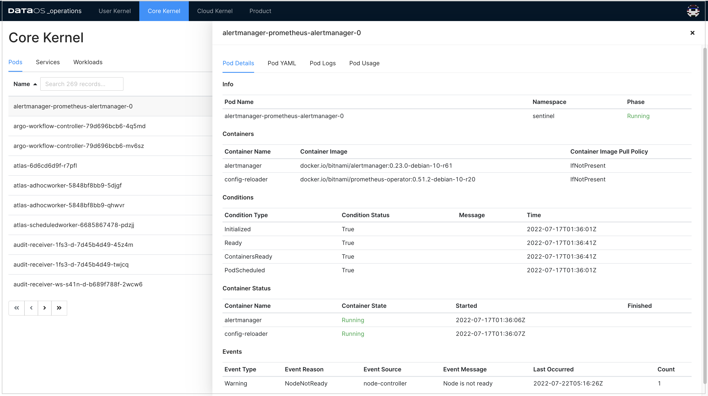

#### Pod YAML

This is Kubernetes generated YAML for this resource where you can see the metadata information such as API version, resource version, its unique id, labels, deployment type, etc. You will also find the ‘spec’ property, which includes containers(image, ports, env, etc), memory requirements, storage volumes, tolerations and runtime status, etc.
 

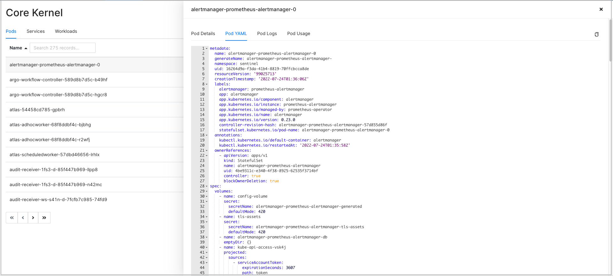

#### Pod Logs

This option will enable you to access live stream logs produced by a named Pod to your terminal, letting you inspect the output from your application and diagnose a problem with your cluster’s workloads.
 

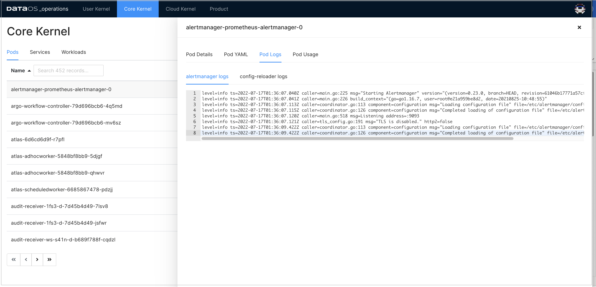

#### Pod Usage

This gives you the aggregate of the CPU use of all containers for the selected pod. Likewise, pod memory utilization refers to the total aggregate of memory used by all containers in the pod.
 

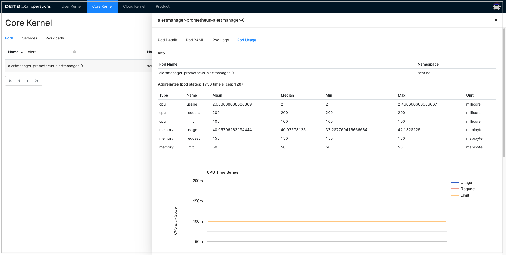

### Services

DataOS services are a means to interact with the Kubernetes system for running the core functionality/components. Select a namespace to get the list of services with their fully qualified domain name. All these services are deployed in the separate logical grouping called namespaces. 
 

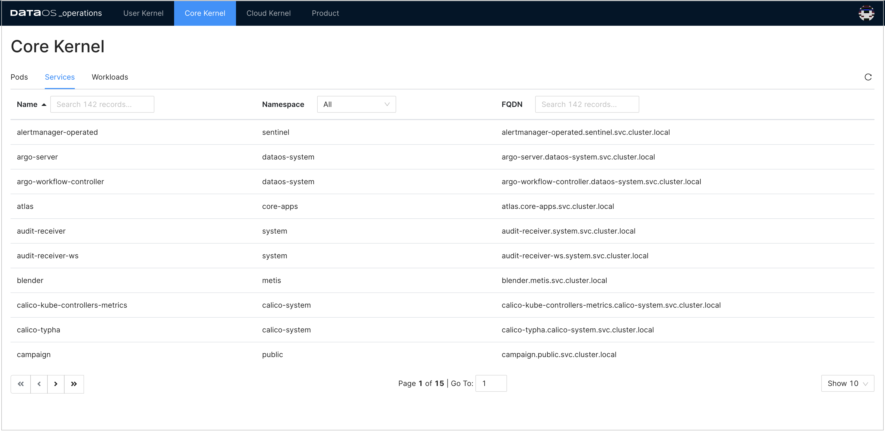

#### Service Details

Click on the service from the selected namespace to view the details such as port details, service and pod endpoints, etc.
 

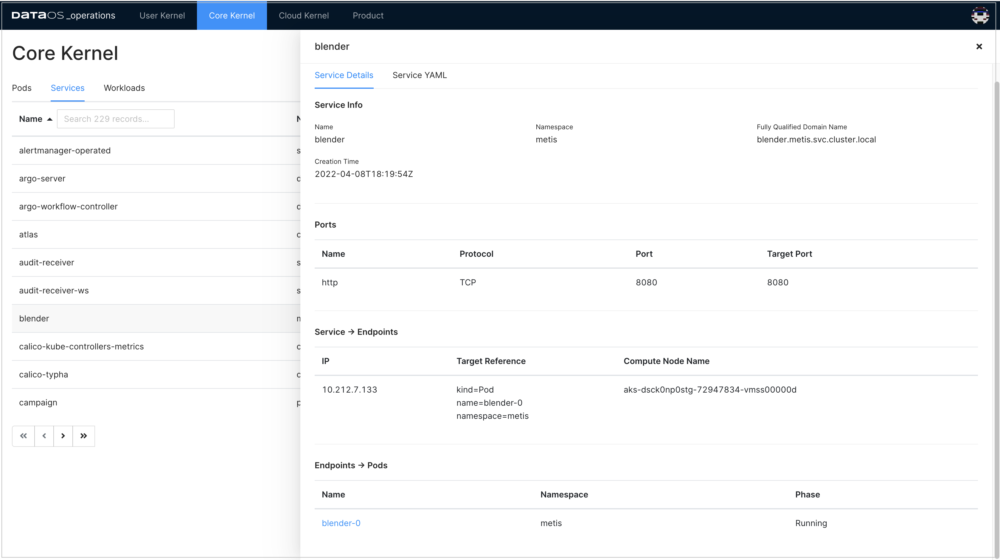

#### Service YAML
 

### Workloads

A workload is a DataOS application running in one or more Kubernetes pods. You have the following workload types.

Deployments are useful for stateless applications. Deployments create and manage identical pods called replicas, based on a pod template. If a pod stops or becomes unresponsive, the deployment's controller will replace it.

Stateful sets live up to their name, they're useful for stateful applications, that's things such as a database. Stateful sets create and manage pods that are expected to have a level of persistence. They allow for stable network identifiers and persistent storage.

Daemon sets are useful for background tasks such as monitoring by creating one pod per node.
 

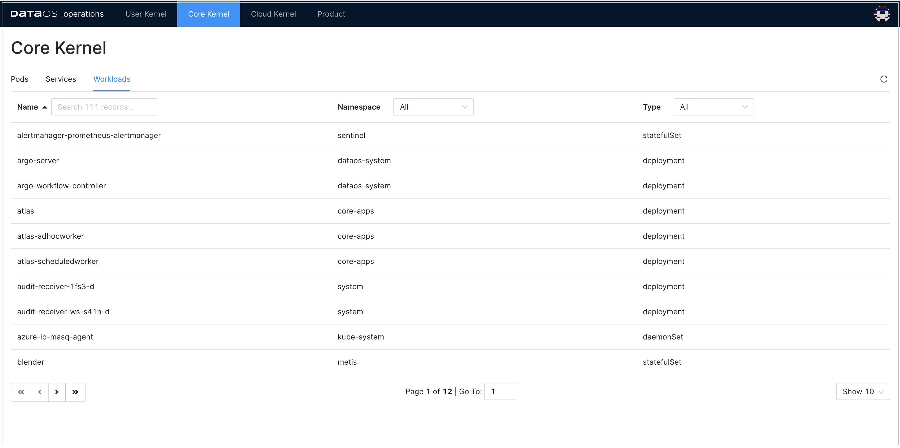

## Cloud Kernel- Resources

Within a cloud environment, compute nodes form a core of resources. They supply the processing, memory, network, and storage that virtual machine instances need. When an instance is created, it is matched to a compute node with the available resources. Here you will access the details about these compute nodes, their creation time, and cloud service provider.
 

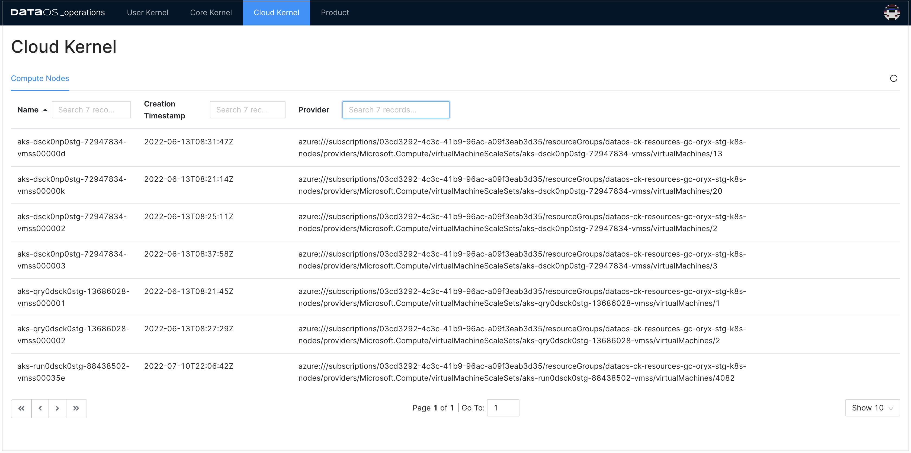

### Compute Node Details

Click on the compute node to see all the details about the general information, such as the operating system used by the node, OS image, Kubernetes version, architecture, etc., and compute node status, which includes:

- Addresses- host IP and hostname. This information varies depending on the cloud provider.
- Conditions- status of all running computing nodes.
- Capacity and allocatable- resources available on the node: CPU, memory, and the maximum number of pods that can be scheduled onto the node.
- Taints- automatically created by the Kubernetes control plane when problems occur on nodes,  that match the conditions affecting the node.
 

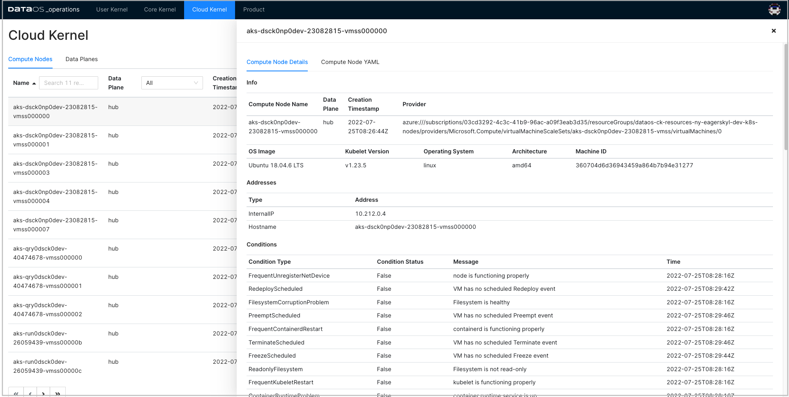

## Product

You can see the deployed DataOS products and their release information here.
 

.png)

Click on the product name to view the release details of all the installed DataOS components. 
 

.png)

> Note: You need ‘Operator’ level permissions to view the installed DataOS components.
>