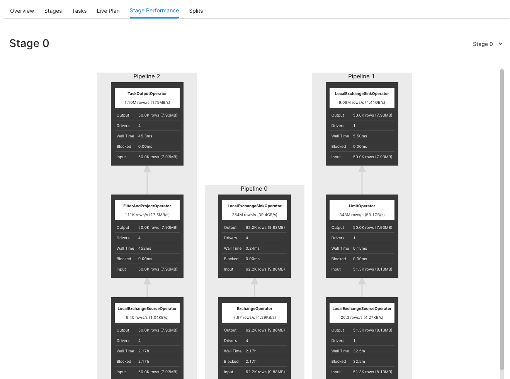
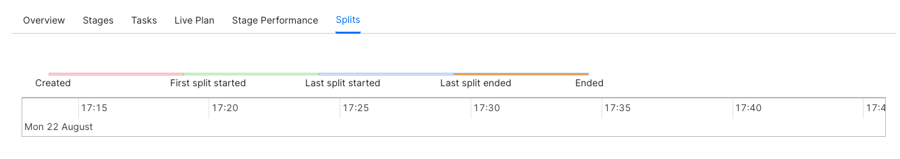
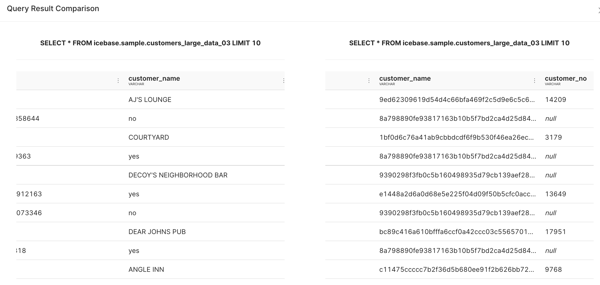
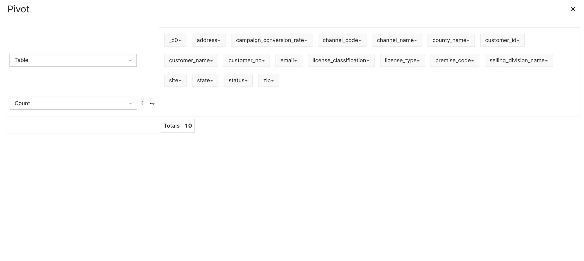
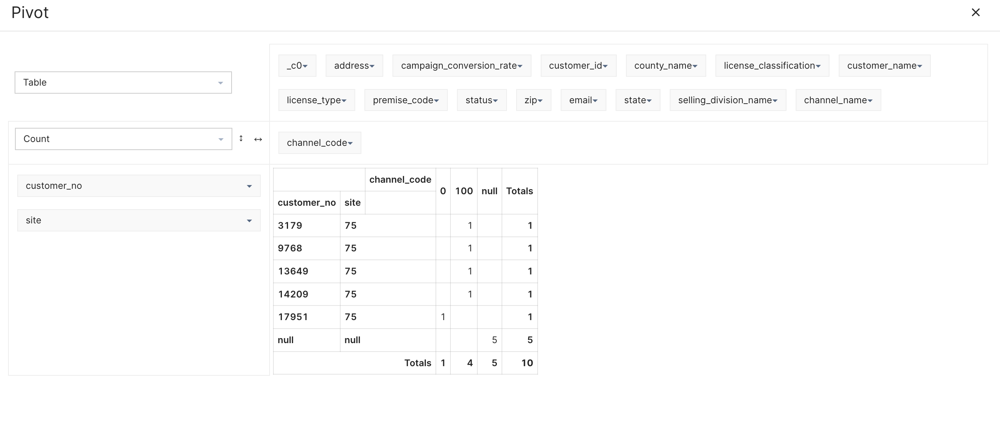

# Workbench

The first thing you do, once you enter the world of Workbench is to choose the Minerva cluster you want to use. The datasets available to you will depend on the depots & catalogs included in the Minerva cluster.

The next step is to select the names of Catalog, Schema, and Table where the data is located. 

The Catalog includes the names of the [Depot](../../../Primitives/Depot/Depot.md) and the catalogs (data sources for which the depot has not been created, but which you can still query through DataOS).

If you do not see the requisite name in the list of Catalogs, ask the admin, or a person with the operator tag to add it to the Minerva cluster you are using. An operator/admin can also create a new cluster just for the data sources you want to use, this way the complex queries you run would not affect the computation resources of existing clusters.
 

.png)

<figcaption align = "center">
Select the cluster, catalog, schema and table to query</figcaption>
 

The mapping from source data to tables is defined by the connector. If you have already gone through [Depot](../../../Primitives/Depot/Depot.md), it’s easy for you to gain a sense of perspective here. For relational databases, you should know that Depot translates to Catalog in Workbench, while Collection to Schema, and Dataset to Table.

You can also search datasets with the table name. If you already know the table name, you can directly start writing the SQL statements in the query pane. A Table name in Workbench is always rooted in Catalog. For example, a fully-qualified table name such as icebase.audience.customers_large_data refers to the Table customers_large_data in the Schema audience which is in the Catalog icebase.

Now you are ready to start writing and running the queries. Just a heads up - it uses TrinoSQL syntax. If you need help getting started, here is a list of the commonly used queries:
[Popular SQL query syntaxes](./Popular%20SQL%20query%20syntaxes.md)

List of all the functions supported by the query engine of DataOS.
[Functions and Operators - DataOS](./Functions%20and%20Operators%20-%20DataOS.md).

Workbench has some cool features which you should try out.

## Studio Feature

For business users or folks who don’t have the time or patience to write tedious & long SQL queries, we have the Studio Feature, wherein you can simply select the Aggregates and Measures, or Raw Records and columns to generate SQL statements.
 

.png)

<figcaption align = "center">Select the Table you want to query and click on the Studio button.</figcaption>
 
 

.png)

<figcaption align = "center">Now choose the fields per your intentions. Once done, click Generate SQL</figcaption>
 

The prepend toggle allows you to keep the previous SQL statements in the query pane while generating the new statements. To remove previously generated SQL statements, disable prepend.

You can now directly export the results of the query to a BI tool. Check out the Atlas section.

## Atlas

It is our custom-made BI solution tool. In the result pane, hover over the three vertically aligned dots. Click it, and go to the Atlas option.
 

.png)

<figcaption align = "center">Along with the Atlas option, you should check out other available features in the list</figcaption>
 

When you select the Atlas option, the pop-up will ask you for the query name. Type a name you like (can be weird & unique, but we would suggest keeping it so it’s relatable to the query) and click export. It will immediately take you to Atlas in a new tab. To start using Atlas, check out the Analytics section: [Atlas](../Atlas/Atlas.md)

## Analyze

Use this feature to get the Query Plan. After all, forethought is the basis of all ingenuity. It gives you access to both the Raw Data as well as the DAG of the distributed query plan.

To analyze, select the entirety of your query and click the little magnifying glass with the lightning symbol on it (shortcut key: ctrl/cmd + shift + enter).
 

.png)

<figcaption align = "center">Click the analyze icon after selecting the entire query
</figcaption>
 
 

.png)

<figcaption align = "center">Clicking on the ℹ️ button will take you to the detailed Query Plan</figcaption>
 

## Runtime Stats

The Runtime Stats option appears while the query is still running. It will not be available once the query has been completed.
 

.png)

<figcaption align = "center">Runtime Stats option can be seen in the result pane</figcaption>
 

Clicking on the Runtime Stats tab will take you to a new tab in the web browser that will hold vital information about the query you ran.
 

.png)

<figcaption align = "center">Scroll down the page to see the available options</figcaption>
 

### Overview

The overview section is further divided into four sub-sections - Session, Execution, Resource Utilization Summary, and Timeline. These are self-explanatory, nevertheless, here’s the gist of things you can view:

*Session* tells you about the source of the query. 

*Execution* will provide you with crucial information on the time taken to plan, analyse and execute the query, among other details. 

*Resource Utilization Summary* not only tells you about the CPU & Memory usage but also holds information on the number of input/output rows and data.

*Timeline* holds the information on Parallelism and updates other details such as rows and bytes per second, as the query runs.

### Stages

A query is executed by breaking up its execution into a hierarchy of stages. Each stage is designed to implement a different section of the distributed query plan. The output from these stages is aggregated into a root stage. The Minerva (query engine) coordinator is responsible for the modelling of the query plan into stages.

Here you can see detailed information on the stages in which your query has been segregated for faster results. It cues you in on the time and resources to be consumed for each section of the query. 

### Tasks

Each stage of the distributed query plan is implemented as a series of tasks. These tasks are distributed over a network of Minerva worker nodes.

Tasks themselves operate on Splits - check the Split section below.  Upon execution of all the tasks, a stage is marked completed. Minerva assigns an ID to every task and tracks its progress on parameters like host, state, CPU time, and buffering details.

### Live Plan

This will give you a graphical representation of the Tasks completed to execute the query. Starting from query input, analysis of the table, returning to the user with accurate output, to giving CPU and memory consumed to run the query. You can check this only after the query has completed running.

### Stage Performance

Graphically represents each stage as a flowchart. The information here will be available only after the execution of the query is finished.
 

<figcaption align = "center">An example of flowchart of a Stage</figcaption>
 

### Splits

Splits are sections of a larger data set. Minerva coordinator retrieves a list of all the splits that are available for a table, through the connector for a particular Catalog. As mentioned earlier, Tasks operate on Splits, which is to say that at the lowest level Stages retrieve data via Splits.
 

<figcaption align = "center">Splits are like the steps/intervals in which data is ingested for query execution</figcaption>
 

## Query Details

You can see the details of the query after it has run. Click the bar showing the result of a particular query.
 

.png)

<figcaption align = "center">On Workbench, hover over & click the area demarcated in red</figcaption>
 

### Query

This will show you the query you just ran. It is as obvious as the statement you are currently reading!

### Stats

Stats will give you information relating to the status of the query, query id, CPU time, processed rows and splits, among other things.

### Governance

This will display all the policies that are applied to the dataset you have queried. If a governance policy has been applied to the Table being queried, you will see the cautionary triangle in the result bar of the result pane.
 

.png)

<figcaption align = "center">The red cautionary triangle indicates you have limited permission to query this Table</figcaption>
 

You can apply the Mask policy, say to mask the column with ‘customer name’ in it, directly from the Metis UI via policy tags. To apply the Filter policy, you will need to apply a YAML file through DataOS CLI. Get more details on the Security page: [Data Policy](../../../Security/Security.md)

### Tables

Tables will show you the table address of the input datasets. You can get more intricate and essential information on the table being queried in the Metis. Click on the arrow button located on the right-hand side of the pop-up screen.

### Columns

Here you can see the metadata of the output dataset.

Not to toot our own horn, but the cool-feature list doesn’t end here! Check out some more.

## Compare

Workbench interface allows you to compare the results of two queries without having to execute additional SQL statements to do this. You can fathom all the different ways you can use this feature.

Select the two query results as shown in the image and click compare.
 

.png)

<figcaption align = "center">You can compare the results of 2 queries at a time</figcaption>
 

In the example shown, we have compared the results of two queries where one of them had customer names masked in the input dataset.
 

<figcaption align = "center">Scroll each output dataset horizontally to compare specific columns</figcaption>
 

## Pivot

With DataOS workbench, you can pivot your output tables/datasets through a click-and-drag interface instead of having to execute it as a SQL statement.

Click the option for More, as depicted in the image below, and go to the Pivot option.
 

%201.png)

<figcaption align = "center">Along with the Pivot option, you should check out other available features in the list</figcaption>
 

Pivot option opens up a new pop-up window where you can find all the columns (where at least one row doesn’t have the null value) listed at the top.
 

<figcaption align = "center">You can also apply filters on each attribute visible in the list. </figcaption>
 

You can now pick and drop these attributes to the empty space as either row names or column names for a new table/dataset.
 

<figcaption align = "center">In the example, we have picked ‘customer_no’ and ‘site’ as the row values, while ‘channel_code’ as the columnar values.
</figcaption>
 

You can do a lot more in Pivot, such as create charts and heatmaps, perform aggregations, among other things. Beyond this point, you should be able to explore it on your own.

## Additional Features

There are lots of more features that make the Workbench interface user-friendly. Some of these features have been listed below, while others, you will figure out on your own when you use the Workbench. What’s life without a little mystery and a pinch of suspense?

### History

This stores the SQL statements executed by you in the last 4 weeks.

### Private/Shared Bench

You can choose to share your SQL statements with other members of your enterprise. Simply save the bench, and click on the Private button.

### Format

It rearranges/restructures your SQL statements so they are readable and legible to everyone else. Think of it like someone with better calligraphy, rewriting your chicken feet-like handwriting.

### Tags

It’s part of the best practice to declare tags for your saved benches, so they are searchable and discoverable later.

Features like New Bench, Saved Benches, Zoom, Save, etc. are pretty straightforward, and we will not bore you with their details.

Wasn’t that a short journey? We would say so, even though it was a power-packed list of way too many features to be retained in one go. Hence, the suggestion - just start using Workbench. If you get stuck anywhere, you can come back and revisit this page.