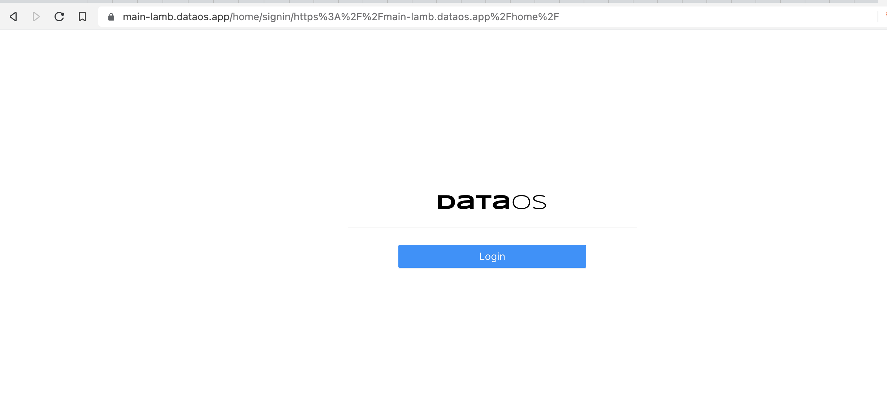
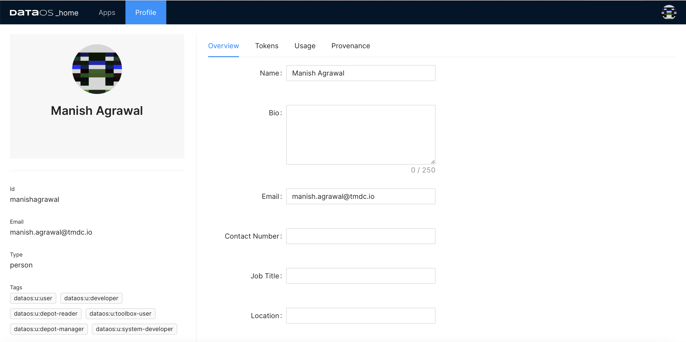

# GUI

The Graphical User Interface of DataOS has been designed in a way that both technical & non-technical users can work on it in a self-serve manner. The applications on GUI should be of particular interest to users with business persona, as they allow for consumption and activation of your data without the requirement of coding knowledge.

If you have worked with data applications before then you don’t really need our help to get started with the GUI, it’s user-friendly. Nevertheless, here is everything, on a silver platter, just for you:

To get started, simply type the DataOS domain name provided for your organisation in the browser, e.g.

`[main-lamb.dataos.app](https://main-lamb.dataos.app/)`

The login page you will see:

Do the second-most obvious thing in the world - click login. The homepage of DataOS GUI will show you all the apps currently available for use:

You can see two tabs at the top - Apps & Profile. By default, App is the selected tab.

## Apps

You can call the GUI a kaleidoscope of data app interfaces where one application allows you to create dashboards and charts, while the other can be used for data exploration through SQL; one app allows you to explore & own the data assets within your organisation; another keeps you informed on the resources like processing power being used by the organisation. There’s a lot more to explore here than we can put in a couple of sentences. 

Here are the details on the apps you might want to explore for your first time (go wild!), refer to
[GUI Applications](./GUI%20Applications/GUI%20Applications.md).

You can also switch between light and dark mode while using DataOS GUI. Click on your profile pic at the top-right corner!

## Profile

You can fill in the information you want.

The ‘Tokens’ tab is an important feature to control accessibility. To learn about it, refer to the
 [Security](../Security/Security.md) section.