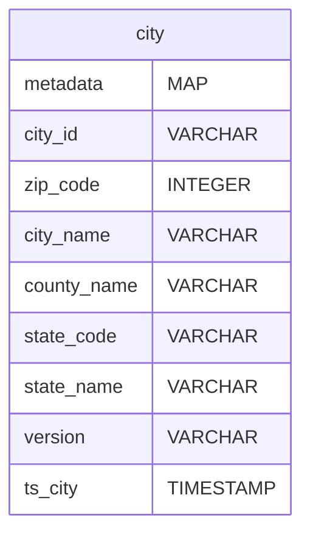
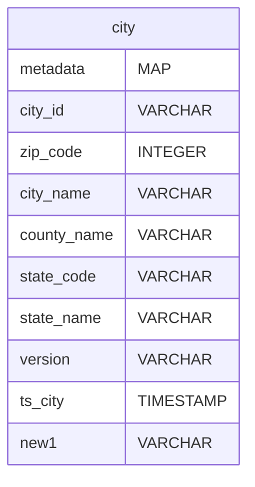
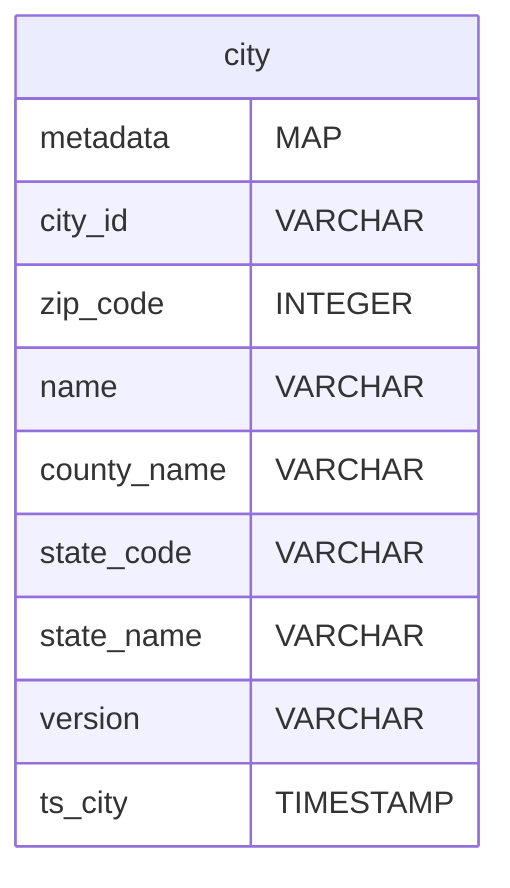
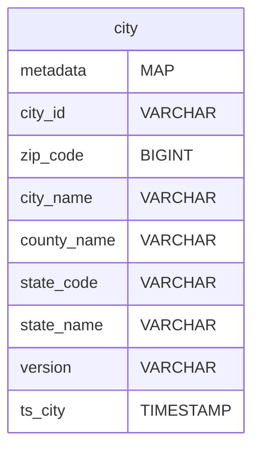

# Case Scenario: Schema Evolution

# Procedure

- Apply the command which you want to execute
- To observe the changes within the Workbench, execute the below command

```bash
dataos-ctl dataset -a dataos://icebase:retail/city set-metadata \
-v latest
```

Dataset - `dataos://icebase:retail/city`

## Add Column

The following command can be used to add a column to the table or a nested struct

```bash
dataos-ctl dataset -a dataos://icebase:retail/city add-field \
-n <column-name> \
-t <column-datatype>
```

Only the following column data types are supported

- `boolean`
- `int`
- `long`
- `float`
- `double`
- `decimal` (precision must be provided, which is in the range [1,38])
- `date`
- `time`
- `timestamp`
- `string`
- `binary`

Initial Schema observed in Workbench

<center>


</center>

Let's add a new column called `new1` into the city dataset with a type `string`. Execute the following code in the terminal

```bash
dataos-ctl dataset -a dataos://icebase:retail/city add-field \
-n new1 \
-t string
```

Output (on successful execution of code)

```bash
INFO[0000] 📂 add field...                               
INFO[0001] 📂 add field...completed
```

To observe the changes made to the initial dataset, execute the following code

```bash
dataos-ctl dataset -a dataos://icebase:retail/city set-metadata \
-v latest
```

Output (on successful execution)

```bash
INFO[0000] 📂 set metadata...                            
INFO[0001] 📂 set metadata...completed
```

Observe the change in the workbench; a new field by the name `new1` is added

<center>



</center>

## Drop Column

To remove an existing column from the table or a nested struct, the following command can be executed

```bash
dataos-ctl dataset -a dataos://icebase:retail/city drop-field \
-n <column-name>
```

<center>


</center>

Let’s remove column `new1` from the city dataset. Execute the following code in the terminal

```bash
dataos-ctl dataset -a dataos://icebase:retail/city drop-field \
-n new1
```

Output (on successful execution of code)

```bash
INFO[0000] 📂 remove field...                            
INFO[0001] 📂 remove field...completed
```

To observe the changes made to the initial dataset, execute the following code

```bash
dataos-ctl dataset -a dataos://icebase:retail/city set-metadata \
-v latest
```

Output (on successful execution)

```bash
INFO[0000] 📂 set metadata...                            
INFO[0001] 📂 set metadata...completed
```

Observe the change in the workbench; the `new1` column is removed

<center>


</center>

## Rename Column

To rename an existing column or field in a nested struct, execute the below code

```bash
dataos-ctl dataset -a dataos://icebase:retail/city rename-field \
-n <column-name> \
-m <column-new-name>
```

Let’s rename the column `city_name` in the city dataset to `name`. For this following code needs to be executed -

<center>


</center>

```bash
dataos-ctl dataset -a dataos://icebase:retail/city rename-field \
-n city_name \
-m name
```

Output (on successful code execution)

```bash
INFO[0000] 📂 rename field...                            
INFO[0001] 📂 rename field...completed
```

To observe the renamed column in the workbench, run the set-metadata command

```bash
dataos-ctl dataset -a dataos://icebase:retail/city set-metadata \
-v latest
```

Output (on successful execution)

```bash
INFO[0000] 📂 set metadata...                            
INFO[0001] 📂 set metadata...completed
```

The `city_name` column is renamed to `name`. As observed below

<center>



</center>

## Update Column

To widen the type of a column, struct field, map key, map value, or list element, the below command can be executed

```bash
dataos-ctl dataset -a dataos://icebase:retail/city update-field \
-n <column-name> \
-t <column-datatype>
```

> 🗣 Updating column type is limited to only certain data types for any particular type 
- `int` to `long`
- `float` to `double`
- Increasing the precision of `decimal` type

<center>


</center>

Let’s update the `zip_code` column type from `INTEGER (int)` to `BIGINT (long)`. The code is as follows -

```bash
dataos-ctl dataset -a dataos://icebase:retail/city update-field \
-n zip_code \
-t long
```

Output(successful execution)

```bash
INFO[0000] 📂 update field datatype...                   
INFO[0001] 📂 update field datatype...completed
```

To observe the changes in the workbench, execute the set-metadata command as follows -

```bash
dataos-ctl dataset -a dataos://icebase:retail/city set-metadata \
-v latest
```

Output (on successful execution)

```bash
INFO[0000] 📂 set metadata...                            
INFO[0001] 📂 set metadata...completed
```

The type of `zip_code` is changed from `INTEGER (int)` to `BIGINT (long)`

<center>



</center>