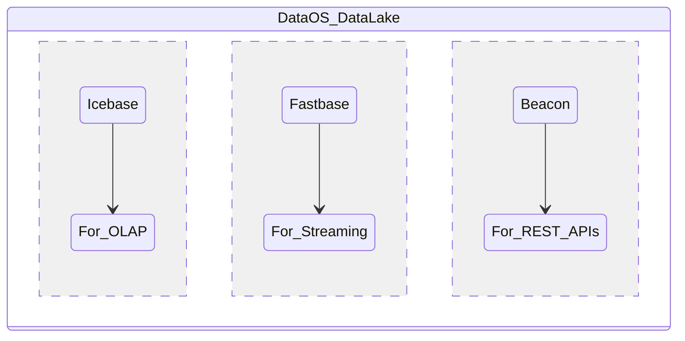

# Storage

DataOS allows you to access your data without moving it from your existing storage layers. At the same time, it provides internal storage options in line with the modern data architecture of Data Lake & Lakehouse. 

> 🗣 Conventionally, the term Data Lake implies object storage without any structure. Within DataOS, the DataOS Data Lake is a combination of depots that handles all types of data - OLAP, OLTP, and Stream data.

> The notion behind modifying the definition of a storage architecture was that the traditional Data Lake and Lakehouse, though served the cause in the case of OLAP data, failed to resolve the various use case scenario while handling stream and real-time data. This opened the way for revisiting the definition of storage architecture in a modern data enterprise.

The DataOS storage architecture consists of the DataOS Data Lake - made up of three different storage formats.

## Icebase

Icebase is a managed depot type within the DataOS backed by Apache Iceberg that implements the Lakehouse storage pattern, making interaction with OLAP data within DataOS Data Lake accessible as data warehouses. To know more about Icebase, refer to
[Icebase](Storage/Icebase.md).

## Fastbase

Fastbase is a managed depot type within the DataOS for stream data. It is backed by Apache Pulsar format. Users can create many such depots for their myriad streaming and real-time data workloads. To learn more about Fastbase, refer to
[Fastbase](Storage/Fastbase.md).

## Beacon

Beacon Stack in DataOS is used to create a service that enables access to the PostgreSQL database. It is used to expose REST APIs over datasets for data apps.To know more about Beacon, refer to
[Beacon](Data%20Apps/Beacon.md).