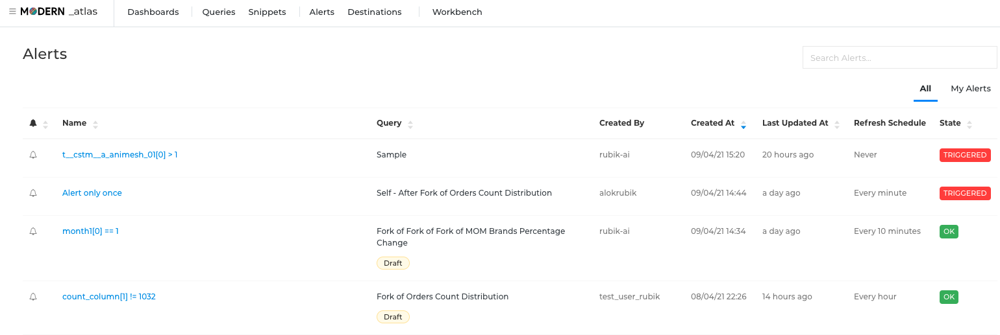

You can wish to be notified when the results of a certain query match a criterion or a set of criteria. For such cases, alerts can be generated and the notification format can be edited.

To see a list of current Alerts click 'Alerts' on the top navbar. By default, they are sorted in reverse chronological order by the Created At column. You can reorder the list by clicking the column headings.

Name shows the string name of each alert. You can change this at any time.
Created By shows the user that created this Alert.
State shows whether the Alert status is UNKNOWN, TRIGGERED, or OK.



An Alert can be added via the Queries section. Top right side menu shows 'Alerts[0]', clicking on that the user is shown his created alerts


#### Alert Notifications

Next to the setting labeled “Template”, click the dropdown and select “Custom template”. A box will appear, consisting of input fields for subject and body.

Any static content is valid, and you can also incorporate some built-in template variables:

ALERT_STATUS - The evaluated alert status (string).
ALERT_SUBJECT - The field/ column of importance (string).
ALERT_PREDICATE - The field column of reference (can be used for comparison) (string).
ALERT_OPERATOR - The alert condition operator (string).
ALERT_NAME - The alert name (string).
ALERT_URL - The alert page url (string).
QUERY_NAME - The correlated query name (string).
QUERY_URL - The correlated query page url (string).

An example subject, for instance, could be: Alert "{{ALERT_NAME}}" changed status to {{ALERT_STATUS}

```
Alert "{{ALERT_NAME}}" changed state to "{{ALERT_STATUS}}"

Query Details - 
Name: {{QUERY_NAME}}
Link: {{QUERY_URL}}

Alert Details -
Subject: {{ALERT_SUBJECT}} (calculated value was {{ALERT_SUBJECT_VALUE}})
Operator: {{ALERT_OPERATOR}}
Predicate: {{ALERT_PREDICATE}} (calculated value was {{ALERT_PREDICATE_VALUE}})

Result: {{ALERT_STATUS}}

Click here {{QUERY_URL}} to open Query's page.
```

Click the “Preview” toggle button to preview the rendered result and save your changes by clicking the “Save” button.

The preview is useful for verifying that template variables get rendered correctly. It is not an accurate representation of the eventual notification content, as each alert destinations can display notifications differently.

To return to the default Redash message templates, reselect “Default template” at any time.
