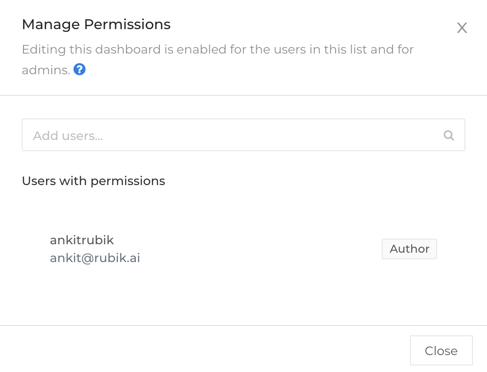

#### Manage Permissions

Any dashboard created by a user can be shared with another user, via the 'Manage Permission' option. Any user added, can edit the Dashboard i.e add/edit and delete visualizations, repanel the windows etc. However the author of the dashboard reserves the right to share the dashboard, and add other users.

