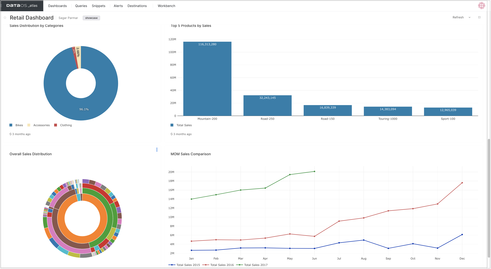
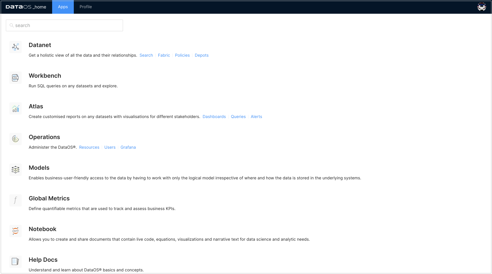
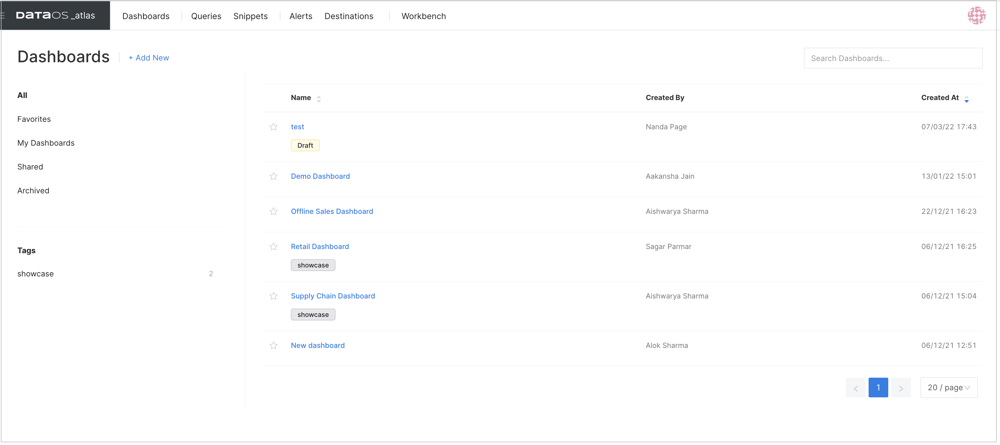

# Atlas

## Introduction

Atlas is an in-built BI solution and enables you to create customized reports/dashboards on any datasets with visualizations. The intuitive visualizations supported in DataOS help you understand complex data, and derive insights to make important decisions. Choosing the right visualization helps you represent and interpret your data effectively. You can generate reports, visualize and track key KPIs etc to make informed marketing decisions that will eventually aid in campaign optimization, enhanced conversions, etc. 

DataOS lets you supercharge your data with several other BI tools like <a href="../../integrations/tableau" target="_blank">**Tableau**</a>  or <a href="../../integrations/powerbi" target="_blank">**Power BI** </a> as well. 

## Highlights

- Create 20+ different visualization types including Sankey, Sunburst, Map Choropleth, Cohort etc. 

- Create unlimited shareable dashboards 

- One responsive dashboard for all screen sizes 

- Share your dashboard with multiple users through ‘Manage Permissions’ option or through 'Dashboards Sharing Option', you can allow public access to everyone. 

- Create deterministic alerts and send notifications to 10+ destinations including Slack, MS teams, Pager Duty etc. 

## Launching Atlas

Sign in to your DataOS instance with your username and password. On the DataOS home page, click on **Atlas**.

On the app's landing screen, dashboard names are listed along with tags, creator, and time of creation. It also lists dashboards that have been shared with you. 

