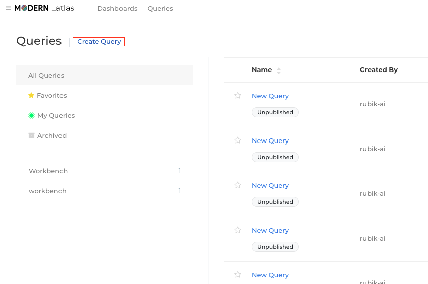
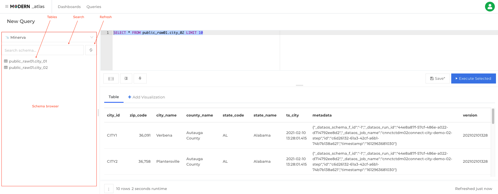
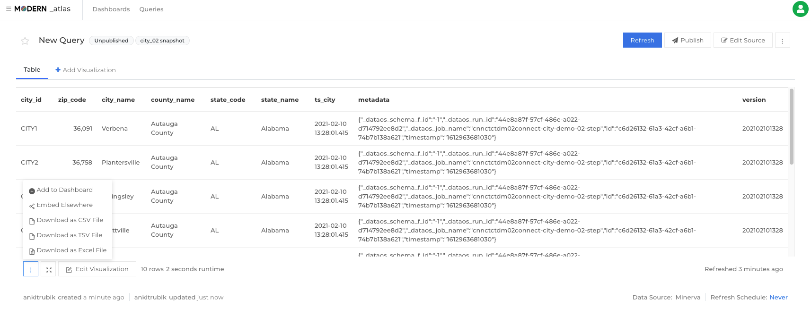

# DataOS® Atlas

### Purpose

All the ingested and processed data is not of any consequence unless it is used to derive actionable intelligence. One quick way to draw insights is via the visual depiction of patterns on the data within the target time period.
Atlas helps you connect and query your data sources, build dashboards to visualize data and share them with the stakeholders. The conventional yet powerful SQL editor combined with slick UI tools to work on visualizations help you achieve deeper understanding leading to better and more informed decisions.

### Launching Atlas

You can launch Atlas from the business section of the apps screen. The landing screen of the app has a list of previously created dashboards having dashboard names with tags, the creator name and created time.

### Querying

After navigating to the query section from the 'Queries' tab, click `Create Query` in the navbar to spawn the editor. Here you can write the required query, and see the results.

#### Keyboard Shortcuts

- Execute query: `Ctrl/Cmd + Enter`
- Save query: `Ctrl/Cmd + S`
- Toggle Auto Complete: `Ctrl + Space`
- Toggle Schema Browser: `Alt/Option + D`

#### Schema Browser

The schema browser lists all the tables and associated columns for the dataset. Search box helps speed up the filtering and picking the relevant tables and refresh button keeps the list updated. The list also periodically refreshes in the background. Double arrow at the end of the field is a shortcut to add the required table or column in the query.

#### Auto Complete

This query editor feature helps you in picking required tables/ columns from a suggestive dropdown appearing when you type. This feature, which is ON by default, can be turned off by the clicking the lightning bolt icon at the bottom of the editor pane or simply using the keyboard shortcut: `Ctrl + Space`

#### Published and Unpublished Queries

By default each query starts as an unpublished draft named New Query. It can't be included on dashboards unless it is published.

To publish a query, change its name or click the `Publish` button. You can toggle the published status by clicking the `Unpublish` button. Unpublishing a query will not remove it from dashboards. But it will prevent you from adding it to any others.

#### Archiving a query

A query cannot be deleted, however, you can archive a query. It can be archived via the vertical ellipses menu at the top-right corner of the query editor. An archived query can only be accessed via direct links.

#### Duplicating (forking) a Query

If you need to create a copy of an existing query (created by you or someone else), you can fork it. To fork a query, just click on the Fork button.

#### Query results

Visit any query page and click the vertical ellipsis (`⋮`) button beneath the results pane. Then choose to download a CSV, TSV, or Excel file. This action downloads the current query result.
