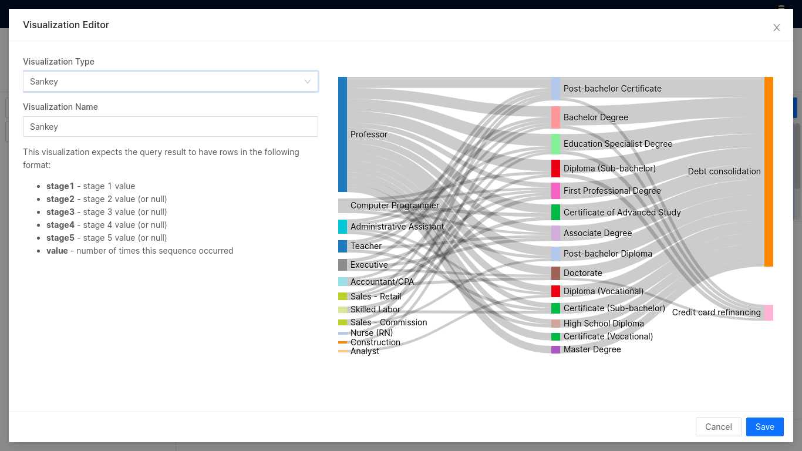

# Sankey

Sankey diagrams are a type of flow diagram used to depict relationships from one set of values to another. The things being connected are called `nodes` and the connections are called `links`. The width of the links is proportional to the flow rate. Sankeys are best used when you want to show a many-to-many mapping between two domains (e.g., universities and majors) or multiple paths through a set of stages (for instance, Google Analytics uses sankeys to show how traffic flows from pages to other pages on your web site). They emphasize the major transfers or flows within a system and help locate the most important contributions to a flow. 

## Example query

```sql
SELECT
  profession  AS e1,
  educational_qualification AS e2,
  loan_type AS e3,
  count(customer_id) AS value
FROM icebase.fibo.raw_fibo_data
WHERE profession!='Other' or not null
GROUP BY
  1,
  2,
  3
ORDER BY
  4 DESC
  
```

To generate the chart, you have to write the query in a specific pattern. 

- Stage 1 Value: `e1 (profession)` in the example
- Stage 2 Value: `e2 (educational_qualification)` in the example
- Stage 3 Value: `e3 (loan_type)` in the example
- Value: `value (count of customer_id)` in the example

Here the aliases should always be named like such shown in the query, and there should be at least 2 stages to generate a Sankey diagram. It determines the count of 'Stage 1 - Stage 2 - Stage 3 - (and so on)' pattern.


The results of the above query have been exported to Atlas and plotted into a Sankey diagram as follows.



This is how the Sankey diagram will look like:


The thickness of links shows the specific weight associated with it. Hovering over any of the links highlights the connection/ relation between nodes.