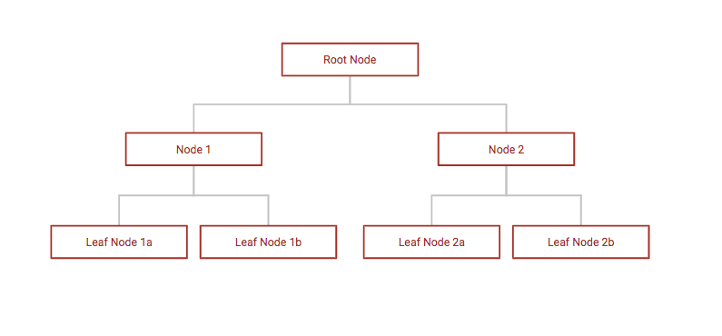
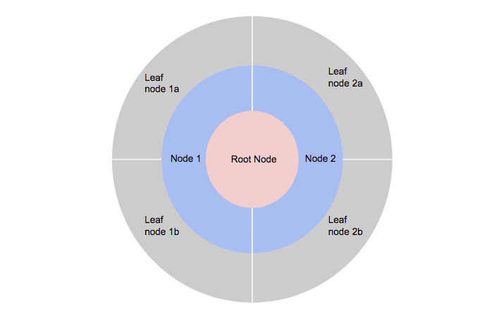
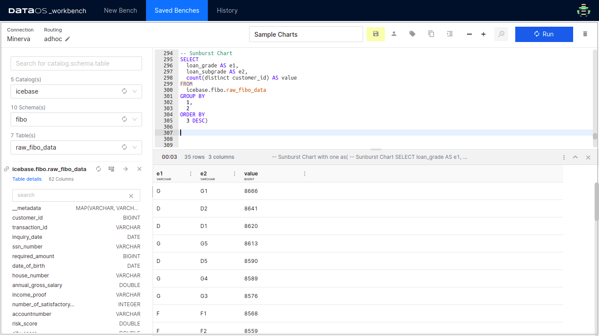
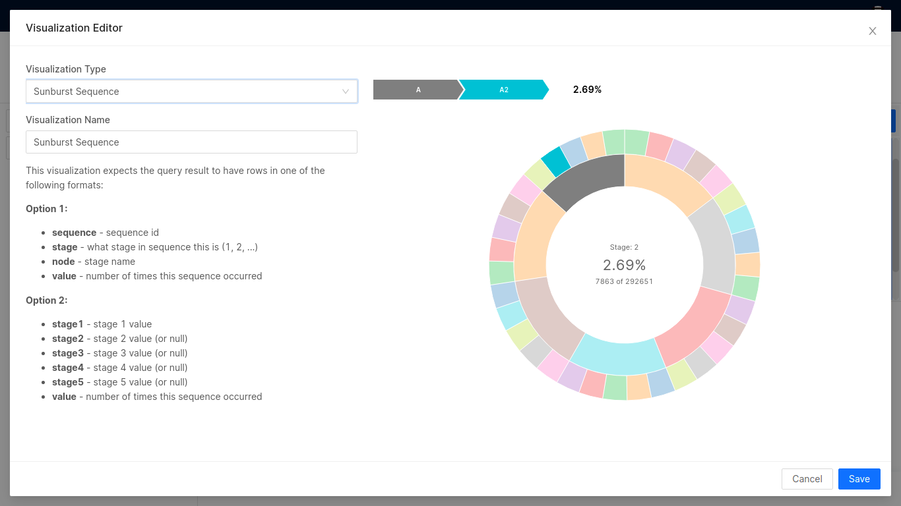
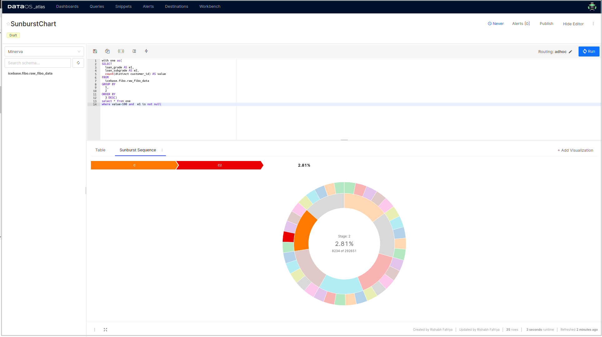

# Sunburst

The sunburst chart is ideal for displaying hierarchical data. Each level of the hierarchy is represented by one ring or circle with the innermost circle as the top of the hierarchy. A sunburst chart without any hierarchical data (one level of categories), looks similar to a doughnut chart.

Consider the following tree:



This is portrayed in the following form using the sunburst chart:




Rings are sliced up and divided based on their hierarchical relationship to the parent slice. The angle of each slice is either divided equally under its parent node or can be made proportional to a value.

## Example query

```sql
SELECT
  loan_grade AS e1,
  loan_subgrade AS e2,
  count(distinct customer_id) AS value
FROM
  icebase.fibo.raw_fibo_data
GROUP BY
  1,
  2
ORDER BY
  3 DESC
```

To generate the Sunburst chart, you have to write the query in a specific pattern. 

- Stage 1 Value: `e1 (loan_grade)` in the example
- Stage 2 Value: `e2 (loan_subgrade)` in the example
- Value: `value (count of customer_id)` in the example

 Here the aliases (e1, e2 and value) should always be named like such shown in the query. There should be at least two stages to generate a Sunburst chart (a Sunburst chart with only one stage is a pie chart).  It determines the number of time 'Stage 1 - Stage 2 - Stage 3 - (and so on)' pattern is repeated.

Here 'e1' or the loan_grade is the top of the hierarchy. The flow depicted here is as follows:


The results of the above query have been exported to Atlas and plotted into a Sunburst chart as follows.

 

This is how the Sunburst chart will look like:

