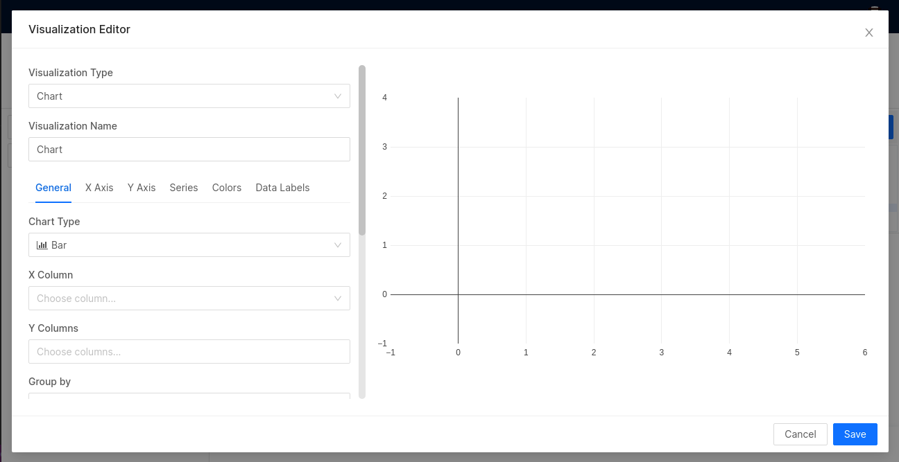
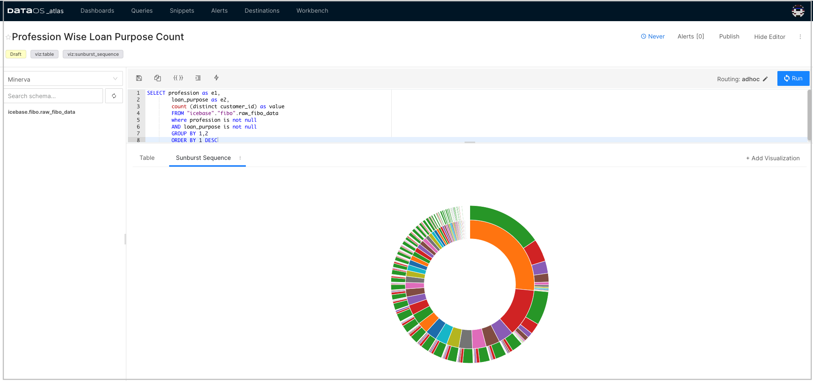

# Tutorial

This tutorial demonstrates the steps to create and add visualizations charts like Sankey, Sunburst, Treemap, Bar, etc., to an existing/new Dashboard. A dashboard is a collection of different visualization charts that help you to track KPIs and get your insights at a glance. 

When you have explored and gathered all the necessary data with appropriate queries, you can start using Atlas to create visualizations on top of that data. 

## Create query

1. Sign in to your DataOS instance with your username and password. On the DataOS home page, click on **Workbench**. 

2. The SQL query interface will be open. Select Catalogs, Schema and Table where your data is present.  
     For Ex:  
     - Catalog: icebase 
     - Schema: fibo 
     - Table: raw_fibo_data 

3. Write the query to explore your data. You can write complex SQL  queries that will be helpful to showcase some  important KPI from the data. The output of SQL query will be displayed as shown below. 

## Export query
The next step to creating dashboards is to export your query from workbench to Atlas.

1. Click on the three dots present just above the output data table. In the pop-up, select  Atlas option. 

2. Provide the name for the query and then export it.

## Add visualization to dashboard
Once you have exported your query, a new tab in your browser will open.

1. You can add chart using the visualization editor, click on **+Add Visualization** tab.

2. A pop-up appears on the screen. Select the right visualization type for your data from the drop-down and provide its name. 

3. Based on the visualization type, provide additional inputs (if required) for rendering the chart. These inputs will vary according to the selected visualization type. Click on **Save**. 

you can see the created visualization under **Queries** tab.
 
4. Click on the three dots present next to  the chart tab. In the pop-up, click on **Add to Dashboard**. 

5. Choose the one from the existing/available dashboards where you wish to add the chart /visualization and then click on **Ok**. 

6. To see the added chart/visualization, goto **Dashboards** tab and click on your dashboard.

> :material-alert: **Note**: You can create a new dashboard from the **Dashboards** tab. Click on the **+ Add New**  and give it a name. Then Goto **Queries** tab and follow 4-6 steps in the above section to add your visualization to the newly created dashboard.
 