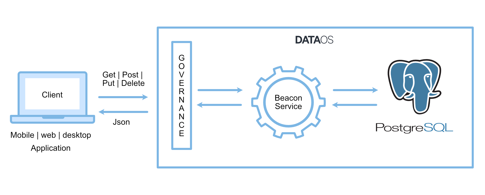

# Introduction

Beacon stack in DataOS is used to create a service that enables you to access the PostgreSQL database. PostgreSQL REST API connection allows web and application platforms to utilize PostgreSQL as a destination. 

Through the Beacon stack, REST API is exposed to provide an interface for seamless and secure usage of PostgreSQL with the client applications.

You can create a Beacon service using declarative YAML and you do not need to write extra code to enable database access. You can also   enforce governance policies for secure access to PostgreSQL data. For example, using policies, you can restrict users to perform Delete/Update operations and allow only reading the data. 

Beacon services are also built to scale. As per the data growth, you can create required number of replicas for the service.

Once you create the Beacon service, you can perform the following operations:

### CRUD Operations

- **Create** — HTTP POST method to create a resource in a REST environment 
- **Read** — GET method to read a resource
- **Update** — PUT method to update a resource 
- **Delete** — DELETE method To remove a resource from the system 

### Other Capabilities
- **Search**- Full-Text Search on the data stored in PostgreSQL
- **Filtering**- Filter result rows by adding conditions on columns
- **Rename**- Rename the columns 

*To understand more about the PostgreSQL API options, refer <a href="https://postgrest.org/en/stable/api.html" target="_blank">PostgREST </a>*.

