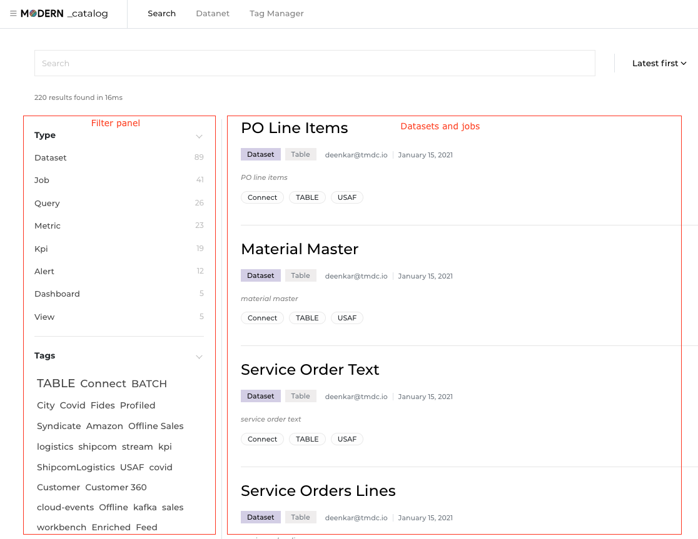
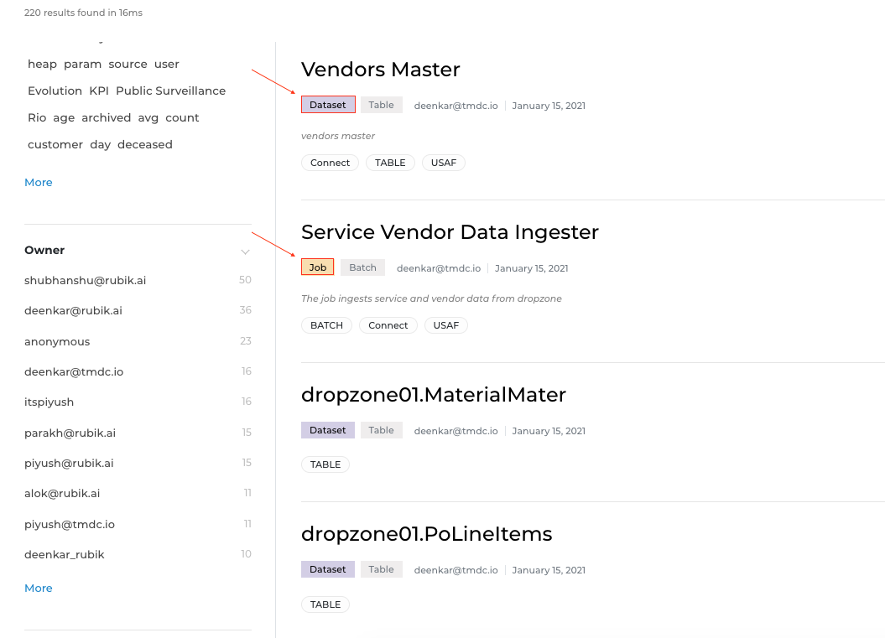
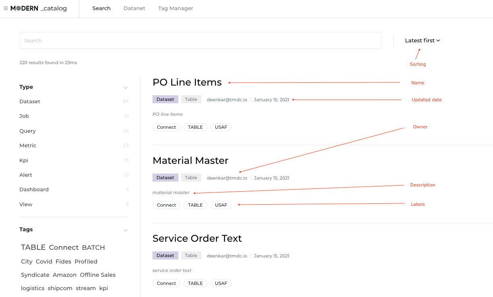
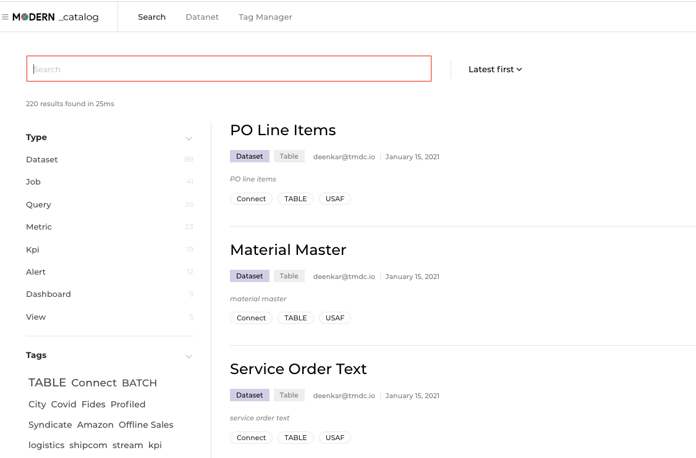

# DataOS® Catalog
## Introduction
### Purpose

The purpose of the Catalog is to help you easily find data within DataOS, to understand the events that have affected the data and to understand the quality of the data.

When you first enter the Catalog screen, you see a search panel on the left side and a list of data sets and jobs on the right side.  The list on the right side includes all of the data sets in DataOS and all of the jobs that were run against those data sets.  When you have found a data set or job that you are interested in, clicking on the Name will drill into that data set or job and provide lots of detailed information.

### Data Sets and Jobs Panel

The list panel on the right side of the page displays all of the data sets in DataOS and all of the jobs that were run on the data sets.  The list can contain as many as two types of items.  The identifiers for these two types are:

- Dataset
- Job

**Dataset** - Dataset is the identifier given to a dataset that has been run through some kind of processing in a DataOS® job (for example, transformations, corrections, etc.). These jobs are usually designed to improve the usability of the data. Post-processing it is usually the case that some or much of the data is not exactly the same as it was in the original source.

**Job** - Job is the identifier given to any DataOS® job i.e data ingestion, data processing, etc.

**Sorting** - The list can be sorted using this pulldown menu.

**Name** - This is the name of the dataset or job.  This value is originally given to it by the user who created it.  Clicking on the name field will drill into detail screens where this name can be edited.

**Description** - This is the description given to the dataset or job.  This value is originally given to it by the user who created it.  It can be modified at any time.

**Updated Date** - This is the last updated date of either the record metadata or the data in the dataset.

**Owner** - This is the owner that was assigned to the data set or job.  This value can be edited by a user and is separate from the Created By value.

**Labels** - Labels can be added to datasets, jobs and columns in the dictionary after the data has been ingested by DataOS®. These labels can be used when searching for specific data sets and when creating workflows.

### Filter Panel

The filter panel on the left side of the page is used to search for and quickly find data sets or jobs that you are interested in. There are five sections in the filter panel that provide different features for narrowing your search. All searches are not case sensitive unless you put the search word or words in single quotes. This is explained in more detail in the Exact Match section below.

#### Advanced Search

At the top of the search panel there is a data entry field where you can enter text to search for data sets and jobs. This field acts similar to the search field in Google.  You simply enter text, hit enter and the results of your search are displayed on the right.

There are functions that you can use in your search to create more complex queries.

- Exact Match
- And
- Or
- Exclude
- Wildcard

**Exact Match** - To return data sets and jobs that have an exact word or phrase in them, put single quotes around the word or phrase, for example, ‘customer 360’.  This will return data sets or jobs that contain the exact phrase and it will prevent data sets or jobs with similar words or close matches from being returned (known as fuzzy matching).

**And** - By default, multiple search words are ANDed together without using any special syntax or functions.  Searching for customer transactions will return data sets or jobs that have both the words “customer” and “transactions” in them.  However, there are times when you would want to specifically use the AND function, like when combining functions in a search, for example, customer AND (transactions OR txn).  Both the ampersand symbol “&” and the word AND perform the same function.  The AND function does not need to be uppercase.  It is only used here to distinguish the function from the other text.

**Or** - Both the pipe symbol “|” and the word OR perform the OR function between words.  Searching for transactions OR txn or alternatively for transactions | txn will return data sets and jobs that contain the word “transactions” or “txn”.

**Exclusion** - A dash or minus sign “-” can be used to return data sets or jobs that do not contain a word, for example, customer -transactions.  This search will return data sets or jobs that contain the word “customer” and not the word “transactions”.

**Wildcard** - A colon followed by an asterisk '\*' can be used at the end of a word as a wildcard character to find words beginning with the text entered.  Searching for Custom:* will return data sets or jobs that contain words including “Custom”, “Customer”, “Customers”, etc.

#### Type

You may only want to search for data sets or you may only want to search for jobs.  To include or exclude either one, you simply select or deselect their respective checkboxes under the “Type” heading.

Selecting “DATA” will display all data sets. Deselesting “DATA” will prevent data sets from being displayed in the list panel.  Selecting “JOB” will display jobs.  Deselecting “JOB” will prevent jobs from being displayed in the list panel.  These types are not user definable.