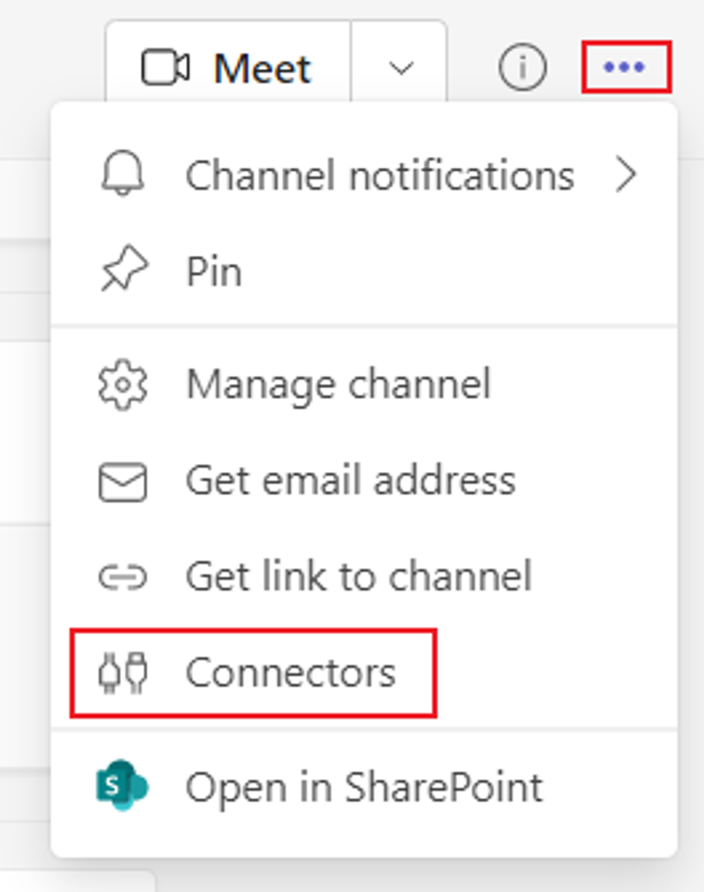
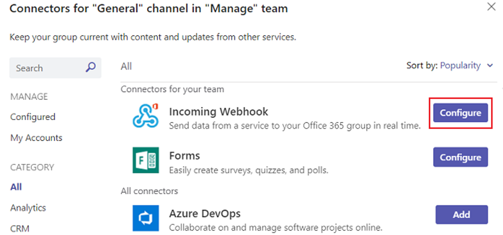
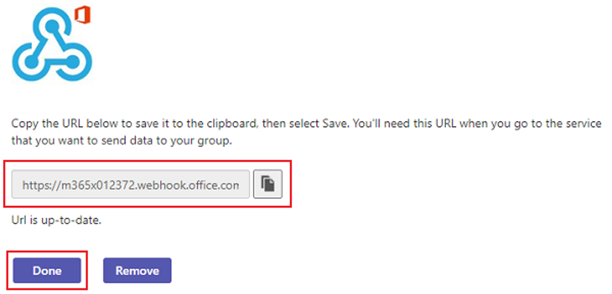

# Create Incoming Webhooks in MS Teams

This document outlines the steps to add an Incoming Webhook to a Teams channel.

## Step 1: Open the Connectors Option

Open the channel in which you want to add the webhook and select ••• from the upper-right corner. Select **Connectors** from the dropdown menu.

Connectors Option in MS Teams

## Step 2: Configure Incoming Webhook

Search for **Incoming Webhook** and select **Add**. Select **Configure**, provide a name, and upload an image for your webhook if necessary.

Search for Incoming Webhook

## Step 3: Copy the Webhook URL

Copy and save the unique webhook URL present in the dialog. The URL maps to the channel and you can use it to send information to Teams. Select **Done**.

Copy the Webhook URL

The webhook is now available in the Teams channel. You can create and send actionable messages or alerts through Incoming Webhook or connector.