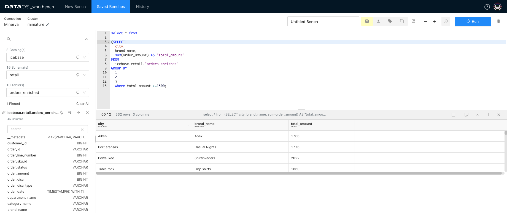
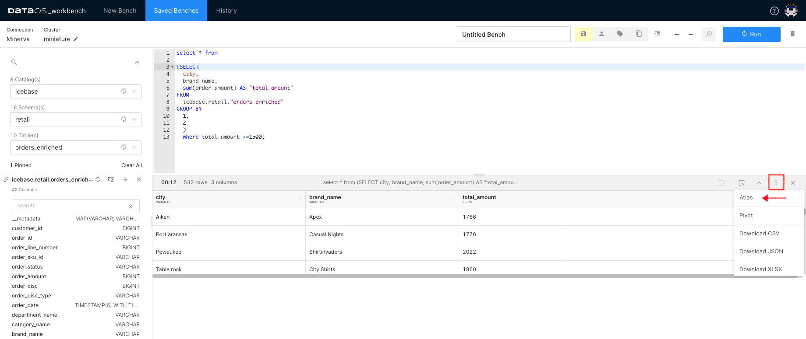
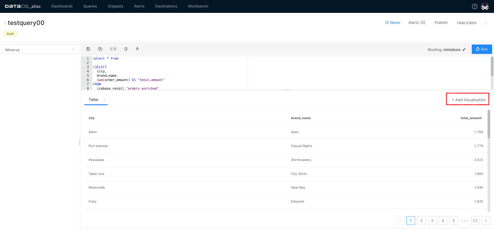
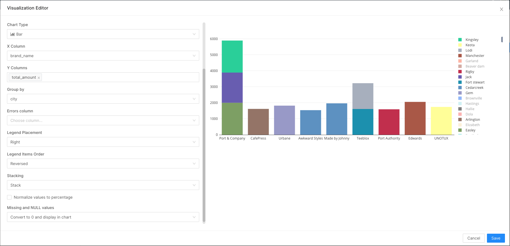
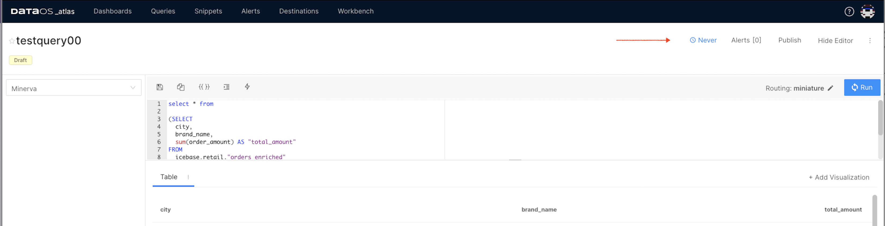
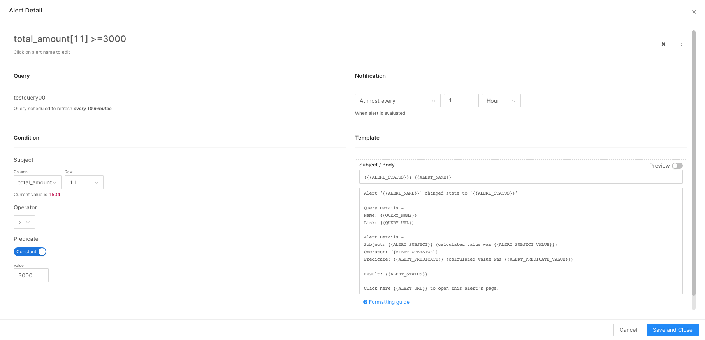
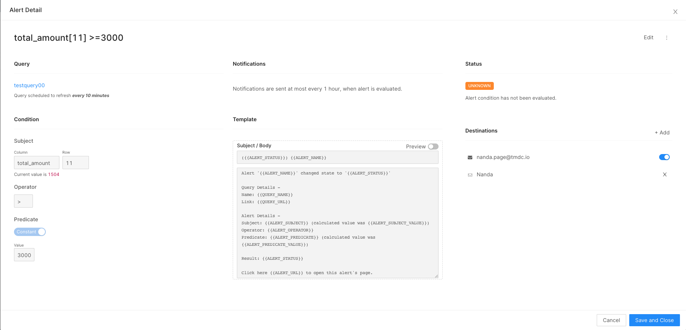
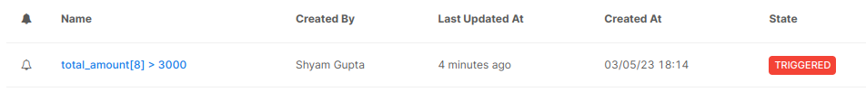
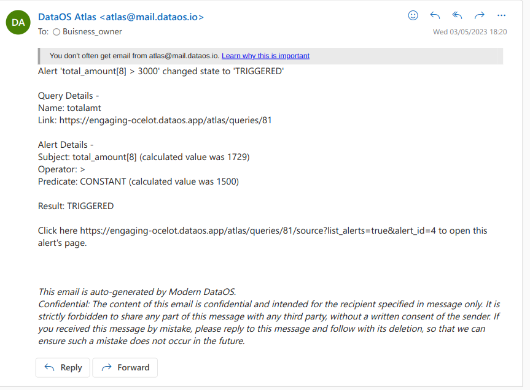

# Setting Up Dashboard Alerts

This guide will walk you through the process of creating custom dashboard alerts. To stay updated with daily metrics such as sales, stock, revenue, orders, and operating costs. DataOS provides numerous alert options, including Email, Slack, Webhook, Mattermost, Chatworks, and Pagerduty.

## Step 1: Query from Workbench

From the DataOS home page, navigate to the Workbench. Select the appropriate Catalog, Schema, and Table. Then, write an SQL query to extract the data you want to display on your dashboard.

<figcaption align = "center">Query and its result  </figcaption>

## Step 2: Export to Atlas

Once you've obtained the required output from the SQL query, click on the ellipsis (three dots) to export your results to Atlas. Assign a name to your query, and the query and its results will be displayed on the Atlas UI.

<figcaption align = "center">'Atlas' option to export the query</figcaption>

## Step 3: Add Visualization

Once you have exported your query, a new tab in your browser will open, as shown below. On Atlas UI, you can add a chart using the visualization editor. Click on the +Add Visualization tab.
Click on the '+Add Visualization' button.

<figcaption align = "center">Adding visualization  </figcaption>

Edit the visualization as needed and save your changes.

<figcaption align = "center">Editing and saving visualization  </figcaption>

## Step 4: Create Alerts

To set up alerts, select the interval at which you want to be alerted and click 'Alerts'.

<figcaption align = "center">Creating alert  </figcaption>

Customize the alert settings as per your requirements and click 'Next'. You can now select the individuals to be notified.

<figcaption align = "center"> Threshold condition and message for alert</figcaption>

In the following screen, add the destinations for your alerts and further customize them as needed.

<figcaption align = "center">Adding destinations  </figcaption>

The system will check the conditions at fixed intervals. If any conditions are met, the query status will be set to 'TRIGGERED', and the designated contacts will be alerted.

<figcaption align = "center">Alert triggered when condition met  </figcaption>

## Alert Example

By following these steps, you have successfully set up customized alerts for your dashboard. These alerts will ensure you and your team are promptly informed when important changes occur, allowing for immediate action.

<figcaption align = "center">Alert example  </figcaption>
 