# Setting up Kubernetes Alerts

Kubernetes, with its dynamic and distributed nature, relies on events to communicate changes, errors, or important occurrences within the cluster. These events provide critical insights and serve as triggers for alerting mechanisms ensuring timely responses to issues and maintaining the health of clusters.   

DataOS utilizes Kubernetes events for robust system monitoring. It tracks event volumes and details over time to establish precise alerts. This approach ensures prompt problem detection and resolution.

The following are the examples of Kubernetes actionable events that could trigger alerts and generate notification.

## Kube CPU Throttling High

The *Kube CPU Throttling High* alert is an informational warning that indicates an increase in CPU throttling for certain processes within a Kubernetes cluster. Here's how the alert notification looks:

**Alert Notification**

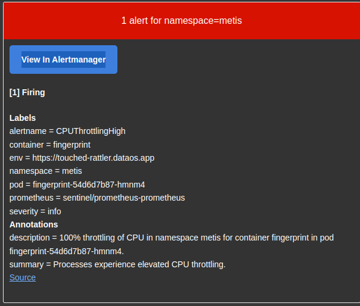

<i>CPU throttling increases for certain processes </i>

### **Impact**

This alert is primarily informational and may be disregarded if no other issues are affecting the application.

### **Diagnosis**

- Verify that the application is functioning properly
- Ensure that CPU resource allocations align with application usage
- Examine the node's kernel version

### **Mitigation**

By default, kube-prometheus suppresses this alert, which will only be transmitted if another alert from the same namespace is active.
<aside class="callout">🗣 Users should avoid raising CPU limits unless the application exhibits erratic behavior (triggered by another alert).</aside>

**In conjunction with other alerts**:

Allocate more CPU limits to a specific container within the pod while maintaining the same requests.

In certain instances, an outdated kernel on a Kubernetes node may cause problems with CPU resource allocation to processes [refer here](https://github.com/kubernetes/kubernetes/issues/67577).

In specific situations, ensure the use of CPU Pinning and isolation – in essence, provide the container with complete CPU cores. Additionally, update the application to be aware of its cgroup environment or explicitly define the number of CPUs it can utilize, or limit the number of threads.

## Kube Pod Crash Looping

The *Kube Pod Crash Looping alert* serves as an important notification for Kubernetes administrators, highlighting a recurring issue with a Pod that is crashing or becoming unresponsive, prompting Kubernetes to restart it automatically. 

**Alert Notification**

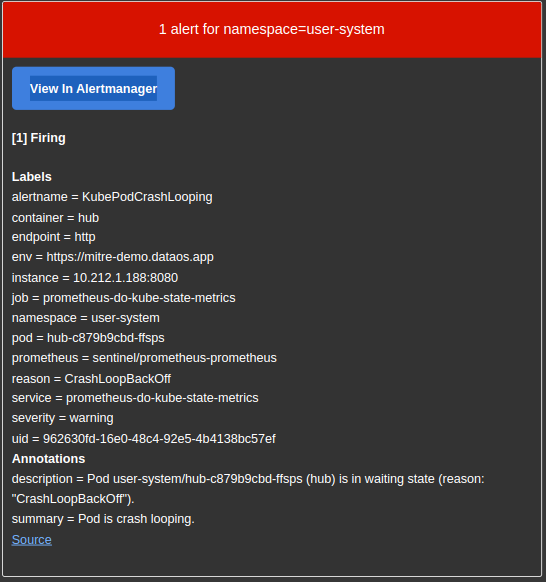

<i>Kube Pod Crash Looping</i>

### **Impact**

The consequences of a CrashLoop include service degradation or unavailability, inability to perform rolling upgrades, and failure of certain applications to execute required tasks, such as data migrations.

### **Troubleshooting**

1. Examine the template by running:

    ```bash
    kubectl -n $NAMESPACE get pod $POD.
    ```
2. Review pod events with:

    ```bash
    kubectl -n $NAMESPACE describe pod $POD.
    ```
3. Inspect pod logs using:

    ```bash
    kubectl -n $NAMESPACE logs $POD -c $CONTAINER
    ```
4. Analyze pod template parameters, such as:
    - Pod priority
    - Resources - the pod may attempt to utilize an unavailable resource, like a GPU, when only a limited number of nodes offer this resource
    - Readiness and liveness probes might be incorrect - verify the port or command, and ensure that the check does not fail too quickly due to a short response timeout

Additional factors to consider:

- Slow application response time due to resource constraints, such as insufficient memory or CPU, especially during startup
- The application waiting for other services to start, like a database
- Misconfiguration that leads to application crashes on startup
- Absence of necessary files, such as configmaps, secrets, or volumes
- Read-only filesystem
- Inappropriate user permissions within the container
- Insufficient container capabilities (securityContext)
- The application being executed in an unexpected directory (e.g., the WORKDIR from the Dockerfile not being used in OpenShift)

### **Resolution**

Consult with developers or review application documentation to ensure appropriate default values are defined for starting the application.

## Aggregated API Down

The *Aggregated API Down* alert is a crucial notification that signifies issues with the availability of the Kubernetes Aggregated API, which plays a vital role in managing and orchestrating cluster resources.  this alert is activated when the monitoring system is unable to reach any Kubernetes API servers for a duration exceeding 15 minutes.

**Alert Notification**

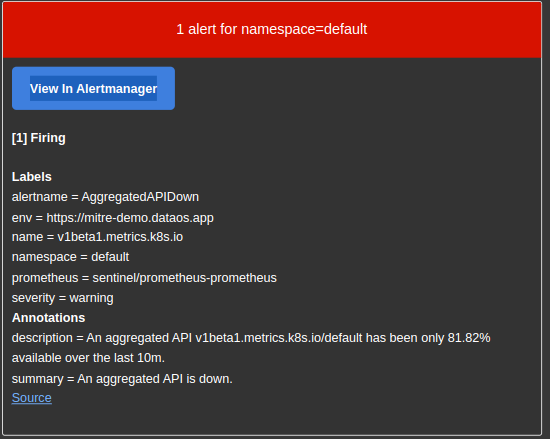

<i>Aggregated API Down</i>


### **Impact**

This critical alert indicates that the Kubernetes API is unresponsive, potentially causing the cluster to be partially or entirely non-functional.

Applications that do not directly rely on the Kubernetes API will continue to operate. However, modifying Kubernetes resources within the cluster will be impossible.

Services that directly utilize the Kubernetes API may start to exhibit unpredictable behavior.

### **Remediation**

1. Examine the status of the API server targets within the Prometheus user interface.
2. Verify if the API remains unresponsive by executing the following command:

    ```bash
    kubectl cluster-info
    ```

1. If the API server is accessible, there could be a network issue between the Prometheus instances and the API server pods. Inspect the status of the API server pods by running:

    ```bash
    kubectl -n kube-system get pods
    ```

1. Examine the logs of the API server pods with the following command:

    ```bash
    kubectl -n kube-system logs -l 'component=kube-apiserver'
    ```

1. Investigate the following aspects for potential issues:
    - Node networking
    - Node firewall settings
    - Kube-proxy logs
    - NetworkPolicies, ensuring that Prometheus and the Kubernetes API are not inadvertently filtered out

## Kube Pod Not Ready

The *Kube Pod Not Ready* alert is triggered when a pod in a Kubernetes cluster remains in a non-ready state for more than 15 minutes. This can occur due to various issues, such as failed readiness probes, pending pod creation for a specific namespace and node, or other underlying problems. The alert aims to notify operators about potential service degradation or unavailability, as the affected pod is not connected to the service and will not receive traffic.

For more information on pod failure to reach the ready state, see the [pod lifecycle](https://kubernetes.io/docs/concepts/workloads/pods/pod-lifecycle/) documentation.

**Alert Notification**

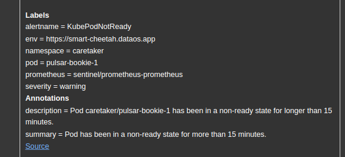

<i>Kube Pod Not Ready</i>

### **Impact**

This issue can lead to service degradation or unavailability, as the pod is not connected to the service and will not receive traffic.

### **Diagnosis**

To diagnose the issue, follow these steps:

1. Examine the pod template using the following command:

    ```bash
    kubectl -n $NAMESPACE get pod $POD.
    ```

1. Review the pod events with this command:

    ```bash
    kubectl -n $NAMESPACE describe pod $POD.
    ```

1. Access the pod logs using:

    ```bash
    kubectl -n $NAMESPACE logs $POD -c $CONTAINER
    ```

1. Investigate the pod template parameters, such as:
    - Pod priority
    - Resources (the pod may be attempting to utilize unavailable resources, such as a GPU with limited node availability)
    - Readiness and liveness probes (these may be incorrect due to wrong port, command, or a too-short response timeout)
    - Stuck or long-running init containers

Additional factors to consider:

- Slow application response due to resource constraints (e.g., insufficient memory or CPU at startup)
- Application waiting for other services to start (e.g., a database)
- Misconfiguration causing application crashes at startup
- Missing files (e.g., configmaps, secrets, or volumes)
- Read-only filesystem
- Incorrect user permissions within the container
- Absence of special container capabilities (securityContext)
- Application executed in an unexpected directory (e.g., a WORKDIR from a Dockerfile not used in OpenShift)

### **Mitigation**

Consult with developers or review the application documentation to ensure proper default values for starting the app.

## Kube Container Waiting

This Kube Container Waiting Alert occurs when a container within a Kubernetes pod experiences an extended period in the Waiting state, indicating potential issues with the deployment or underlying resources. Prolonged waiting periods can impact the overall performance and availability of services, making it crucial to identify and resolve the underlying causes.

**Alert Notification**

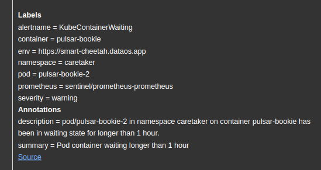

<i>Kube Container Waiting</i>


### **Impact**

This may result in service degradation or unavailability.

### **Troubleshooting**

1. Examine pod events by executing the following command:

```bash
kubectl -n $NAMESPACE describe pod $POD
```

1. Review pod logs with the following command:

```bash
kubectl -n $NAMESPACE logs $POD -c $CONTAINER
```

1. Inspect for missing components, such as configuration maps, secrets, or volumes.
2. Assess pod requests, particularly unique ones, like GPU.
3. Investigate node taints and capabilities.

### **Resolution**

Refer to the [Container Waiting](https://kubernetes.io/docs/tasks/debug-application-cluster/debug-application/#my-pod-stays-waiting) section of the Kubernetes documentation for further guidance.

## Kube CPU Over Commit

The *Kube CPU Over Commit* alert occurs when a Kubernetes cluster's CPU resource requests for Pods surpass its capacity, resulting in an overcommitted state. This situation renders the cluster vulnerable to node failure, as it would be unable to accommodate some Pods within the remaining nodes, causing them to enter a `Pending` state. Proper diagnosis and remediation measures are crucial for maintaining optimal cluster performance and ensuring that critical services remain operational even in the event of node failure. 

**Alert Notification**


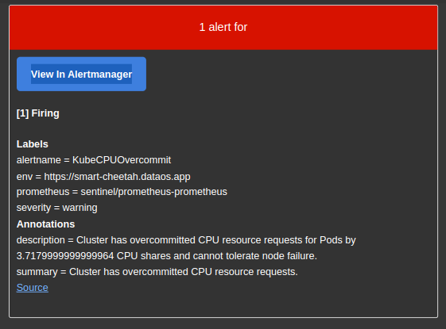

<i>Kube CPU Over Commit</i>


### **Consequences**

The cluster is unable to tolerate node failure. Should a node fail, some Pods will enter a `Pending` state.

### **Diagnosis**

- Verify if the CPU resource requests align with application usage
- Ensure that some nodes are available and not cordoned off
- Investigate any issues with the cluster-autoscaler's ability to add new nodes

### **Remediation**

- Increase the number of nodes in the cluster - it is generally preferable to have a higher number of smaller nodes rather than a few larger ones.
- Introduce various node pools with different instance types to circumvent issues that may arise from relying solely on one instance type in the cloud.
- Implement pod priorities to safeguard critical services from performance degradation; refer to [pod priority and preemption](https://kubernetes.io/docs/concepts/scheduling-eviction/pod-priority-preemption/).
- Optimize settings for specific Pods used in conjunction with the [cluster-autoscaler](https://github.com/kubernetes/autoscaler/blob/master/cluster-autoscaler/FAQ.md#how-does-cluster-autoscaler-work-with-pod-priority-and-preemption).
- Conduct performance tests based on expected workloads and plan cluster capacity accordingly.

## Kube StatefulSet Generation Mismatch

The *Kube Statefulset Generation Mismatch* alert occurs when there is a discrepancy in StatefulSet generation, potentially due to a rollback. This discrepancy can lead to service degradation or unavailability, negatively impacting the performance of your Kubernetes cluster. Identifying, diagnosing, and resolving such issues is crucial for maintaining efficient and reliable operations.

**Alert Notification**


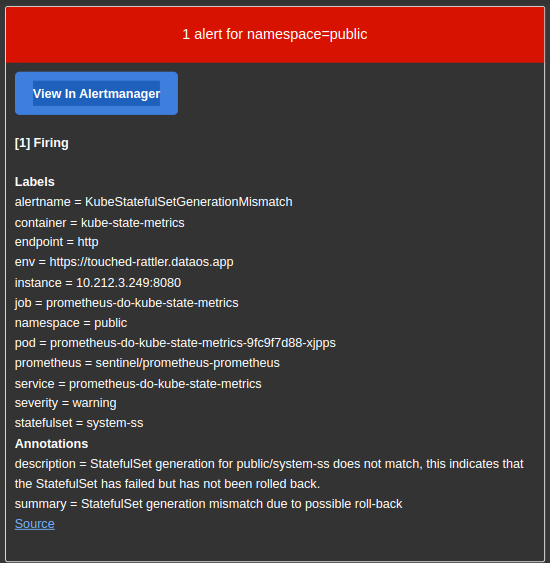

<i>Kube StatefulSet Generation Mismatch</i>


### **Consequences**

This can lead to a reduction in service quality or complete unavailability.

### **Troubleshooting**

Refer to the [Kubernetes Documentation - Failed Deployment](https://kubernetes.io/docs/concepts/workloads/controllers/deployment/#failed-deployment), which can also be applied to StatefulSets to a certain extent:

- Examine the rollout history:

```bash
kubectl -n $NAMESPACE rollout history statefulset $NAME
```

- Verify the rollout status, ensuring it is not paused.
- Review the deployment status using:

```bash
kubectl -n $NAMESPACE describe statefulset $NAME
```

- Determine the number of declared replicas.
- Investigate whether new pods are crashing.
- Assess any issues with PersistentVolumes associated with StatefulSets.
- Evaluate the status of pods belonging to the replica sets within the deployment.
- Analyze pod template parameters, including:
    - Pod priority - determine if it was evicted by higher-priority pods.
    - Resources - ensure it is not attempting to use unavailable resources, such as a limited number of nodes with GPUs.
    - Affinity rules - check if a lack of available nodes due to affinities prevents pod scheduling.
    - Pod termination grace period - verify if an excessively long period causes pods to remain in the terminating state.
- Inspect whether the Horizontal Pod Autoscaler (HPA) is activated due to untested values (request values).
- Confirm that the cluster-autoscaler can create new nodes by reviewing its logs or the cluster-autoscaler status ConfigMap.

### **Remediation**

StatefulSets have unique characteristics and often employ specialized scripts for pod termination. Investigate whether specific commands, such as data migration, are executed, as they may substantially slow down the process.

If scaling out, adding new nodes typically resolves the issue.

Alternatively, the StatefulSet definition may require adjustments.

In rare instances, it may be necessary to roll back to a previous version. Consult the [Kubernetes Documentation - Rolling Back](https://kubernetes.io/docs/concepts/workloads/controllers/statefulset/#rolling-updates).

In extremely rare cases, deleting problematic pods may be the best course of action.

## Kube Quota Fully Used

The *Kube Quota Fully Used* alert occurs when the cluster's resource utilization within a specific namespace reaches its permitted limits. When this happens, the deployment of new applications might be hindered, affecting the overall performance and functionality of the system. To address this issue, it is crucial to investigate resource consumption, adjust quotas, optimize resource utilization, and follow standard capacity planning procedures as outlined in the page below.

**Alert Notification**


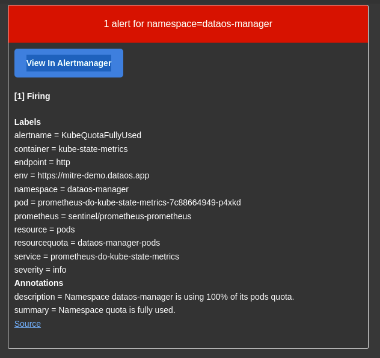

<i>Kube Quota Fully Used</i>

**Consequence**

Installation of new applications might be hindered.

### **Investigation**

- Examine the resource consumption for the specified namespace within the given time frame.

### **Resolution**

- Evaluate the current quota for the specified namespace and make appropriate adjustments.
- Assess the resources governed by the quota and optimize their utilization.
- Proceed with standard capacity planning processes.
- Refer to [Resource Quotas](https://kubernetes.io/docs/concepts/policy/resource-quotas/) for more information.

## Kube Persistent Volume Filling Up

When a volume in a Kubernetes cluster begins to fill up, it can create performance and stability issues for the services and applications that rely on it. The *Kube Persistent Volume Filling Up* alert occurs when a volume approaches its capacity, potentially causing service degradation, read-only mode activation, or even data loss.  A variety of factors, such as increased application usage, data retention, and misconfiguration, can contribute to a volume filling up. To prevent service degradation or switching to read-only mode, it is essential to identify and implement appropriate mitigation strategies, ensuring that the volume usage remains within acceptable limits and that the overall infrastructure continues to operate efficiently.

**Alert Notification**


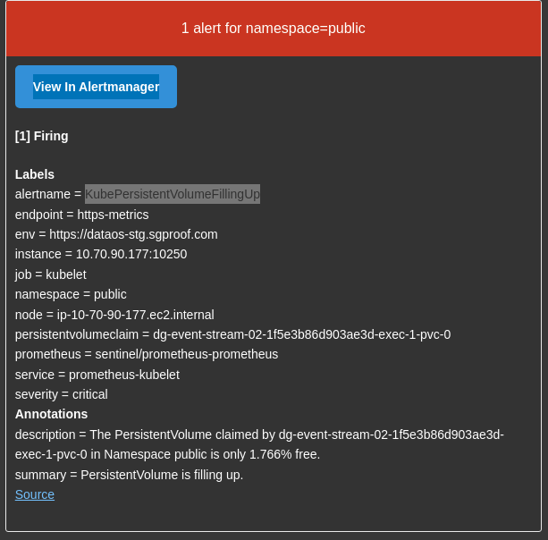

<i>Kube Persistent Volume Filling Up</i>

### **Consequences**

Filling up a volume may lead to service degradation and potentially a switch to read-only mode.

### **Identifying the Problem**

Examine application usage over time and check for configurations such as snapshotting or automatic data retention.

### **Solutions**


**Data Retention**

The quickest and most cost-effective solution is to delete unneeded data. Consult the service owner to determine if specific old data can be removed. If possible, enable data retention, especially for snapshots.


**Data Export**

If the data is not required within the service but needs to be processed later, transfer it to an external location, such as an S3 bucket.


**Cluster Data Rebalancing**

Some services automatically rebalance data within a cluster when a node fills up. This may involve redistributing data across existing nodes or adding new nodes. If supported, increase the number of replicas and either wait for data migration or initiate it manually.

Examples of services that support this feature include:

- Cassandra
- Ceph
- Elasticsearch/OpenSearch
- Gluster
- Hadoop
- Kafka
- MinIO

<aside class="callout">🗣 Some services may necessitate specific scaling conditions, such as doubling the number of existing nodes.</aside>


**Direct Volume Resizing**

If volume resizing is an option, simply increase the volume capacity. To check if volume expansion is available, run the following command with your namespace and PVC-name replaced:

```bash
kubectl get storageclass `kubectl -n <my-namespace> get pvc <my-pvc> -ojson | jq -r '.spec.storageClassName'`

NAME                 PROVISIONER            RECLAIMPOLICY   VOLUMEBINDINGMODE   ALLOWVOLUMEEXPANSION   AGE
standard (default)   kubernetes.io/gce-pd   Delete          Immediate           true                   28d
```

If `ALLOWVOLUMEEXPANSION` is true, you can utilize this feature. To resize the volume, run:

```bash
kubectl -n <my-namespace> edit pvc <my-pvc>
```

Adjust `.spec.resources.requests.storage` to the desired storage size. Once the PVC status prompts you to restart the associated pod, perform the following to restart it:

```bash
kubectl -n <my-namespace> delete pod `kubectl -n <my-namespace> get pod -ojson | jq -r '.items[] | select(.spec.volumes[] .persistentVolumeClaim.claimName=="<my-pvc>") | .metadata.name'`
```


**Data Migration to a Larger Volume**

When resizing is not possible and the data cannot be deleted, create a larger volume and migrate the data.


**Volume Purging**

For ephemeral data on volumes that cannot be expanded, purging the volume may be the best option. Be cautious, as this will permanently delete the data on the volume.


**Data Migration to a Larger Instance Pool within the Same Cluster**

In specific situations, it may be beneficial to migrate data to a new, larger instance pool within the same cluster. This can be challenging due to the management of certain resources in Kubernetes.

The general procedure involves:

1. Adding new nodes with greater capacity than the existing cluster
2. Initiating data migration
3. Scaling down the old instance pool to zero and then deleting it.


**Data Migration to a Larger Cluster**

This common scenario is more expensive and time-consuming and may cause split-brain issues during writing.

The general procedure involves:

1. Creating a data snapshot on the existing cluster
2. Adding a new cluster with greater capacity than the existing cluster
3. Restoring data on the new cluster based on the snapshot
4. Switching the old cluster to read-only mode
5. Reconfiguring the network to point to the new cluster
6. Migrating data from the old cluster to the new cluster to synchronize the differences between the snapshot and the latest writes
7. Removing the old cluster

### **Additional Considerations**

When implementing any of the above mitigation strategies, it is crucial to consider the specific requirements and limitations of your environment, such as available resources, budget constraints, and data sensitivity. Be sure to consult with service owners and other relevant stakeholders before making any changes.

Additionally, it is essential to monitor the impact of these changes on your system, ensuring that the desired outcomes have been achieved without introducing new issues or exacerbating existing ones. Regularly review and update your mitigation strategies as necessary to maintain optimal performance and data integrity.

In conclusion, addressing volume-filling issues is a vital aspect of maintaining a healthy and efficient infrastructure. By following the guidelines and mitigation strategies provided in this technical document, you can effectively manage volume-filling concerns and minimize the negative impact on your services and applications.

## Kube HPA Maxed Out

The *Kube HPA Maxed Out* alert is triggered when the Horizontal Pod Autoscaler (HPA) in a Kubernetes cluster reaches its maximum replica count for an extended period, specifically longer than 15 minutes. This situation may prevent the HPA from creating new pods, thus limiting the application's ability to scale according to demand. 

**Alert Notification**


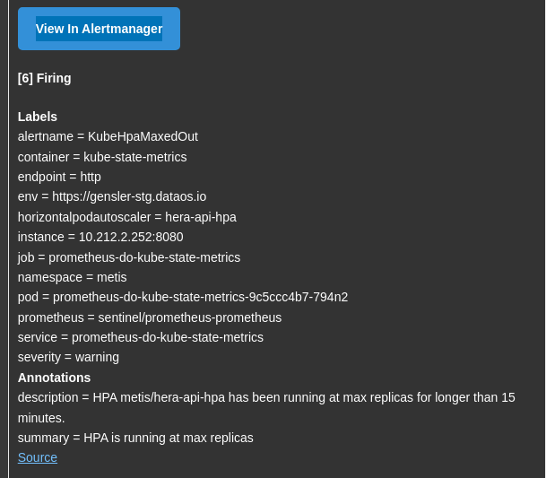

<i>Kube HPA Maxed Out</i>


### **Consequences**

The HPA will be unable to create new pods, limiting the application's scaling capabilities. It is important to note that for some services, reaching the maximum HPA value is intentional.

### **Identifying the Issue**

Investigate the factors preventing HPA from scaling:

- Insufficient maximum replica count
- Undervalued resource requests, such as CPU

### **Solutions**

For basic metrics like CPU and memory, ensure appropriate `requests` values are set. If memory-based scaling is in use, verify the absence of memory leaks. For custom metrics, fine-tune the application's scaling behavior based on the metric.

Conduct performance tests to evaluate the application's scaling capabilities.

## Kube HPA Replicas MisMatch

The *Kube HPA Replicas MisMatch* alert is triggered when the Horizontal Pod Autoscaler (HPA) in a Kubernetes cluster fails to reach the desired number of replicas for an extended period, specifically longer than 15 minutes. This situation may occur due to various factors such as insufficient nodes, resource quota limitations, or pod eviction based on priority.

**Alert Notification**


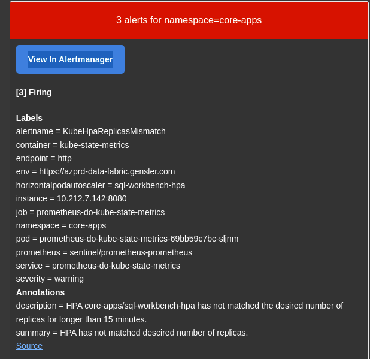

<i>Kube Hpa Replicas MisMatch</i>


### **Consequences**

The HPA will be unable to create new pods, limiting the application's scaling capabilities. It is important to note that for some services, reaching the maximum HPA value is intentional.

### **Identifying the Issue**

Investigate the factors preventing HPA from scaling:

- Insufficient maximum replica count
- Undervalued resource requests, such as CPU

### **Solutions**

For basic metrics like CPU and memory, ensure appropriate `requests` values are set. If memory-based scaling is in use, verify the absence of memory leaks. For custom metrics, fine-tune the application's scaling behavior based on the metric.

Conduct performance tests to evaluate the application's scaling capabilities.

## Kube Version MisMatch

The *Kube Version MisMatch* alert is triggered when Kubernetes components within a cluster are running different semantic versions, which typically occurs during the cluster upgrade process. Control plane nodes or worker nodes may have mismatched versions during minor or major version upgrades. Such discrepancies in API versions can lead to a wide range of issues, from individual container performance to overall cluster stability. 


**Alert Notification**

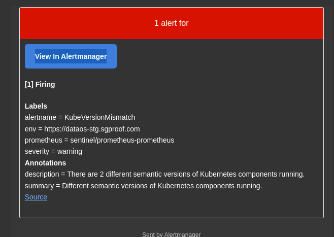

<i>Kube Version MisMatch</i>

### **Consequences**

Incompatible API versions between Kubernetes components can result in a wide range of issues, affecting individual containers, application stability, and overall cluster stability.

### **Identifying the Issue**

- Examine existing Kubernetes versions using:

```bash
kubectl get nodes
```

- Observe the version column in the output
- Verify if there is an ongoing Kubernetes upgrade, particularly in managed cloud services

### **Solutions**

- Safely drain affected nodes before upgrading or replacing them with newer versions. Refer to [Safely drain node](https://kubernetes.io/docs/tasks/administer-cluster/safely-drain-node/) for guidance.
- Ensure proper control plane version and node pool versions are set when creating clusters.
- Enable automatic cluster updates for the control plane and node pools.
- Establish appropriate maintenance windows for clusters.

[Kube Version MisMatch](https://www.notion.so/Kube-Version-MisMatch-8ac611546dcd45aea9bc5502ac983099?pvs=21)

## Kube Node not Ready

The *Kube Node Not Ready* alert occurs when a Kubernetes node remains in a state other than `Ready` for an extended period. This can impact the node's ability to host new pods, consequently affecting the performance and reliability of cluster deployments.

**Alert Notification**


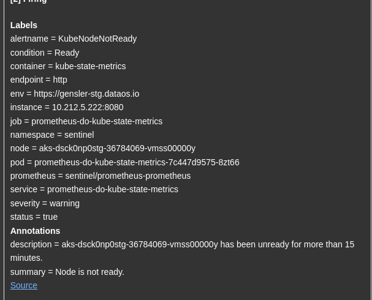

<i>Kube Node Not Ready</i>


### **Consequences**

The cluster's deployment performance may be impacted depending on the overall workload and the affected node's role.

### **Identifying the Issue**

The alert notification should indicate the unready node, for example:

```bash
 - alertname = KubeNodeNotReady
...
 - node = node1.example.com
...
```

Log in to the cluster and check the node's status:

```bash
kubectl get node $NODE -o yaml
```

The output should reveal the reason for the node's unready state (e.g., timeouts when reaching the API or kubelet).

### **Solutions**

After resolving the issue preventing the node from being replaced, terminate the instance to restore normal functionality.

## Kube Node Unreachable

The *Kube Node Unreachable* alert is triggered when a Kubernetes node becomes unreachable, which can lead to the rescheduling of certain workloads. This situation may impact the performance and reliability of cluster deployments. Various factors, such as disruptive software upgrades, hardware failures, or network issues, can contribute to a node becoming unreachable. 

**Alert Notification**


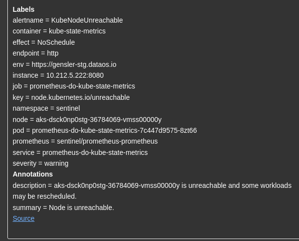

<i>Kube Node Unreachable</i>


### **Consequences**

The cluster's deployment performance may be impacted, depending on the overall workload and the affected node's role.

### **Identifying the Issue**

The alert notification should indicate the unreachable node, for example:

```bash
 - alertname = KubeNodeUnreachable
...
 - node = node1.example.com
...
```

Log in to the cluster and check the node's status:

```bash
kubectl get node $NODE -o yaml
```

The output should reveal the reason for the node's unreachability.

Common failure scenarios include:

- Disruptive software upgrades
- Network partitioning due to hardware failures
- Firewall rule changes
- Virtual machines suspended because of storage area network issues
- System crashes or freezes caused by software or hardware malfunctions

### **Solutions**

If the node is undergoing maintenance, ensure it is properly [cordoned and drained](https://kubernetes.io/docs/tasks/administer-cluster/safely-drain-node/).

For other scenarios, ensure storage and networking redundancy, if applicable.

## Kube StatefulSet Update Not Rolled Out

The alert is triggered when a StatefulSet update in a Kubernetes cluster fails to roll out successfully. This can lead to service degradation or unavailability, impacting the performance and reliability of your applications and infrastructure.

**Alert Notification**


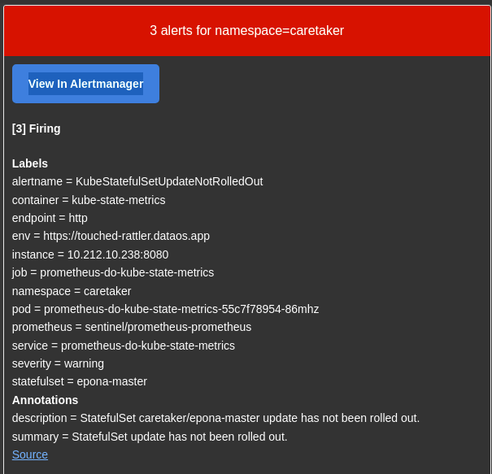

<i>Kube StatefulSet Update Not Rolled Out</i>


### **Consequences**

Service degradation or unavailability may occur.

### **Identifying the Issue**

- Inspect the StatefulSet using:

```bash
kubectl -n $NAMESPACE describe statefulset $NAME.
```

- Verify if the StatefulSet update was not manually paused (see status)
- Check the declared number of replicas
- Examine the status of pods belonging to the replica sets under the StatefulSet
- Review pod template parameters, such as:
    - Pod priority - potential eviction by higher priority pods
    - Resources - possible utilization of unavailable resources, e.g., GPUs with limited node availability
    - Affinity rules - scheduling constraints due to affinities and insufficient nodes
    - Pod termination grace period - extended terminating state due to excessive duration
- Investigate potential issues with disk attachment to the StatefulSet, e.g., a disk in Zone A while the pod is scheduled in Zone B
- Assess if the Horizontal Pod Autoscaler (HPA) is triggered due to untested values (requests values)
- Examine if the cluster-autoscaler can create new nodes by reviewing its logs or the cluster-autoscaler status ConfigMap

### **Solutions**

Refer to [Debugging Pods](https://kubernetes.io/docs/tasks/debug-application-cluster/debug-application/#debugging-pods) for guidance on resolving the issue.