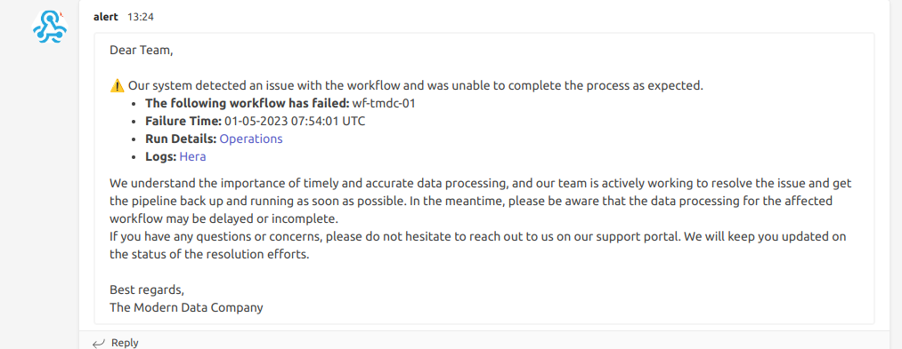

# Setting up Workflow Alerts

Workflow alerts are a crucial element in the larger Data Observability framework within DataOS. They are valuable in managing vast amounts of Workflows and Jobs, facilitating efficient monitoring and real-time notifications in case of failures. This guide outlines the process to establish Workflow alerts using Python and Alpha Stack in DataOS and, further, dispatch notifications to Microsoft Teams.

## Workflow Alerting Mechanism

The Workflow alerting system utilizes Pulsar topics for real-time alerting. As the Workflow runs, live data is fed directly into a service powered by a Pulsar topic, enabling instant alert generation.

This approach ensures immediate alerts in case of Workflow or job failures, significantly enhancing the Developer Experience (DevX). Each alert comes with direct links to the Operations App and the Hera app, providing in-depth details about Workflow and job runs, as well as access to logs. This streamlines the process of identifying and resolving issues quickly, minimizing downtime, and improving overall operational efficiency.

## Prerequisites

Before proceeding with the implementation, make sure you have the required prerequisites.

### **Get `pulsar-admin` tag**

In order to set up workflow alerts, you need access to the environment Pulsar within DataOS. To get the same, you require the `roles:id:pulsar-admin` tag. You can contact the DataOS Operator within the organization to grant you the pulsar-admin tag.

### **Get the webhook for the Notification Service**
The webhook for the Notification Service is configured for the respective messaging service (e.g., Microsoft Teams, Slack, Email, etc.). Specifically for Microsoft Teams, the procedure to obtain the webhook is given on the page below.

[Create Incoming Webhooks in MS Team](create_webhook.md)

### **Get the apikey for the user**

The DataOS API key for the user can be obtained by executing the command below.

```bash
dataos-ctl user apikey get
```

## Procedure

### **Step 1: Push the Alerts Code to the Docker Hub**

To set up the alerting system, you will need to create a Python script for sending alerts, a Dockerfile, and a requirements file. Below are samples of the Python script, Dockerfile, and requirements file to help you get started.

**Python Script for Sending Alerts**

```python
# Import necessary libraries
import pulsar
import requests
import json
from datetime import datetime 
import time

# The user needs to provide the webhook URLs of the Microsoft Teams channels
# where the notifications will be sent
webhook_urls = '<webhook of MS-teams>'

# The user needs to provide the API token for the DataOS user
api_token = '<api token>'

# Function to send a message to a Microsoft Teams channel using a webhook
# Inputs:
#     webhook_url: The URL of the Microsoft Teams channel webhook
#     message: The message to send to the channel
def send_message_to_teams(webhook_url,message):
    for webhook_url in webhook_urls:
        data = {'text': message}
        headers = {'Content-Type': 'application/json'}
        response = requests.post(webhook_url,headers=headers, json=data)
        if response.status_code != 200:
            raise ValueError("Failed to send message to Microsoft Teams channel")
        
# Function to consume messages from a Pulsar topic. If the connection fails, 
# it attempts to reconnect.
# Inputs:
#     broker_url: The URL of the Pulsar broker
#     topic_name: The name of the topic to consume from
#     subscription_name: The name of the subscription
#     auth_params: The authentication parameters
def consume_pulsar_topic(broker_url, topic_name, subscription_name, auth_params):
    while True:
        try:
            # Initialize the Pulsar client
            auth = pulsar.AuthenticationToken(auth_params)
            client = pulsar.Client(broker_url, authentication=auth)
            consumer = client.subscribe(topic_name, subscription_name, consumer_type=pulsar.ConsumerType.Shared)
            while True:
                try:
                    # Consume messages from the topic
                    consumer.seek(pulsar.MessageId.latest)
                    msg = consumer.receive()
										ts = msg.publish_timestamp()/1000
                    str_date=datetime.fromtimestamp(ts)
                    time_ist=str_date.strftime("%d-%m-%Y %H:%M:%S")
                    msg_decode = msg.data().decode("utf-8")
                    json_data = json.loads(msg_decode)
                    job_name = json_data['data']['actionName']
                    wf = job_name.split('/')
                    wf_name = wf[0]
                    dag_name = wf[1]
                    if json_data['data']['namespace'] == 'public' and json_data['data']['state'] == 'FAILED':
                        # print(str(json_data['data']['actionName'])+" " + str(time_ist))
                        operation_link = "ENV LINK/operations/user-kernel/resources/resource-runtime?name="+str(wf_name)+"&type=workflow&workspace="+str(json_data['data']['namespace'])
                        hera_link = "ENV LINK/hera/app/action/"+str(json_data['data']['namespace'])+"/"+str(wf_name+"/run-history")
                        message = "<p>Dear Team,</p>    <p><br>⚠️ Our system detected an issue with the workflow and was unable to complete the process as expected.</b></p>    <ul>      <li><b>The following workflow has failed:</b> "+str(wf_name)+ "</li>      <li><b>Failure Time:</b> "+str(time_ist) +" UTC</li>      <li><b>Run Details:</b> <a href="+str(operation_link)+"> Operations </a></li>  <li><b>Logs:</b> <a href="+str(hera_link)+"> Hera </a></li>  </ul>    <p>We understand the importance of timely and accurate data processing, and our team is actively working to resolve the issue and get the pipeline back up and running as soon as possible. In the meantime, please be aware that the data processing for the affected workflow may be delayed or incomplete.</p>    <p>If you have any questions or concerns, please do not hesitate to reach out to us on our support portal. We will keep you updated on the status of the resolution efforts.</p><br><p>Best regards, <br>The Modern Data Company</p>"
                        send_message_to_teams(webhook_urls,message)
                        print("Alert Send !!!!")

                except Exception as e:
                    print("Error while consuming message: {}".format(e))
                    time.sleep(5)

        except Exception as e:
            # If the connection fails, send a notification to the Teams channel
            # and retry in 5 seconds
						# print("Connection failed, retrying in 5 seconds...")
            alert_message = "<p>Dear Team,</p>    <p><br>&#127384; Our system detected an issue with the alert workflow and was unable to run the process as expected.</b></p><ul><li><b>Error:</b> "+str(e)+ "</li></ul><br>    <p>We understand the importance of timely and accurate data processing, and our team is actively working to resolve the issue and get the pipeline back up and running as soon as possible (<b>this system will automatically retry in 5 seconds...</b>). In the meantime, please be aware that the data processing for the affected workflow may be delayed or incomplete.</p>    <p>If you have any questions or concerns, please do not hesitate to reach out to us on our support portal. We will keep you updated on the status of the resolution efforts.</p><br><p>Best regards, <br>The Modern Data Company</p>"
            send_message_to_teams(webhook_urls,alert_message)
            time.sleep(5)

# Call the function to consume messages from the Pulsar topic
consume_pulsar_topic('pulsar+ssl://tcp.engaging-ocelot.dataos.app:6651', 'persistent://system/metis/action_lifecycle_events', '9d86196d56cac3a7b9e5c4ec448c7299f45ab5744bfdd47b34496498856e6d1e', api_token)
```

**Dockerfile**

```python
# Use an official Python runtime as a parent image
FROM python:3.10.7
COPY <name-of-the-alert-file> . # Input the name of the Alert Python File
COPY requirements.txt requirements.txt
RUN pip3 install -r requirements.txt
# Run app.py when the container launches
CMD [ "python3","<name-of-the-alert-file>"] # Input the name of the Alert Python File
```

**Requirements File**

```
pulsar-client
requests
```

**Build the Docker Image**

In your terminal, navigate to the directory containing the Dockerfile and run the following command to build your Docker image. Replace `<image-name>` with the name you want to give your Docker image.

```bash
docker build -t <image-name> .
```

**Tag the Docker Image**

Before you can push the image to Docker Hub, you need to tag it with your Docker Hub username and the repository name you want to push it to. Replace the DockerHub Username with your one.

```bash
docker tag workflowalert:latest <dockerhub-username>/<image-name>:latest 
```

**Log in to Docker Hub**

Log in to Docker Hub from your command line. You'll be prompted to enter your Docker Hub username and password.

```
docker login
```


**Push the Docker Image to Docker Hub**

Use the following command to push your image to your Docker Hub repository:

```bash
docker push <dockerhub-username>/<image-name>:latest
```

Replace `<dockerhub-username>` with your Docker Hub username and `<image-name>` with the name you want to give your Docker image.

Your Workflow Alert is now packaged in a Docker image and available on Docker Hub.

### **Step 2: Construct the Alert Workflow**

In this step, we will create a new Workflow and deploy the Docker image created in the previous step on DataOS using the Alpha stack. The example below illustrates a sample Workflow YAML that generates a Workflow Alert. 

```yaml
version: v1 
name: wf-tmdc-001 # Workflow Name
type: workflow 
tags:
- workflow
- alert
description: This workflow generates a Workflow Alert
workflow:
  title: Connect City  
  dag: 
# Job 1
  - name: workflow-alert
    spec:
      stack: alpha
      compute: runnable-default
      alpha:
        image: <dockerhub-username>/<image>
        command: 
          - python
        arguments:
          - teams_alert.py
```

### **Step 3: Implement the Alert Workflow**

After creating the Alert Workflow, it's time to put it into action. This is achieved by applying the workflow using the `apply` command with the relevant configuration file. The system should return a sequence of information, culminating in a confirmation that the workflow has been successfully applied.

```bash
dataos-ctl apply -f <path-to-alert-config-yaml>
# Expected Output
INFO[0000] 🛠 apply...                                   
INFO[0000] 🔧 applying(public) wf-tmdc-001:v1:workflow... 
INFO[0004] 🔧 applying(public) wf-tmdc-001:v1:workflow...created 
INFO[0004] 🛠 apply...complete
```

### **Step 4: Design the Monitored Workflow**

Next, we need to set up the workflow that will be monitored. For a sample, we will use a basic workflow that performs data ingestion. The YAML for the same is given below.

```yaml
version: v1 
name: wf-tmdc-01 # Workflow Name
type: workflow 
tags:
- Connect
- City
description: The job ingests city data from dropzone into raw zone
workflow:
  title: Connect City  
  dag: 
# Job 1
  - name: wf-job1 # Job 1 name
    title: City Dimension Ingester
    description: The job ingests city data from dropzone into raw zone
    spec:
      tags:
      - Connect
      - City
      stack: flare:3.0 
      compute: runnable-default 
      flare:
        job:
          explain: true
          logLevel: INFO

          inputs:
           - name: city_connect
             dataset: dataos://thirdparty01:none/city
             format: csv
             schemaPath: dataos://thirdparty01:none/schemas/avsc/city.avsc

          outputs:
            - name: cities
              dataset: dataos://icebase:retail/city01?acl=rw
              format: Iceberg
              description: City data ingested from external csv
              options:
                saveMode: append
                sort:
                  mode: partition
                  columns:
                    - name: version
                      order: desc
                iceberg:
                  properties:
                    write.format.default: parquet
                    write.metadata.compression-codec: gzip
                  partitionSpec:
                    - type: identity
                      column: version
          steps:
          - sequence:
              - name: cities
                doc: Pick all columns from cities and add version as yyyyMMddHHmm formatted
                  timestamp.
                sql: |
                    SELECT
                      *,
                      date_format (now(), 'yyyyMMddHHmm') AS version,
                      now() AS ts_city
                    FROM
                      city_connect 
# Job 2
  - name: datatool-1 # Job 2 name
    spec:
      stack: toolbox 
      compute: runnable-default
      toolbox:
        dataset: dataos://icebase:retail/city01
        action:
          name: set_version
          value: latest
# Dependent on Job 1 for the start of execution
    dependencies: wf-job1
```

### **Step 5: Apply the Monitored Workflow**

Once the workflow to be monitored has been designed, it's time to deploy it. After some time, this workflow may fail, as simulated in the example provided. 

```bash
dataos-ctl -t workflow -w public get                                                                 ok | %  12:47:24 

# Output
INFO[0000] 🔍 get...                                     
INFO[0000] 🔍 get...complete                             

     NAME    | VERSION |   TYPE   | WORKSPACE | STATUS | RUNTIME |   OWNER     
-------------|---------|----------|-----------|--------|---------|-------------
  wf-tmdc-01 | v1      | workflow | public    | active | failed  |  iamgroot
```

When the workflow fails, two alerts are triggered: one for the job failure and the other for the workflow failure. These alerts are instrumental in diagnosing issues, particularly when the workflow contains multiple jobs.

### **Step 6: Alert Notifications**

Upon the triggering of these alerts, notifications will be sent to the designated Teams channel. These notifications provide valuable information about the job and workflow that failed, which is particularly useful for debugging as the alerts contain links to the Operations App (for run details) and the Hera app (for logs), facilitating the troubleshooting process by providing access to relevant details and logs.


<figcaption align = "center">Notification in email  </figcaption>