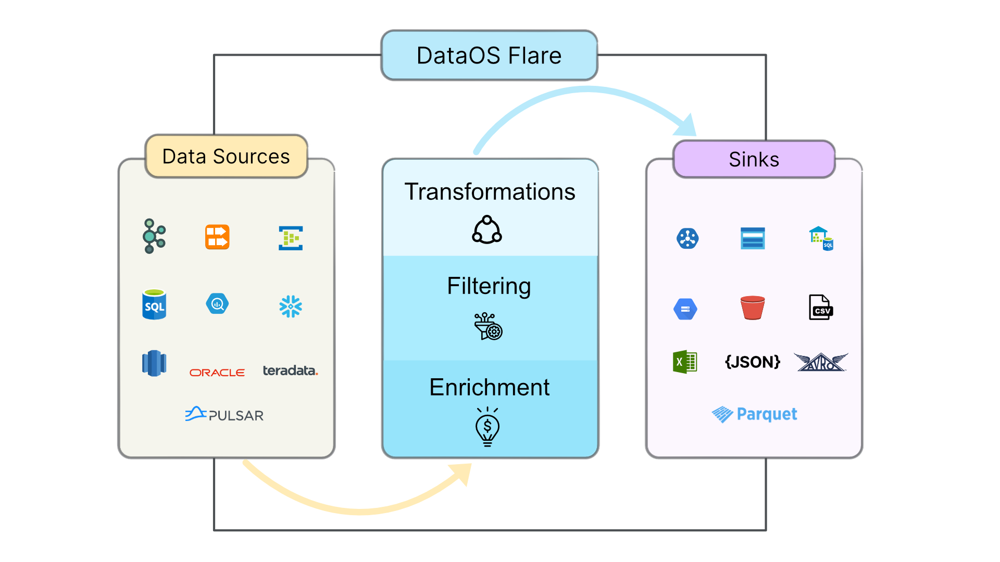

# DataOS Flare

## Introduction

DataOS provides users with the infrastructure to run batch and streaming jobs including stateful and stateless computations. To process big data workloads, you can use Flare, Spark-backed data-processing engine.  

DataOS Flare is a declarative stack for large-scale data processing workflows/ jobs defined in the form of a sequential YAML.  Flare makes creating and triggering a job much easier and enables the data engineer to create fairly complex workflows to carry out the data processing tasks. 




## Flare workflow

Flare workflow consists of dags that contain a series of jobs. Every Flare job essentially consists of the following parts:

### Input
The 'inputs' sections contains the dataset details for reading data from supported data sources. The Flare workflow can read from multiple data sources. 

```yaml

   inputs:                                    # data sources to read from
     - name: 
        dataset:
        format:
        Schema:
        Options:
        
```
To understand more about the properties in **inputs** section, refer to [Reading and Writing Data](readwritedata.md).

### Output
An output is a storage/sink where we wish to save data after applying transformations. The 'outputs' section includes the configuration settings required for writing to different data formats/sinks supported in Flare.  The Flare workflow can write to multiple data sources. 

```yaml
outputs:                                   # reference and location of the output
  - name: 
    depot: 
```
To understand more about the properties in **outputs** section, refer to [Reading and Writing Data](readwritedata.md).

### Transformations 

Flare workflow contains transformations to perform all data enriching/processing tasks. You can define transformations such as adding new computed columns, aggregations, filtering in the **steps** section to complete the processing. The 'steps' section contains 'sink' and 'sequence'.  

```yaml
steps:                                  # transformation steps
  - sink:                               # output dataset information and additional options
     - sequenceName: 
       datasetName: 
       outputName: 
       outputType: 
       title:
       description: 
       tags:
         - 
       outputOptions:
       saveMode: 
       partitionBy:
         - column: 
    sequence:                           # series of data processing sql statements 
      - name: 
        doc: 
        sql: 
        functions:
        - name: 
            column: 
            asColumn: 
```
To understand more about the properties in **steps** section, refer to [Reading and Writing Data](readwritedata.md).

## Flare workflow template

You define a Flare workflow in the following way.

```yaml

workflow:
   dag:
     - name: 
       title: 
       description: 
       spec:
          tags:
            - tag1
          stack: flare:1.0
          flare:
            job:
              inputs:                      # data sources to read from
                - name: 
                  dataset: 
              outputs:                     # reference and location of the output
                - name: 
                  depot: 
               steps:                      # transformation steps                           
                - sink:                    # output dataset details and additional options
                  - sequenceName: 
                    datasetName: 
                    outputName: 
                    outputType: 
                    title:
                    description: 
                    tags:
                      - 
                    outputOptions:
                      saveMode: 
                      partitionBy:
                        - type: 
                          column: 
                  sequence:                 # series of data processing sql statements 
                    - name: 
                      doc: 
                      sql: 
                      functions:
                        - name: 
                          column: 
                          asColumn: 
```

> :material-alert: **Note**: Flare workflow requires proper indentation while defining configuration properties in nested sections. You can change the order of properties of the same level but it is recommended to follow the best paractices as shown in the template.

## Data ingestion example

The YAML for a Flare workflow involves many inputs, which you have to provide in key-value pair. 

**Sample YAML:**

```yaml
version: v1beta1
name: cust-bq-demo-01
type: workflow
tags:
  - Connect
  - Customer
description:  Customer data ingestion from bigquery 
owner: itspiyush
workflow:
  title: Connect Customer
  dag:
    - name: customer                           # job name
      title: Customer Dimension Ingester
      description: The job ingests customer data from bigquery into raw zone
      spec:
      tags:
        - Connect
        - Customer
      stack: flare:1.0
      flare:
        driver:
          coreLimit: 1200m
          cores: 1
          memory: 1024m
        executor:
          coreLimit: 1200m
          cores: 1
          instances: 1
          memory: 1024m
        job:
          explain: true
          logLevel: WARN

          inputs:                                               
            - name: customer_connect
              dataset: dataos://crmbq:demo/customer_profiles
          outputs:
            - name: output01
              depot: dataos://filebase:raw01

          steps:                                                
                                                      
            - sink:                                             
               - sequenceName: customers
                 datasetName: customer
                 outputName: output01
                 outputType: Parquet
                 title: Customer Source Data
                 description: Customer data ingested from bigquery
                 tags:
                   - Connect
                   - Customer
                 outputOptions:
                   saveMode: overwrite
                   partitionBy:
                     - cust_id
                
              sequence:                                         
                - name: customers
                  doc: Pick all columns from customers and add version 
                  as yyyyMMddHHmm formatted timestamp.
                  sql: SELECT *, date_format(now(), 'yyyyMMddHHmm') as version, now() as
                  ts_customer FROM customer_connect
                  functions:
                    - name: rename
                      column: Id
                      asColumn: cust_id

```
 
## Essential concepts 
This section explains the required concepts and properties essential to write a Flare workflow.

### version

This holds the current version of Flare.

### name 

This defines the name of the workflow which you want to run. 

> :material-alert: **Note**: Rules for Workflow name: 64 alphanumeric characters and a special character '-' allowed. [a-z,0-9,-]

### type

The type is a workflow. For other artifacts, the type could be Depot, Policy, Secret etc.

### tags

Tags are  attributes, keywords  qualifying the workflow/ job. They are used in access control and quick search.

### description

This is the text describing the workflow.
### owner

[Optional] The ID of the author of the job.
### workflow

It consists of dag having data processing jobs, defined as an array of essential key-value pairs for each job.
### dag

dag is a directed acyclic graph, a conceptual representation of a series of activities(jobs). These jobs in a dag are executed in the order they are defined. Any job is dependent on its previous job to be executed entirely. You define multiple jobs as an array.
```yaml
  dag:
    - name:                       # job1 name
      title:                      # job1 title
      description:                # job1 description
      spec:                       # job1 specifications
        tags:
          - 
        stack: flare:1.0
        flare:
          driver:
          executor:
          job:
        ...
        ...
    - name:                      # job2 name
      title:                     # job2 title
      description:               # job2 description
      spec:                      # job1 specifications
        tags:
          - 
        stack: flare:1.0
        flare:
          driver:
          executor:
          job:
        ...
        ... 
```
> :material-alert: **Note**: Rules for job name: 64 alphanumeric characters and a special character '-' allowed. [a-z,0-9,-]
### stack

Here you define the Flare stack version to run the workflow. Ensure that you are using the latest version/proper version.

### driver

The 'driver' is the controller node of the operation, controls the operations of the workflow. It must interface with the cluster manager in order to actually get physical resources and launch executors. Cluster Manager is responsible for maintaining a cluster of machines that will run your Flare workflow. It launches executor based on request from driver.In this section, you define memory and processor requirements for controller node. 

```yaml
driver:
  coreLimit: 1200m
  cores: 1
  memory: 1024m
```
For better utilization of resources , you can tune these parameters. To know more, see  [Flare Job Tuning](flaretuning.md).

### executor

The 'executor' is the worker node of the operation which performs the operations defined in the workkflow and send result back to driver. Here, you define memory and processor requirements for executor nodes. 

```yaml
driver:
  coreLimit: 1200m
  cores: 1
  memory: 1024m

```
If these values are not given in the YAML, default settings will be considered. you can tune these parameters. To know more, see  [Flare Job Tuning](flaretuning.md).

> :material-alert: **Note**: If not defined, default values will be considered.

### job

Here, you need to specify configuration settings required to perform a data processing job such as driver, executor, inputs, outputs, steps etc. You can define multiple jobs that will be executed in the sequential order.
```yaml
    job:
        explain: 
        logLevel: 

        inputs:                                               # data source(s) to read from
        - name: 
            dataset: 
        outputs:
        - name: 
            depot: 
        steps:                                                # transformation steps
        - sink:                                             # output dataset information and additional options
            - 
            sequence:                                         # data processing sql statement 
            - 

```

### loglevel

A log level is a piece of information from a given log message.  They  distinguish log events from each other. These log levels help in finding runtime issues with your Flare workflow and in troubleshooting.
You can define loglevel as:

- info
- warning
- debug
- error
```yaml
  loglevel:INFO/WARN/DEBUG/ERROR/
```
### inputs
This section includes the configuration settings required for reading from different data sources such as name,location of data source, format etc. To read from multiple data sources, you have to provide an array of data source definitions.

```yaml
inputs:  
  - name: sample_csv
    dataset: dataos://thirdparty01:none/sample_city.csv
    format: csv

  - name: my_input_view
    dataset: dataos://kafka:default/cloudevents01
```

To know more, see  [Reading and Writing Data](readwritedata.md).

> :material-alert: **Note**: Rules for input name: Only alphanumeric characters and must begin with an alphabetic character or an underscore (_).  allowed. [a-z,0-9,_]

### outputs
The 'outputs' section contains the details like where the dataset is to be stored, what is going to be its name etc. You have to provide an array of definitions for writing to  multiple output locations. 
 
```yaml
outputs:
  - name: output01
    depot: dataos://filebase:raw01

  - name: output02
    depot: dataos://icebase:retail?acl=rw
```
To know more, see  [Reading and Writing Data](readwritedata.md).

> :material-alert: **Note**: Rules for output name: Only alphanumeric characters and must begin with an alphabetic character or an underscore (_).  allowed. [a-z,0-9,_]

### steps

Here you define the steps required to generate the output dataset. 

```yaml
steps:
  - sink:
    ...
    ...
    sequence:
    ...
    ...
```
### sink
This section contains all the details of the output dataset(name, title, description, output type) along with the reference to corresponding output and sequence name. You can also specify additional options to customize the writing behaviour such as  partition specs etc.

```yaml
- sink:
   - sequenceName: seq_01
     datasetName: retail_dataset
     title: Retail Data
     description: ingested retail data
     tags:
       - connect
       - retail
     outputName:  output01
     outputType: Parquet
     outputOptions:
     saveMode: overwrite
     partitionBy:
        - cust_id
```
> :material-alert: **Note**: Rules for sequence name: Rules for output name: only alphanumeric characters and must begin with an alphabetic character or an underscore (_).  allowed. [a-z,0-9,_]

### sequence

The sequences are order of transformations/operations which result in the data for your output dataset. To define a sequence, you need to specify the sequence name to be used as reference for the output of the SQL query it has and the SQL query of the operation. 
```yaml
sequence:
  - name: seq_00
    sql: select *, to_timestamp(pickup_datetime/1000) as date_col from retail_data

  - name: seq_01
    sql: SELECT *, date_format(now(), 'yyyyMMddHHmm') as version, now() as ts_retail_data FROM seq_00
     
```