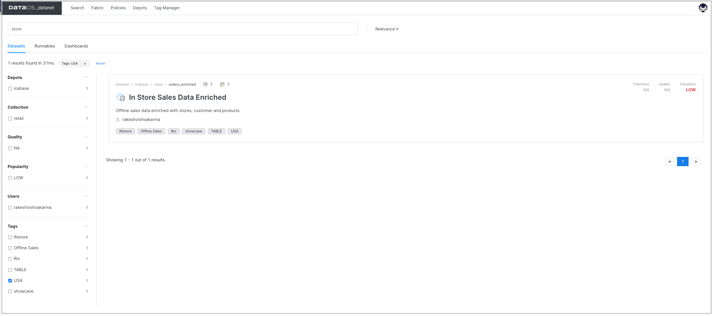

# Assertions
Sometimes input data sources contain invalid data or incorrect data. You need to validate the captured data to determine whether the data meets business requirements. It is critical for generating valuable, correct insights.

Assertions are business-specific validation rules applied to test and evaluate the quality of specific datasets if they are appropriate for the intended purpose. DataOS allows you to define your own assertions with a combination of tests to check the rules. These tests are boolean expressions containing metric functions for aggregated data, such as the average sales price does not exceed some limit. DataOS automatically creates the metrics as per the function used while defining the assertions. You can also define assertions using SQL and regular expressions for more advanced use cases.


## Getting assertions summary/graph/trend on DataOS UI
You can view the list of assertions created for the dataset to monitor the data quality and trends charts for each run. The trend charts also show whether the checks are passed or failed. 

1. Sign in to your DataOS instance with your username and password. 
2. On the **DataOS Datanet** page, search for the dataset for which you want to view the profile data. To display the dataset information, click on its name.

3. On the **Dataset information** page, click on **Quality**. 


## Creating assertions

Provide the following:

**Property** | **Value** | 
-------- | -------- | 
column | column on which rule is to be defined |
filter| criterion, to apply assertions on the resulting data based on the filter criterion |
sql | sql statement for more complex custom logic that can be evaluated with computed columns |
regex | regular expression if type is regex |
tests| a boolean expression for each test. You can use quality metrics functions such as avg, max ,min etc. to define the rules with threshold values. These tests are expected to evaluate to true if the assertion should pass. |

 

## Defining YAML 

The following is the sample YAML file to set up data quality assertions.

```yaml
---
version: v1beta1
name: mtrx-chks-odr-enr-01
type: workflow
tags:
  - Metrics
  - Checks
description: The job performs metrics calculations and checks on order enriched data
#owner: itspiyush
workflow:
  title: Metrics and checks
  dag:
    - name: metrics-chks-order-enrich
      title: Metrics and checks
      description: The job performs metrics calculations and checks on order enriched data
      spec:
        stack: flare:1.0
        tags:
          - Metrics
        title: Metrics and checks
        description: The job performs metrics calculations and checks on order enriched data
        flare:
          driver:
            coreLimit: 3000m
            cores: 2
            memory: 4000m
          executor:
            coreLimit: 6000m
            cores: 2
            instances: 1
            memory: 10000m
          job:
            explain: true
            logLevel: INFO
            #validate single input
            inputs:
              - name: source
                dataset: dataos://icebase:retail/orders_enriched
                format: iceberg
            #override outputs, steps with specific template
            assertions:
              - column: order_amount
                tests:
                  - avg > 1000.00
                  - max < 1000
                  - max > 1000
                  - distinct_count > 100
                  - missing_count < 100
                  - missing_percentage < 0.5

              - column: order_amount
                filter: brand_name == 'Urbane'
                tests:
                  - avg > 500
                  - distinct_count > 100
                  - missing_count < 100

              - column: brand_name
                validFormat:
                  regex: Awkward
                tests:
                  - invalid_count < 5
                  - invalid_percentage < 0.1

              - sql: |
                  SELECT
                    AVG(order_amount) AS avg_order_amount,
                    MAX(order_amount) AS max_order_amount
                  FROM source
                   where brand_name = 'Awkward Styles'
                tests:
                  - avg_order_amount > 1000
                  - max_order_amount < 1000

```

### Running quality checks job

You can run the job defined with the assertions on-demand or schedule it for recurring runs if the data changes or is incremental. Follow the steps to [submit the workflow to run Flare job on DataOS CLI](../cli/tutorials.md). DataOS creates a summary/graphical view  containing the results of the assertions. 


## Quality metrics functions

**Function** | **Description** | 
-------- | -------- | 
avg | The AVG functions returns the average of a column |
avg_length | The AVG_LENGTH function returns the average length of column value |
distinct_count | The DISTINCT_COUNT function returns the count of the distinct values of a column |
duplicate_count | The DUPLICATE_COUNT function returns the count of duplicate values in column. 
min | The MIN function returns the minimum value of a column |
max | The MAX function returns the maximum value of a column |
max_length  | The MAX_LENGTH function returns the maximum length of column value |
min_length | The MIN_LENGTH function returns the minimum length of column value |
missing_count | The MISSING_COUNT function returns the count of missing values in column |
missing_percentage  | The MISSING_PERCENTAGE function returns the rate of missing values in column |
sum  | The SUM function returns the total sum of column value |

