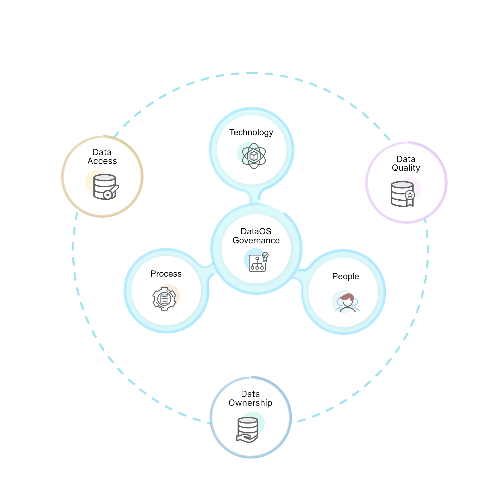

# Data Governance in DataOS
Data Governance is a framework that you can use to proactively manage organization data and ensure the quality and security of the data used across the organization. Data governance ensures a high quality of data management through all phases of the data lifecycle. It establishes a set of policies, processes and technologies that enforce the availability, usability, integrity, and security of all enterprise data. 

DataOS enables you to define clear policies for data usage, authorized access and to meet regulatory compliance requirements such as GDPR. 

This process encompasses the people, process, and technology that is required to ensure that data is fit for its intended purpose. Data Governance deals with the following:

1. **Data Ownership**

     - DataOS Metis will catalog all Datasource, Datastream, Dataset and Datasinks, and track their ownership over time. 

     - Transitive ownerships will be AUTOMATICALLY applied from the Jobs responsible for the Dataset. 
       So, If John D ran a job Enrich Txn With Product which created a Datastream enriched_txn_with_product then John D automatically becomes one of the owners for the Datastream enriched_txn_with_product.

    - Ownership can also be manually curated on DataOS UI Interface.

2. **Data Quality**
    - Users can use data catalog engine (Metis) to know about their own data and its landscape like quality, profile, lineage, and dictionary, etc.

3. **Data Access**

    - Metadata of all datasets will be available for anyone in the organisation to consume. 

    - DataOS will restrict access only at the Dataset level. You can either read the Dataset or not.

    - You can always create new datasets with filtered columns and grant separate access of them. 
