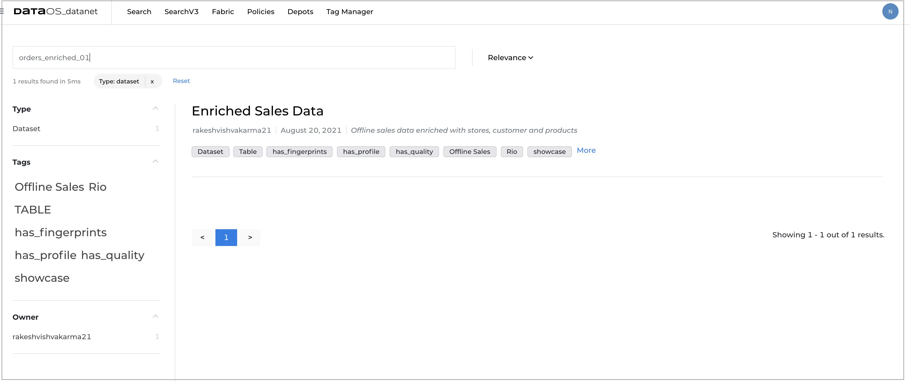

# Data profiling in DataOS

## What is data profiling?


Data profiling is the process of assessing the quality and structure of the data in the dataset. It examines source data to determine the accuracy, completeness, and validity and summarizes information about that data.

## Why data profiling?

It is crucial to know the **completeness** and correctness of the data to take full advantage of the value and usefulness of the source data available. Inaccurate and incomplete data used for the analysis can lead to incorrect data-driven decisions for any organization.

Analysis and assessment algorithms incorporated in data profiling tools  will provide insights into what potential issues exist within a dataset.

You can assess your source data quality before using it in critical business scenarios and verify that data columns in your dataset are populated with the right kind of data. 

## How data profiling tool works?

Data profiling tool analyzes the structure, content, and relationships within data to uncover patterns and rules, inconsistencies, anomalies, and redundancies to achieve higher data quality. It uses basic statistics to know about the validity of the data.  

**Structure discovery:** This validates that your data is consistent and formatted correctly. Structure discovery examines the patterns in the data. For example, pattern matching helps you find the valid formats within the data set if your data contains phone numbers. It also uses basic statistics like the minimum and maximum values, means, medians, modes, and standard deviations to gain insight into the validity of the data.

**Content discovery:** This looks more closely into the individual elements of the dataset to check data quality. It can help you find entries in your dataset that contain null values or values that are incorrect or ambiguous. 
For example, if there are phone numbers with no area code.

**Relationship discovery:** This discovers how the data columns are interrelated/interdependent/associated. 


## Getting profile data on DataOS UI
1. Sign in to your DataOS instance with your username and password. 
2. On the **DataOS Datanet** page, search for the dataset for which you want to view the profile data. To display the dataset information, click on its name.

3. On the **Dataset information** page, click on **Profile**. 

4. You will get the following profile data and chart:
    - [Summary](#summary)
    - [Correlation matrix](#correlation-matrix)
    - [Tabular profile data](#tabular-profile-data)


### Summary
DataOS enables you to have an overview of the data in the profile report.
The following information is generated as a summary:

1. **Job run details** such as job name, who run the job, date & time 
2. **Sample selection filter**- click on the link to see the applied filter (if any) to get the sample data for profiling
3. **Query**- click on the link to see the generated query 
4. **Number of rows analyzed**
5. **Number of columns analyzed**
6. **Number of columns with type mismatches**
7. **Number of columns with complete data and names of those columns**
8. **Number of columns with incomplete data and names of those columns**

### Correlation matrix
Data profiling generates a correlation matrix,  a table showing correlation  between data elements(essentially having numerical values)using color gradients. It helps in quick visual analysis.
You can explore the association between two variables and makes inferences about the strength of the relationship. You can discover uncommon associations using this matrix that can help you going ahead with further exploration of data.


### Tabular profile data
DataOS also allows you to have more detailed view and to drill down the data in the profile report. You will get the following information in the tabular form.

- **General**

**Property** | **Value** | 
-------- | -------- | 
Column | Data type of the column, length of the data in the column//check	|
Unique(% / value) |	Uniqueness Percentage/ Unique count |
Distinct |	Number of distinct patterns observed |
Completeness | Number and percentage of records with a null value |

- **Statistics**

**Statistical Measures** | **Description** | 
-------- | -------- | 
Min | The smallest mathematical value in the data set
Max |The largest mathematical value in the data set
Mean | Average value of a distribution |
Mode | The most frequent value
Median | Middle value in a sorted set |
Standard Deviation | How much the members of a group differ from the mean value for the group. This is very useful in finding an outliers histogram. Outliers are the abnormal distance from the group, the occurrence of these numbers are uncommon|
Skewness | Measure of symmetry, or more precisely, the lack of symmetry. A data set is symmetric if it looks same to the left and right of the center point (mean)|
Coefficient of variation | The coefficient of variation shows the extent of variability of data in a sample in relation to the mean of the population |
First quartile | The lower quartile, or first quartile, is denoted as Q1 and is the middle number that falls between the smallest value of the dataset and the median 
Second quartile | The second quartile (Q2) is the median of a data set; thus 50% of the data lies below this point


               
### Interpretation of profile data
The output from any data profiling job needs to be interpreted before it is useful. 
## Use cases/examples

## Performing data profiling
Data profiling can be  done on the entire dataset or a sample /filtered data. You can filter the data by applying appropriate rules. Data profiling is a quite computationally intensive in terms of resources so it is recommended to run it for a sample data in a dataset. 

### Basic structure of profile job
Define a YAML file for your profiling job. 

To learn more about defining a YAML file, refer to [Flare](../flare/index.md) section.

There are some **additional properties** that you need to define specifically for the profiling job.

1. **Persistent Volume:** This is mandatory to define the volume to store intermediate files generated in the process of profiling. The directory given here is  predefined.
```yaml
persistentVolume:
    name: persistent-v
    directory: fides
``` 
2. **Filters:** You may define  the fiter criterion to reduce the data on which you want to perform profiling. If removed, profiling will be performed on the entire dataset. The filter criterion is like a *where* clause of your SQL query. 
```yaml
profile:
    # basic | intermediate | advanced
    level: basic
    filters:
        - type: expression
          expression: "gender='MALE'"
```
3. **Input:** Dataset, on which we are perofmring profiling, should be first in the input list.
```yaml
inputs:
- name: profile_input_df
  dataset: dataos://set01:default/orders_enriched_01?acl=r
  format: hudi
```
> :material-alert: **Note**: One profile job can have only one dataset.

### YAML template of profile job

```yaml
version: v1beta1
name: prf-s-odr-er-01
type: workflow
tags:
- Fides
- Offline Sales
- has_profile
workflow:
  title: Enriched Order Profiler
  dag:
  - name: p-s-odr-er-01
    title: Order Enriched Data Profiler
    description: The job performs profiling on order enriched data
    spec:
      stack: flare:1.0
      tier: system
      title: Order Enriched Data Profiler
      persistentVolume:                                             # define volume
        name: persistent-v
        directory: fides
      flare:
        job:
          explain: true
          inputs:
            - name: profile_input_df
              dataset: dataos://icebase:set01/orders_enriched_01?acl=r    # dataset name
              format: iceberg
          logLevel: WARN
          profile:                                                  # basic | intermediate | advanced
            level: basic
            filters:
              - type: expression
                expression: "gender='MALE'"                         # Filter expression
```

### Running profile job

You can run the job for profiling on-demand. Follow the steps to [submit the workflow to run Flare job on DataOS CLI](../cli/tutorials.md).


