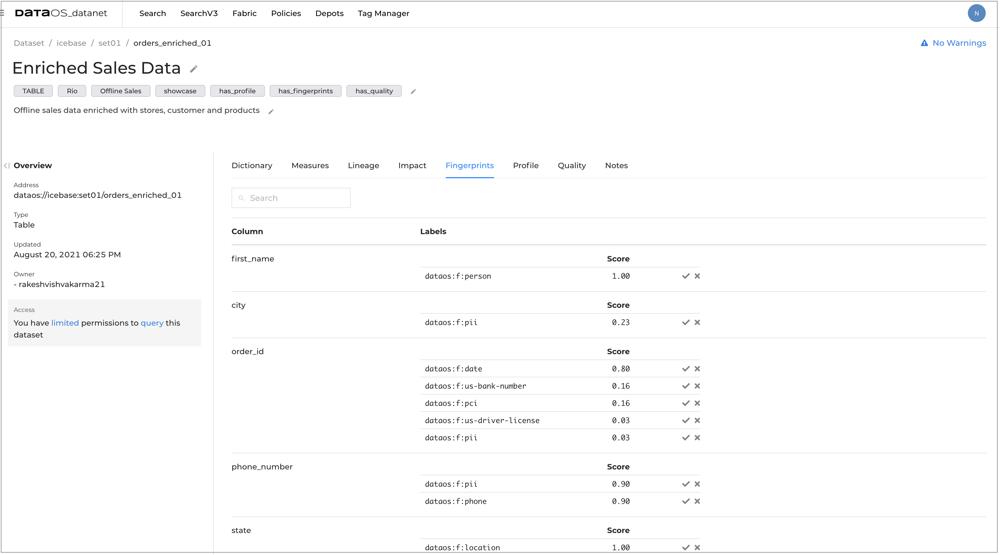
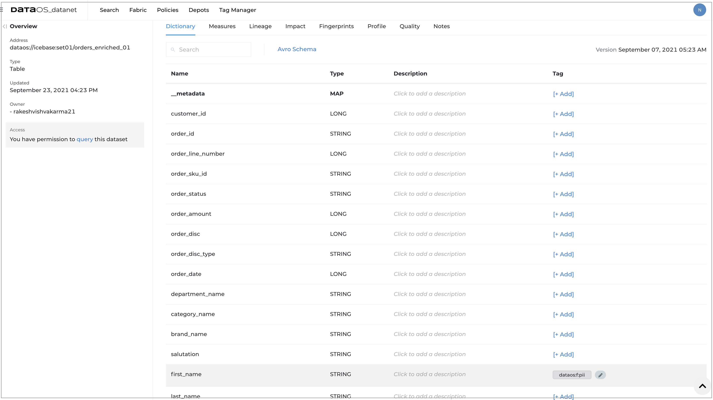
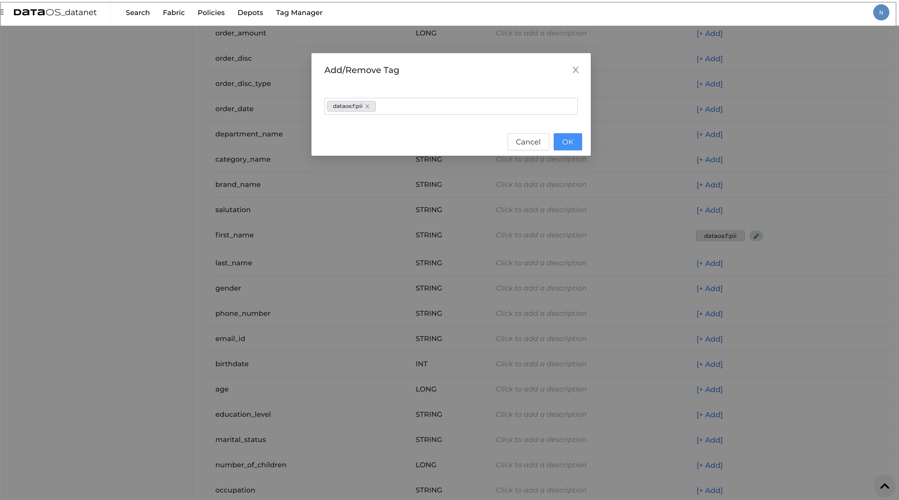

# Data Fingerprinting

While you perform the data profiling, the min/max, standard deviation, uniqueness, correlation, etc., help you understand your data and even discover problems like missing and duplicate values.

Fingerprinting analyzes the data to know that a column of data has a signature or a fingerprint. By examining the data values in a column, we can identify what type of data is there and determine what business terms or labels can be attached to this data.

Examining the data values is important as it allows you to automate identifying sensitive data that needs to be secured or even just cataloged to comply with government regulations like the  GDPR. For example, if data contains a column for a name, social security numbers, credit card numbers or phone numbers, you can tag this data as PII. 

To handle various types of sensitive data and information in increasingly large quantities, data fingerprinting provides a scalable technique for identifying, monitoring, and applying protective controls to data as it moves across the network.

Fingerprinting examines the actual data values, whether via regular expression or value-based tagging. It is a powerful but time-consuming process for data monitoring and protection. For this reason, you need to carefully consider the sample amount of data to fingerprint.

## Fingerprinting report on DataOS UI

1. Sign in to your DataOS instance with your username and password. 
2. On the **DataOS Datanet** page, search for the dataset for which you want to view the profile data. To display the dataset information, click on its name.

3. On the **Dataset information** page, click on **Fingerprints**. 
You will get the following fingerprinting data.

    a. **Column names** for which fingerprinting is performed.

    b. **Label** showing the labels identified in the data. These labels are defined as system labels or according to business value.

    c. For each label, you will get an option to **accept** the label to tag fingerprint to column or **discard** the label.  

4. Once you accept the label, you can view the tagged column in the dictionary. Click on **Dictionary**.

5. Click on the Pencil icon to get the option to remove this tag. You can also add more tags. 
