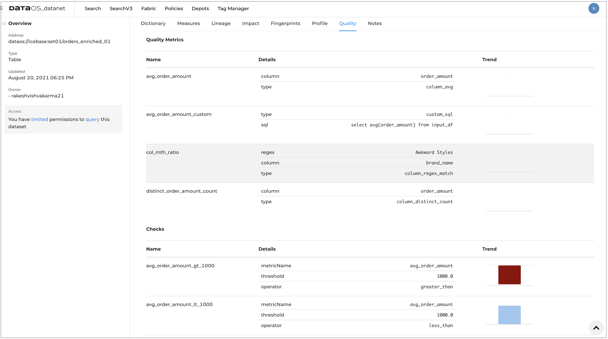

# Metrics and Checks

DataOS allows you to define your own metrics to identify aspects of data that can be measured, such as average order amount, average age of buyers. These metrics are used in combination with checks through which you can validate data quality. 

Once metrics are defined using simple SQL or specifying column names, you can set checks to configure business-specific rules. These rules can be used to analyze and evaluate the quality of specific data sets if they are appropriate for the intended purpose.

## Getting metrics and checks on DataOS UI
You can view the list of metrics and checks created for the dataset to monitor the data quality and trends charts for each run. The trend charts also show whether the checks are passed or failed. 

1. Sign in to your DataOS instance with your username and password. 
2. On the **DataOS Datanet** page, search for the dataset for which you want to view the profile data. To display the dataset information, click on its name.

3. On the **Dataset information** page, click on **Quality**. 


## Creating quality metrics
Provide the following:

**Property** | **Value** | 
-------- | -------- | 
name | name of the metrics |
type | [data quality metrics function](#), for example sqltype, regex |
column | column on which metrics is to be defined |
sql | sql statement if type is sql |
regex | regular expression if type is regex |

## Setting up quality checks
Provide the following:

**Property** | **Value** | 
-------- | -------- |
name | name to refer the check  |
operator | [data quality checks operator](#), for example less than, greater_than  |
metric name | metric on which checks to be defined |
threshold |  a value to check the criterion|
sql | sql statement if operator is custom sql |


## Defining YAML 

The following is the sample YAML file to Set up data quality metrics and checks.

```yaml
---
version: v1beta1
name: mtrx-chks-odr-enr-01
type: workflow
tags:
  - Metrics
  - Checks
description: The job performs metrics calculations and checks on order enriched data
workflow:
  title: Metrics and checks
  dag:
    - name: metrics-chks-order-enrich
      title: Metrics and checks
      description: The job performs metrics calculations and checks on order enriched data
      spec:
        stack: flare:1.0
        tags:
          - Metrics
        title: Metrics and checks
        description: The job performs metrics calculations and checks on order enriched data
        flare:
          job:
            explain: true
            logLevel: INFO
                                                                      # Single dataset in the input section
            inputs:
              - name: input_df
                dataset: dataos://icebase:set01/orders_enriched_01?acl=r
            metrics:
              - name: avg_order_amount
                type: column_avg
                column: order_amount
              - name: distinct_order_amount_count
                type: column_distinct_count
                column: order_amount
              - name: avg_order_amount_custom
                type: custom_sql
                sql: select avg(order_amount) from input_df
              - name: col_mth_ratio
                type: column_regex_match
                column: brand_name
                regex: Awkward Styles
            checks:
              - name: avg_order_amount_gt_1000
                metricName: avg_order_amount
                operator: greater_than
                threshold: 1000.00
              - name: avg_order_amount_lt_1000
                metricName: avg_order_amount
                operator: less_than
                threshold: 1000.00
              - name: avg_order_amount_lt_sum_order_amount
                operator: custom_sql
                sql: select avg(order_amount) < sum(order_amount) from input_df

```

### Running quality checks job

You can run the job defined with the quality checks on-demand or schedule it for recurring runs if the data is changing or incremental. Follow the steps to [submit the workflow to run Flare job on DataOS CLI](../cli/tutorials.md).


## Quality metrics functions

**Function** | **Description** | 
-------- | -------- | 
avg | The AVG functions returns the average of a column.

**Snippet**
```yaml
metrics:
  - name: avg_price
    type: avg
    column: price
```

### distinct_count
**Function** | **Description** | 
-------- | -------- | 
  distinct_count | The DISTINCT_COUNT function returns the count of the distinct values of a column.

**Snippet**
```yaml
metrics:
  - name: distinct_price_count
    type: distinct_count
    column: price
```

### sql
**Function** | **Description** | 
-------- | -------- | 
  sql | The SQL function returns the output of sql query. SQL output must be an integer value.

**Snippet**
```yaml
metrics:
  - name: avg_price_custom
    type: sql
    sql: select avg(price) from input_df
```

**Function** | **Description** | 
-------- | -------- | 
 regex_match  | The REGEX_MATCH function calculates the ratio of matching regex on a column.

**Snippet**
```yaml
metrics:
  - name: regex_on_col
    type: regex_match
    column: product_name
    regex: Western Cowboy
```

### min
**Function** | **Description** | 
-------- | -------- | 
  min | The MIN function returns the minimum value of a column.

**Snippet**
```yaml
metrics:
  - name: min_price
    type: min
    column: price
```

### max
**Function** | **Description** | 
-------- | -------- | 
  max | The MAX function returns the maximum value of a column.

**Snippet**
```yaml
metrics:
  - name: max_price
    type: max
    column: price
```

### avg_length
**Function** | **Description** | 
-------- | -------- | 
  avg_length | The AVG_LENGTH function returns the average length of column value.

**Snippet**
```yaml
metrics:
 - name: avg_len_product_name
   type: avg_length
   column: product_name
```

### max_length
**Function** | **Description** | 
-------- | -------- | 
 max_length  | The MAX_LENGTH function returns the maximun length of column value.

**Snippet**
```yaml
metrics:
   - name: max_len_product_name
     type: max_length
     column: product_name
```

### min_length
**Function** | **Description** | 
-------- | -------- | 
  min_length | The MIN_LENGTH function returns the minimum length of column value.

**Snippet**
```yaml
metrics:
  - name: min_len_product_name
    type: min_length
    column: product_name
```

### sum
**Function** | **Description** | 
-------- | -------- | 
 sum  | The SUM function returns the total sum of column value.

**Snippet**
```yaml
metrics:
  - name: total_sale_price
    type: sum
    column: sale_price
```

### missing_count
**Function** | **Description** | 
-------- | -------- | 
 missing_count | The MISSING_COUNT function returns the count of missing values in column.

**Snippet**
```yaml
metrics:
  - name: missing_sale_price
    type: missing_count
    column: sale_price
```

### missing_percentage
**Function** | **Description** | 
-------- | -------- | 
 missing_percentage  | The MISSING_PERCENTAGE function returns the rate of missing values in column. 

**Snippet**
```yaml
metrics:
  - name: missing_rate_sale_price
    type: missing_percentage
    column: sale_price
```

## Quality checks operators

### greater_than
**Function** | **Description** | 
-------- | -------- | 
  greater_than |  The GREATER_THAN function compares the metric value is greater or not with given threshold.

**Snippet**
```yaml
checks:
  - name: check001
    metricName: avg_price
    operator: greater_than
    threshold: 1000.00
```

### less_than
**Function** | **Description** | 
-------- | -------- | 
 less_than  |  The LESS_THAN function compares the metric value is less or not with given threshold. 

**Snippet**
```yaml
checks:
  - name: check002
    metricName: avg_price
    operator: less_than
    threshold: 1000.00
```

### custom_sql
**Function** | **Description** | 
-------- | -------- | 
  custom_sql |  The CUSTOM_SQL function returns the output of sql query.

**Snippet**
```yaml
checks:
  - name: check003
    operator: custom_sql
    sql: select avg(sale_price) < sum(sale_price) from input_df
```