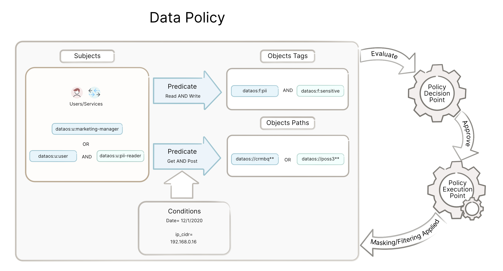
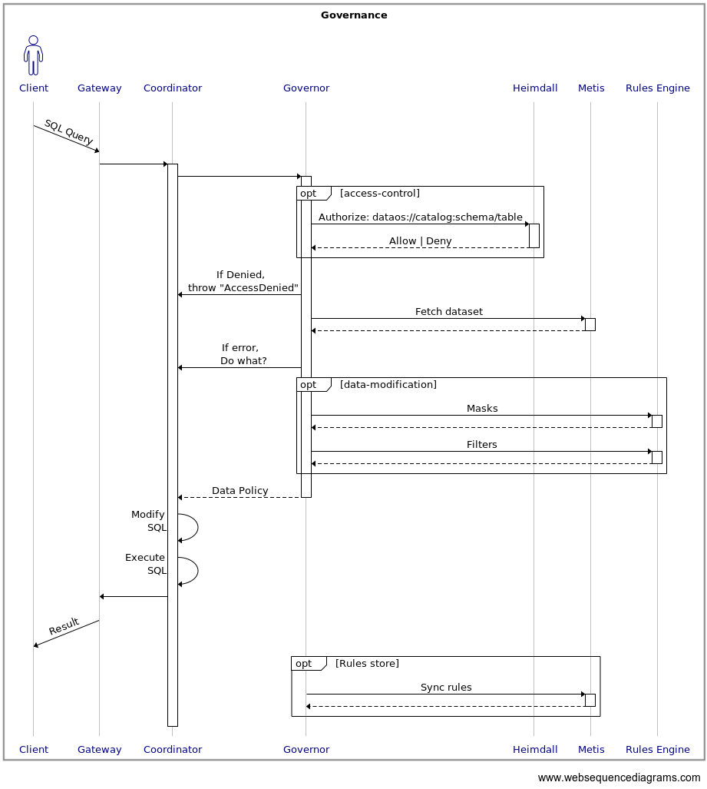
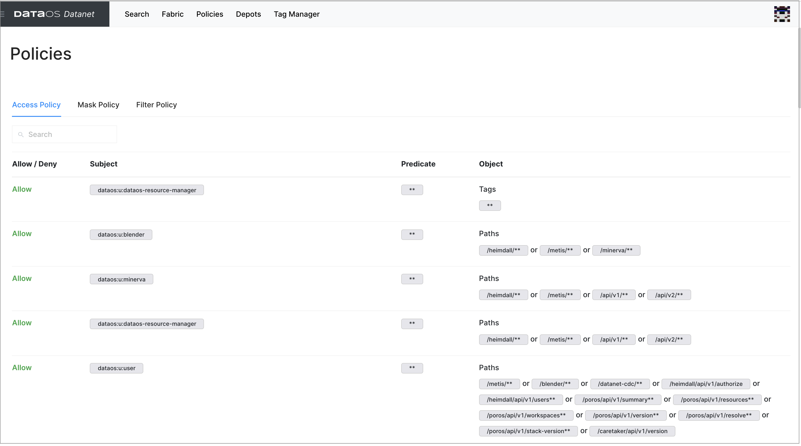
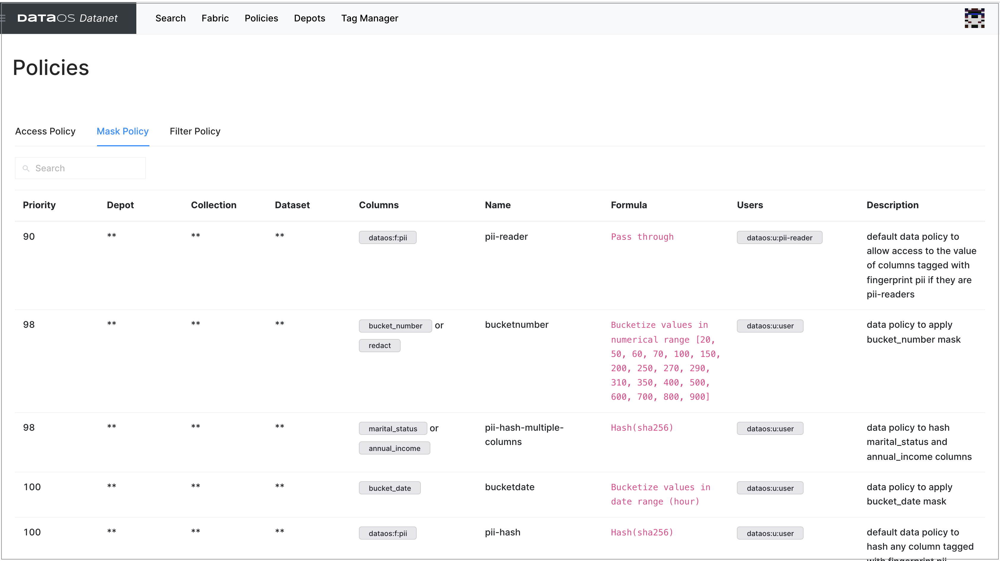
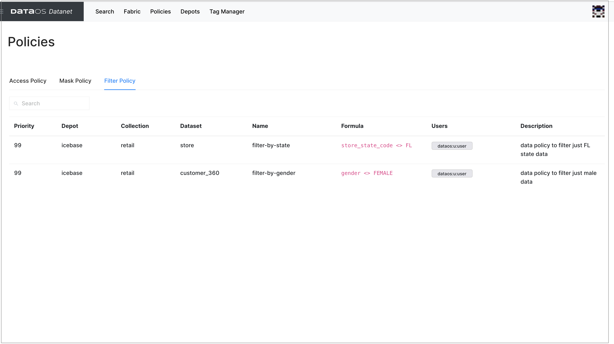

# Governance Policy in DataOS

A DataOS governance policy is a set of rules that help safeguard data and establish standards for its access, use, and integrity. DataOS policies allow organizations to authorize users, employees, and third parties to access enterprise data in a manner that meets security, privacy, and compliance requirements.

## Definitions

**Term** | **Description** |
-------- | -------- | 
Subject | Subject is a user or system identified by a token, that would like to perform a specific predicate on a specific object |
Predicate | Predicate is an action that the subject would like to perform on the specific object |
Object | Object is a target that the subject would like to perform the predicate on. This target can be an API path, a document, a file, or a column |
Metadata | Metadata is an additional information that may be pertinent in the policy evaluation decision of access |
Policy | Policy is a rule defining what tags are associated with subjects, predicates, tags or paths associated with objects, and optional additional conditions on metadata to allow or deny access to DataOS resource/environment |
Policy Decision Point (PDP) | Policy Decision Point (PDP) is the service that evaluates a specific subject-predicate-object-metadata request against the current policies to determine if access to the DataOS resource/environment is allowed or denied |
Policy Execution Point (PEP) | Policy Execution Point (PEP) is the executor of the decision that is returned from the PDP. This occurs within any application that requires a policy decision to be made about access. Example: kong proxy during ingress validates that specific api paths are allowed or denied and does not proxy the request if the PDP returns denied |


## Types of policies
There are two types of policies in DataOS, and both are managed through the artifact type of “policy”. 

- Access policy
- Data policy

### Access policy
Access policy is a security measure to regulate the individuals who can view, use, or access a restricted DataOS environment/resource. 

The Access policy type is implemented using an Attribute-Based Access Control paradigm. More specifically, we leverage the attribute tags of Subjects and the attribute tags or paths of Objects to evaluate a set of policies when determining if a specific Predicate(action) should be allowed or denied.  For example, a user with a tag 'user' can access secrets or specific Depots to connect to data, but a user with an 'operator' tag can perform CRUD operations.

**Example 1**
```yaml
---
name: "user-access-demo-depots"
version: v1beta1
type: policy
layer: user
description: "policy allowing users to read from demo depots"
policy:
  access:
    subjects:
      tags:
        - - "dataos:u:user"
    predicates:
      - "read"
    objects:
      paths:
        - "dataos://crmbq**"
        - "dataos://poss3**"
    allow: true
```
**Example 2**
```yaml
name: "user-access-demo-syn-depots"
version: v1beta1
type: policy
layer: user
description: "policy allowing users to crud demo depots"
policy:
  access:
    subjects:
      tags:
        - - "dataos:u:operator"
    predicates:
      - "create"
      - "read"
      - "update"
      - "delete"
    objects:
      paths:
        - "dataos://syndicationgcs**"
    allow: true
```

### Data policy

Data policies are a collection of statements that describes the rules controlling the integrity, security, quality, and use of data during its lifecycle and state change. You can create data policies to guide what data the user sees once they access a dataset. 

You can set up data policies in the follwoing two ways:


- **Global** - covers all the columns based on tags. Will only support column masking

- **Local** - covers columns of a specific dataset. Will support column masking and row level filters

These policies selectively mask/filter data and provide multiple views for users and groups based on their access and visibility rules.

#### Masking policy

A data masking policy defines the logic that replaces(masks) the original sensitive data with fictitious data  to maintain the privacy of sensitive data. For example, PII data can be shown with an appropriate mask, replaced with "####" string, or with some hash function.    

The following examples show what the masked data might look like after the masking policy is applied.

**Type** | **Original Value** | **Masked Value** |
-------- | -------- | -------- |
 Email ID | john.smith@gmail.com | bkfgohrnrtseqq85@bkgiplpsrhsll16.com |
 SSN      | 987654321 | 867-92-3415 | 
 Credit card number | 8671 9211 3415 4546 | #### #### #### #### 

##### **Masking strategies**
Masking strategies can be defined in the YAML files and applied. These strategies may be simple or complex depending on the information security needs of the organization.

Here is a list of operators/rules through which you can define masking definitions.

**Rule Type** | **Description** | 
-------- | -------- | 
Hashing | allow user to pick pre-defined strategies to mask column values |
Bucketing | <ul><li>Numeric - based on the bucket size given by the user, the policy will define lower and upper bound for each bucket based on min & max of values of a column and replace the column value with the lower value of the bucket in which the value lies</li><li>Date - based on the time bucket (hour/day/week/month) given by the user, the policy will replace the column value with the lower value of the time bucket</li></ul> |
Regex replace | based on regex pattern defined by the user, the policy will replace the matching characters with the string given by user |
Format preservation | based on the format pattern given by user, policy will replace the column values with random strings/numbers preserving the given format |
Redaction | policy will simply redact values of the column based on its type: <ul><li> String - ‘Redacted’ </li><li>Number - 0 </li><li>Date - 01/01/1972 </li><li> Object - empty  </li>|</ul> |

##### Supported column types

The checklist for support of masking strategy by column types is given below.

**Type** | **Text** | **Number** | **Date** | **Object** |
-------- | -------- | -------- | -------- |-------- |
Hashing | Y | N | N | N |
Bucketing | N | Y | Y | N |
Regex replace | Y | N | N | N |
Format preservation | Y | N | N | N |
Redaction | Y | Y | Y | N |

> :material-alert: **Note**: You can override the masking strategies by using a special policy type- **passs_through**. This policy will allow access to the value of columns tagged with fingerprint pii.

**Example 1**
```yaml
---
name: demo-pii-hash
version: v1beta1
type: policy
layer: user
description: "data policy to hash pii columns by name"
owner:
policy:
  data:
    type: mask
    priority: 99
    selector:
      user:
        match: any
        tags:
          - "dataos:u:user"
      column:
        names:
          - "first_name"
          - "last_name"
          - "email_id"
    mask:
      # operator: redact
      operator: hash
      hash:
        algo: sha256
```
**Example 2**

```yaml
---
name: pii-pass-through
version: v1beta1
type: policy
layer: user
description: "data policy to pass-through all finger-prints"
owner:
policy:
  data:
    type: mask
    priority: 95
    selector:
      user:
        match: any
        tags:
          - "dataos:u:operator"
      column:
        tags:
          - "dataos:f:pii"
    mask:
      operator: pass_through
```

**Example 3**

```yaml
name: demo-reader
version: v1beta1
type: policy
layer: user
description: "policy to allow users with a demo-reader tag to view"
policy:
  data:
    type: mask
    priority: 90
    selector:
      user:
        match: any
        tags:
          - "dataos:u:demo-reader"
      column:
        names:
          - "first_name"
          - "last_name"
    mask:
      operator: pass_through
```
#### Filtering policy

The filtering policy constraints data visibility for end users. You can define a policy to remove rows from the query's result set based on comparison operators set on a column, such as some users cannot see ' Florida' region data. Filter policy can be defined in the YAML file and applied at the time of the query.


**Example**
```yaml
---
name: filter-to-florida
version: v1beta1
type: policy
layer: user
description: "data policy to filter just FL data"
owner:
policy:
  data:
    type: filter
    priority: 80
    selector:
      user:
        match: any
        tags:
          - "dataos:u:user"
    filters:
      - column: store_state_code
        operator: not_equals
        value: FL
    depot: raw01
    collection: public
    dataset: store_01
```

## Creating policies

DataOS implements a unique  PDP based on tags associated with Subjects and Objects. This allows a very flexible approach to policy definition which complements the ever changing set of subjects and objects in a Data Fabric.




While creating policy in the YAML file, provide various configuration properties, set permissions, and identify a  priority for the policy.

### Rules

1. AND/OR relationship

Subjects are defined using one or more tags with AND/OR relationship.

```yaml
# tag1 OR tag2
- - tag1
- - tag2

# tag1 AND tag2
- - tag1
  - tag2

# tag1 OR (tag2 AND tag3)
- - tag1
- - tag2
  - tag3

```
**Example 1**

In this example policy, a subject MUST have the (dataos:u:pii-reader **AND** dataos:u:user) tags attributed to qualify for this policy to apply.

```yaml
name: subject-example1
version: v1beta1
type: policy
layer: user
description: example policy
policy:
  access:
    subjects:
      tags:
        - - dataos:u:pii-reader
          - dataos:u:user
    predicates:
      - read
    objects:
      tags:
        - - dataos:f:pii
          - dataos:type:column
    allow: true
```
**Example 2**

In this example policy, a subject MUST have the (dataos:u:pii-reader AND dataos:u:user) **OR** dataos:u:marketing-manager tags attributed to qualify for this policy to apply.

```yaml
name: subject-example2
version: v1beta1
type: policy
layer: user
description: example policy
policy:
  access:
    subjects:
      tags:
        - - dataos:u:pii-reader
          - dataos:u:user
        - - dataos:u:marketing-manager
    predicates:
      - read
    objects:
      tags:
        - - dataos:f:pii
          - dataos:type:column
    allow: true
```
2. Predicates are the string array of actions that the policy will apply to. Predicates are OR relationships only since the PEP is authorizing one action at a time. In this example policy, a predicate MUST be read OR write from the PEP to qualify for this policy to apply.

```yaml
name: predicate-example2
version: v1beta1
type: policy
layer: user
description: example policy
policy:
  access:
    subjects:
      tags:
        - - dataos:u:pii-reader
          - dataos:u:user
        - - dataos:u:marketing-manager
    predicates:
      - read
      - write
    objects:
      tags:
        - - dataos:f:pii
          - dataos:type:column
    allow: true
```
3. Objects are defined on resource paths or using one or more tags that must be an attribute of the requested object. In this example policy, an object MUST have the resource path of /metis/api/v2/workspaces/public OR /metis/api/v2/workspaces/sandbox to qualify for this policy to apply.

**Example 1**
```yaml
name: object-example1
version: v1beta1
type: policy
layer: user
description: example policy
policy:
  access:
    subjects:
      tags:
        - - dataos:u:developer
          - dataos:u:user
    predicates:
      - read
    objects:
      paths:
        - /metis/api/v2/workspaces/public
        - /metis/api/v2/workspaces/sandbox
    allow: true
```

**Example 2**

In this example policy, an object MUST have the dataos:f:pii OR dataos:f:sensitive tags attributed to qualify for this policy to apply.

```yaml
name: object-example2
version: v1beta1
type: policy
layer: user
description: example policy
policy:
  access:
    subjects:
      tags:
        - - dataos:u:developer
          - dataos:u:user
    predicates:
      - read
    objects:
      tags:
        - - dataos:f:pii
        - - dataos:f:sensitive
    allow: true
```

## Policy enforcement

DataOS Heimdall is the Access Control Gatekeeper for all the various touchpoints. The Heimdall application has the following capabilities:

- Policy Decision Point

- User and Policy Tag Management

- User Management

- Policy Management

- Token and Secret Provider



## Getting policy details on DataOS UI
1. Sign in to your DataOS instance with your username and password. 
2. On the **DataOS Datanet** page, click on **Policies**.

3. For Access policies, Click on **Access Policy**. 

> :material-alert: **Note**: You must have 'Operator' previleges to access this information.

    The following information appears on the screen.

    **Field** | **Description** | 
    -------- | -------- | 
    Allow/Deny| Permission to access the resource |
    Subject| User/system who wants permission to perform the action|
    Predicate| Action to be performed such as read, write,get post|
    Object | Target to perform action on based on the tags |

4. For Masking policies, Click on **Mask Policy**. 

The following information appears on the screen.

    **Field** | **Description** | 
    -------- | -------- | 
    Priority| Permission to access the resource |
    Depot| Depot on which access permission is given, ** indicates all depots|
    Collection| Collection on which access permission is given, ** indicates all collections|
    Dataset | Dataset on which access permission is given, ** indicates all datasets  |
    Columns |  Columns on which masking strategy is applied |
    Name | Policy name  |
    Formula | Formula for masking strategy  |
    Users | Users or tags who have this policy applied  |
    Desc |  Short description of the policy defined |


For example, a default PII policy is defined to protect sensitive information in your data. So, any column of any collection and dataset with dataos:f:pii tag is not visible to any user with tag dataos-user (default tag for all logged-in users) as the defined policy hashes the column values. But sometimes, you want some of the users to access this information. So the other policy is defined to override the default PII policy. Any column of any collection and dataset with the tag dataos:f:pii is visible to the user who has dataos:u:pii-reader tag. 

5. For Filtering policies, Click on **Filter Policy**. 

The following information appears on the screen.

    **Field** | **Description** | 
    -------- | -------- | 
    Priority| Permission to access the resource |
    Depot| Name of the Depot|
    Collection| Name of the collection |
    Dataset | Name of the dataset  |
    Name |  Policy name |
    Formula | Formula for filter criterion  |
    Users | Users or tags who has this policy applied  |
    Desc |  Short description of the policy defined |