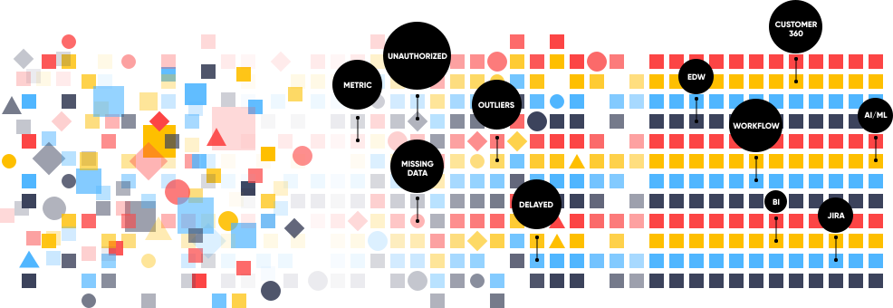

---
hide:
  - navigation
  - toc
---

Implementing a programmable data architecture over legacy & cloud data sources to deliver high-quality data in a governed and secured fashion may seem complex in theory, but with DataOS, we have solved the complexities by creating an operating system that you can control and enhance. With its exhaustive capabilities, provided out-of-the-box, DataOS becomes the one-stop solution for all your data problems.

-   :material-clock-fast:{ .lg .middle } __About DataOS__

    ---

    Learn about DataOS Architecture, Kernels, Primitives & Stacks, Services & Applications.

    [:octicons-arrow-right-24: Read More](About DataOS/About DataOS.md)

-   :fontawesome-brands-markdown:{ .lg .middle } __Data Management Capabilities__

    ---

    Jump to this section to understand how DataOS can meet the needs of you organisation's Data Infrastructure.

    [:octicons-arrow-right-24: Read More](#)

-   :material-format-font:{ .lg .middle } __Proof of Value__

    ---

    Check out some use-cases which enterprises can implement using DataOS. These have been presented as ready-to-use recipes to reduce the overall time-to-value.

    [:octicons-arrow-right-24: Read More](#)

-   :material-format-font:{ .lg .middle } __Case Scenarios__

    ---

    Learn how to implement some common data developer tasks using DataOS.

    [:octicons-arrow-right-24: Read More](#)

-   :material-format-font:{ .lg .middle } __Operator's Manual__

    ---

    Learn how to administrate DataOS for your organisation. This section will guide you on installation, integration of DataOS with the Active Directory of your organisation, day-to-day monitoring & management of the Operating System, and the steps that the administrator of DataOS can take after installation.

    [:octicons-arrow-right-24: Read More](#)

-   :material-format-font:{ .lg .middle } __Training & Certification Program__

    ---

    To quickly get your data teams ready, check out our customized learning paths for different personas of your enterprise.

    [:octicons-arrow-right-24: Read More](#)

# DataOS
## Modern Data Fabric for the AI-powered World

A first of its kind Data Operating System that removes complexity to future proof your data ecosystem so you can build and deploy new data services and applications... in ~~months~~ weeks.

---

_TBD_
