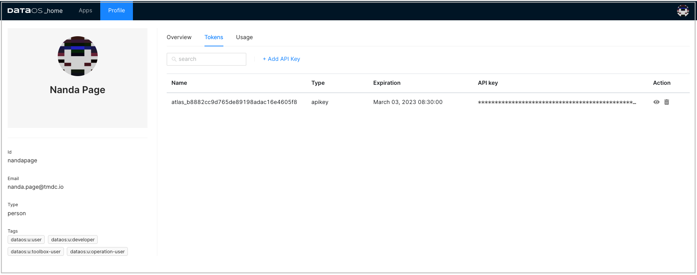

# DataOS Integration with Power BI

This article will help you to set up the connection between DataOS and Power BI. It provides specific steps needed to fetch data from DataOS into Power BI.

## Explore your DataOS data with Power BI

Power BI is a business analytics service to provide interactive visualizations and business intelligence capabilities. Using Power BI’s simple user interface, you can create your reports and dashboards. 

DataOS and Power BI seamless integration works to take advantage of that powerful visualization technology, on the data pulled from DataOS.

## Requirements

 
- Power BI Desktop installed on your system - If Power BI is not installed on your system, you can download the latest version from the <a href="https://powerbi.microsoft.com/en-us/downloads/" target="_blank">Power BI website.</a>
- Simba Presto ODBC Driver - In order to connect to DataOS Catalog, you would have to install this Presto driver. 

- DataOS API token - To authenticate and access DataOS, you will need API token. 

## Download and install Presto driver

1.  Download it from <a href="https://www.magnitude.com/drivers/presto-odbc-jdbc" target="_blank">Presto ODBC & JDBC Drivers download page</a>.
      
   
2.  To run the installer, double-click on downloaded **Simba Presto XX-bit** installer file. Select the 32 or 64 bit version according to your system configurations. 

Follow the steps for the successful installation.

a. Click **Next**.

b. Select the check box to accept the terms of the License Agreement if you agree, and then click **Next**.

c. To change the installation location, click Change, then browse to the desired folder, and then click **OK**.

To accept the installation location, click **Next**.

d. Click **Install**.

e. When the installation completes, click **Finish**.

3. After successful installation, copy the **license** file (that you have received in your email) into the **\lib** subfolder of the Simba installation folder.

> :material-alert: **Note**: Contact your network administrator in case you encounter an error due to not having required admin priviliges.

## Generate DataOS API Token

1. Sign in to your DataOS instance with your username and password. On the DataOS home page, click on **Profile**.

2. On the 'Profile' page, click on **Tokens**.

3. Click on the **Add API Key** link on the **Tokens** tab.

4. Type in name for this token and also set the validity period of your token based on the security requirements as per your business needs. Click **Save** to create one for you. 

5. The API key is listed below. Click on the “eye icon” on the right side to make the full API key visible.

6. Click on the APIkey to copy it. You need this API key to configure Simba Presto driver. 
## Configure Presto ODBC DSN 

To use the Simba Presto ODBC Driver in Power BI application, you need to configure a Data Source Name (DSN) to connect to your data in DataOS.

1. Open **ODBC Data Source Administrator** (64-bit or 32-bit). 

2. Click  **System DSN** tab.

3. In the list of DSNs, select Simba Presto ODBC DSN, and then click **Configure**.

4. In the DSN Setup dialog box, provide the following inputs:

- Provide 'Description' for data source name.

- In the 'Authentication' section

    - Select Authentication type as `No Authentication`

    - Enter generated API key as username

- Now in the 'Data Source' section, provide required information.

    - `Host` (e.g. tcp.reasonably-welcome-grub.dataos.io)
    - `Port` (e.g. 7432)
    - `Catalog` (e.g. icebase)
    - `Schema` (optional)

5. In the DSN Setup dialog box, click **SSL Options** and enable SSL.

6. Click **Test**. and if successful, press **OK** to close the Test Results dialog box.

7.Click **OK** to save your DSN. 

> :material-alert: **Note**: If you encounter any error in setting up the connection, please check DataOS url, validity of API key and try again or contact your administrator.

## Access DataOS on Power BI

1. Launch Power BI. Click on the **Get Data** option in top menu bar and click **More**. 

2. Search for the **ODBC** from the data source list, then select ODBC and click on **Connect**`.

3. Select the DSN you tested successfully during the DSN setup process, and click **OK**

4. Enter API key for username and password both in the dialogue box and click on **Connect**.

5. On successful connection, you can see the DataOS catalog in the left panel. Select the schema and table and click **Load**. 

6. Now you can explore and visualize this data in Power BI.

