# Integrate with Power BI

### Purpose: 

Power BI business analytics solution comprises several products and services, and value and versatility comes from leveraging the individual elements, and taking advantage of how they work together.

The following text streamlines the integration with Power BI, to make it quick and straightforward.

### Download driver: 
Download and install `Simba Presto ODBC Driver` from the following link 

https://www.simba.com/drivers/presto-odbc-jdbc/

### Install Simba Presto ODBC driver

a) Double-click the downloaded driver file to start the installation process, click `Next` and follow the instructions.

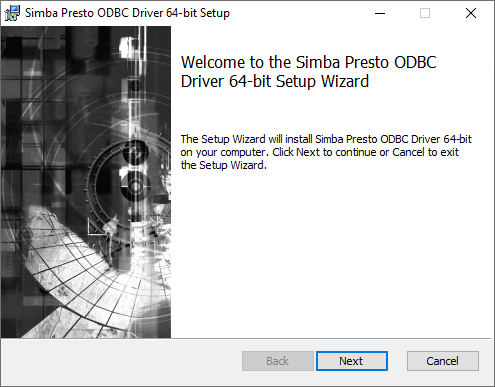  

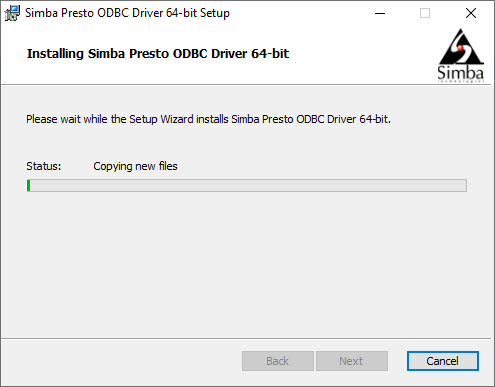

b) After successful installation, copy the license file (that you must have received in your email) into the `\lib` subfolder of the installation folder you selected above. 

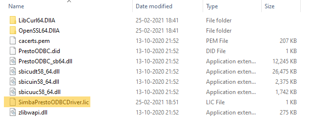

In case you encounter an error, you may not have the required admin priviliges. Contact your network administrator to accomplish this.

### Configure ODBC DSN

After successful installation, proceed as follows to configure ODBC DSN:

a) ODBC Data Sources (64-bit) Go to ODBC Sources Administrator(64 bit or 32 bit) and open it.

b) In the dialogue box select `System DSN` tab

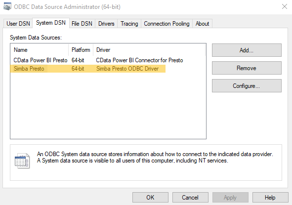

c) Now click `Add` and select driver name which you entered during driver installation process and click `Finish`

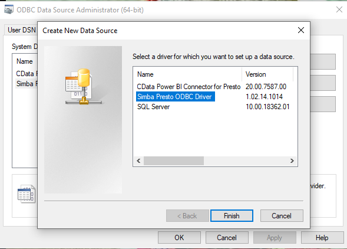

d) A new dialogue box opens up for ODBC driver DSN setup

  - In the DSN Setup section, provide  `Data Source Name` and 'Description' 
  -  In the Authentication section, Select Authentication type as `No Authentication`
  -  Enter username and the system generated login key  
  -  Now in the Data Source section, provide required information (example follows)

     - `Host` (e.g annually-harmless-lark.dataos.io)
     - `Port` (e.g 7432)
     - `Catalog` (e.g hive)
     - `Schema` (optional)

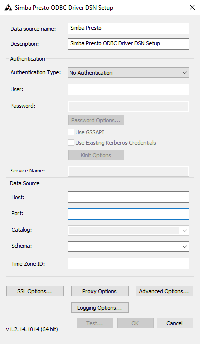

#### -- Generate login key --
Coming soon...

e) Perform `Test` action and successful test results imply a successfull connection to the data source.

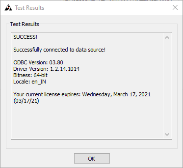

### Connect Presto to Power BI:
a) Launch Power BI and click on the `Get Data` option in top menu bar

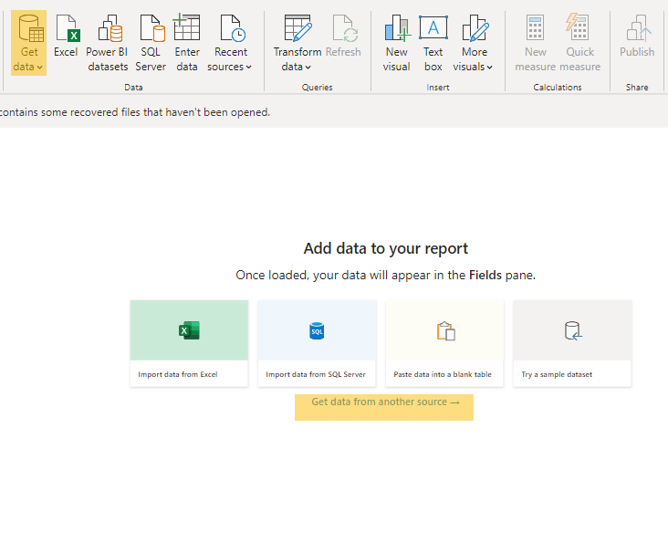

b) Search for the option of ODBC from the data source list, then select ODBC and click on `Connect`.

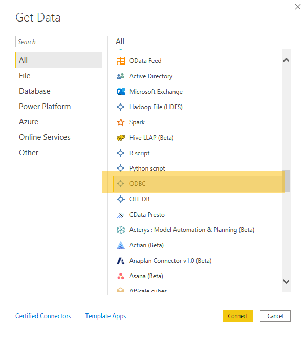

c) Select the DSN you tested successfully during the DSN setup process, and click `OK`

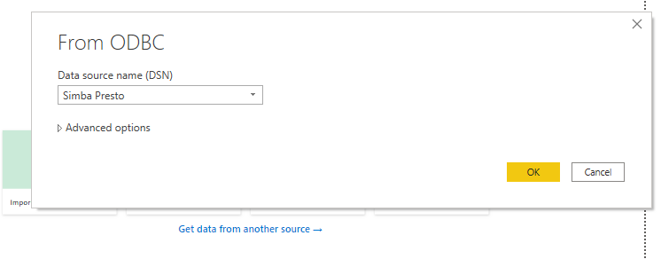

d) Enter the username, password in the dialogue box and click on `Connect`.

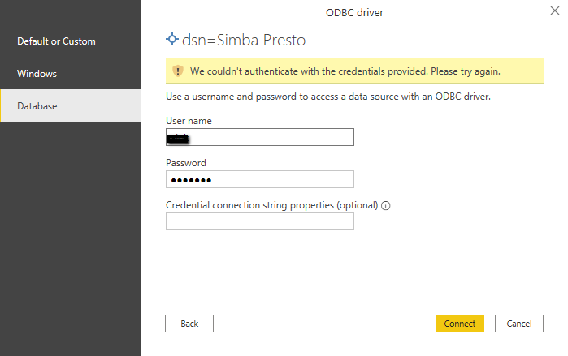

e) Post a successful connection, you can preview the data.

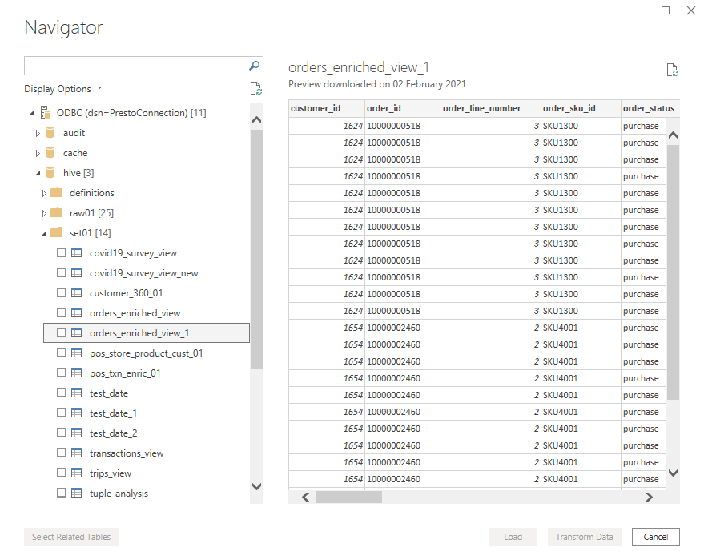

f) Tick the checkbox of the relevant dataset/table in the left menu and click `Load`.

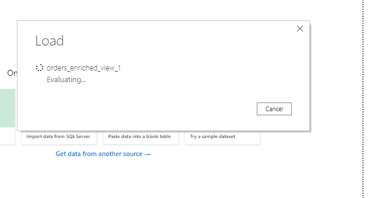

g) Now you are ready to work with Power BI chart visualization activities.

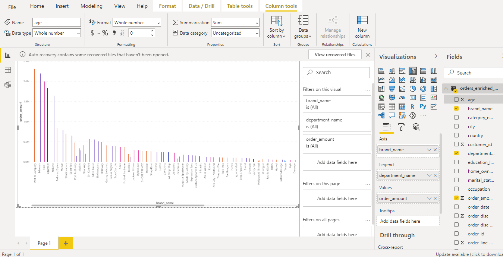

