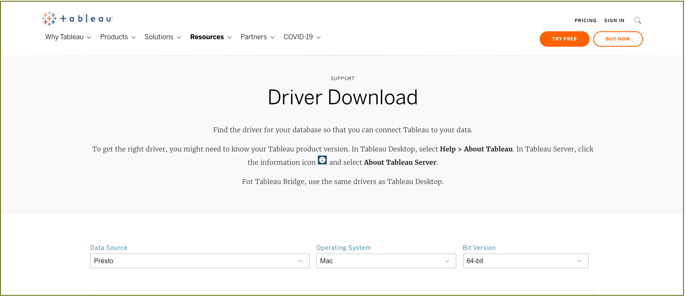
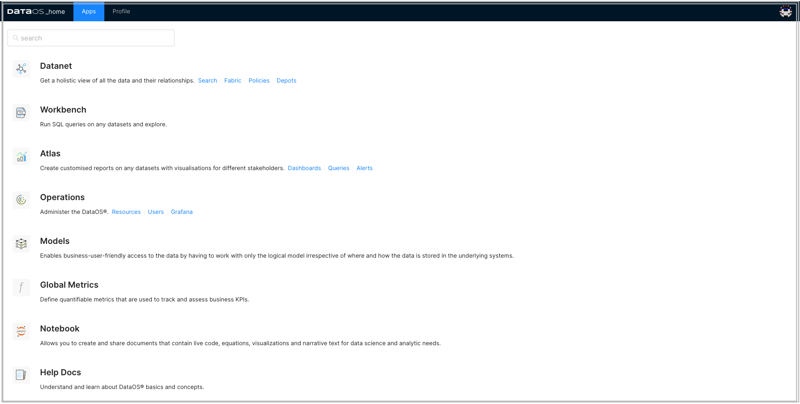
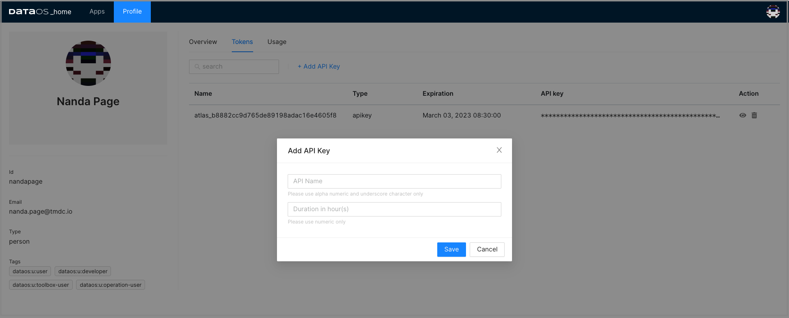
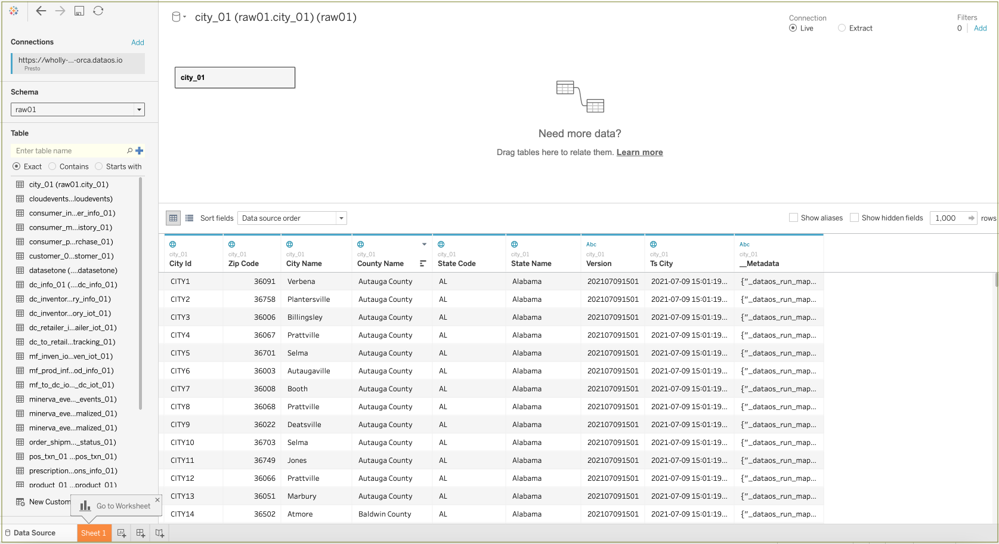

# DataOS Integration with Tableau

This article will help you to set up the connection between DataOS and Tableau. It provides specific steps needed to fetch data from DataOS into Tableau.

## Explore your DataOS data with Tableau

Tableau is one of the most powerful business intelligence tools which allows you to pull vast amounts of information from disparate sources, and helps you turning it into advanced visualizations. The dashboard created from these visualizations empowers you with business insights and helps in data-driven decisions.

DataOS and  Tableau integration works to take advantage of that powerful visualization technology, on the data pulled from DataOS. 

## Requirements

 
- Tableau Desktop installed on your system - If Tableau is not installed on your system, you can download the latest version from the <a href="https://www.tableau.com/products/desktop/download" target="_blank">Tableau website.</a>

- Java installed on your system- you can download the latest version from the <a href="https://www.oracle.com/java/technologies/downloads/#jdk17-mac" target="_blank">Latest Oracle Java.</a>

- Driver - In order to connect to DataOS Catalog, you would have to install the driver. 

- DataOS API token - To authenticate and access DataOS, you will need an API token.
 

## Download and install driver

Check your Tableau version and follow the steps given below:

- Tableau: **2021.3, 2021.2.2, 2021.1.5, 2020.4.8, 2020.3.12, and above**

    a. Download the driver (for example, trino-jdbc-373.jar) from the <a href="https://trino.io/docs/current/installation/jdbc.html" target="_blank">Trino</a> page. Please note that Presto is Trino now.

    b. Copy the downloaded JAR file to the appropriate location.

     - ~/Library/Tableau/Drivers for MAC. 
     - C:\Program Files\Tableau\Drivers for WINDOWS

- Tableau: **10.0-2020.2**
  
    a. Download the driver from <a href="https://www.tableau.com/support/drivers?__full-version=20204.21.0114.0916#presto" target="_blank">Tableau driver download page</a>. 

    b. Select the operating system and bit version according to your system configurations.      
    

    c. Click on **Download** button (mac or Windows). 
    

    d. Double-click on downloaded 'Simba Presto 1.1.pkg' for mac or Windows 64-bit driver to run the installer. 

    e. Click **Continue** and follow the steps for suceessful installation.

##  Generate DataOS API token

1. Sign in to your DataOS instance with your username and password. On the DataOS home page, click on '**Profile**'.

2. On the 'Profile' page, click on **Tokens**.

3. Click on the **Add API Key** link on the **Tokens** tab:

4. Type in name for this token and also set the validity period of your token based on the security requirements as per your business needs. Click **Save** to create one for you. 

5. The API key is listed below. Click on the “eye icon” on the right side to make the full API key visible.

6. Click on the APIkey to copy it. You need this API key to configure Presto driver.

## Configure driver on Tableau

You need to configure the Presto driver in Tableau application to connect to your data in DataOS.

1. Open the Tableau desktop application. Click on **More** to access the list of all the servers connectors. Search for **Presto** and click on it.

2. Provide the following values:

**Property** | **Value** | 
-------- | -------- | 
Server  | e.g.  tcp.reasonably-welcome-grub.dataos.io  |
Port  | 7432  | 
Catalog  | e.g. icebase  |  
Schema  | an optional field  |
Authentication  | username  | 
Username  | Access API Key from DataOS  |
Require SSL  | Check the box  |

3. Click **Sign In**.

> :material-alert: **Note**: If you encounter any error in setting up the connection, please check DataOS URL, validity of API key and try again or contact your administrator.

## Access DataOS on Tableau

1. Once you've completed the driver configuration steps successfully, you can see the DataOS catalog in the left panel in Tableau dialog. 

2. To get the list of available schemas, click on Search icon. To select the relevant schema, double-click on it.

3. To bring the data from the table, click on Search icon and you can see all the tables available in your DataOS schema cluster. Double-click to select a table that you want to retrieve data from.

4. Click **Upload Now** to load the data for preview. Tableau retrieves data from the selected DataOS table and loads it into a worksheet.

5. Now you can explore and visualize this data in Tableau.

