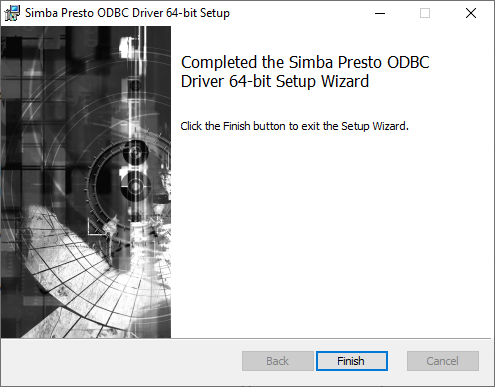
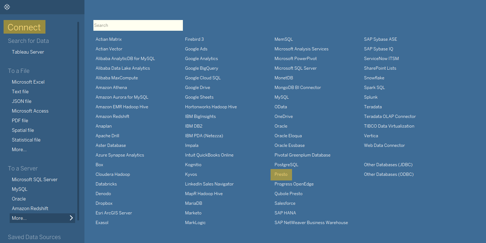
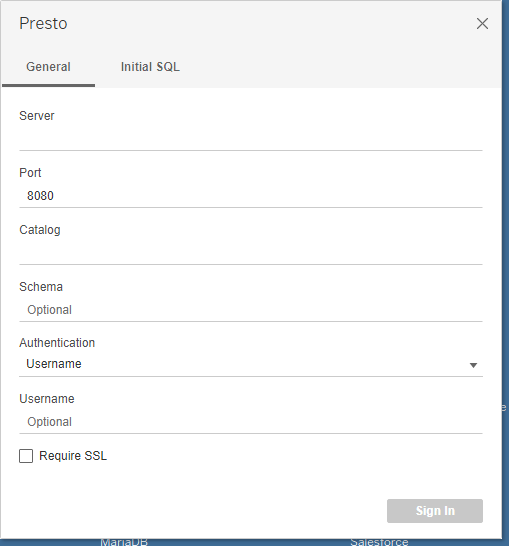
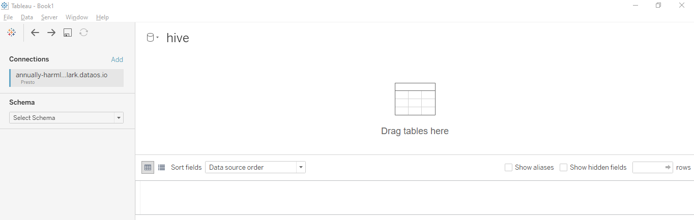
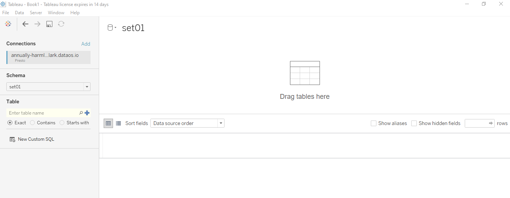
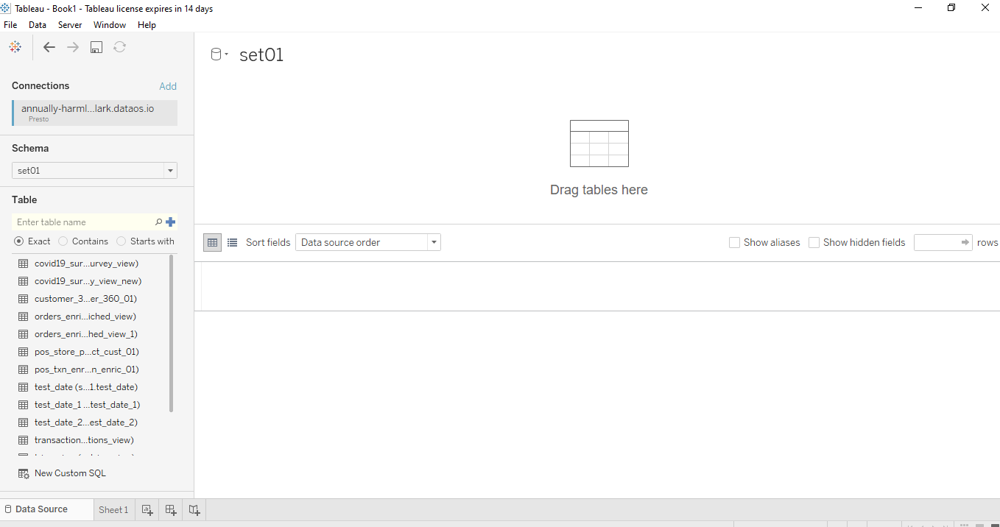
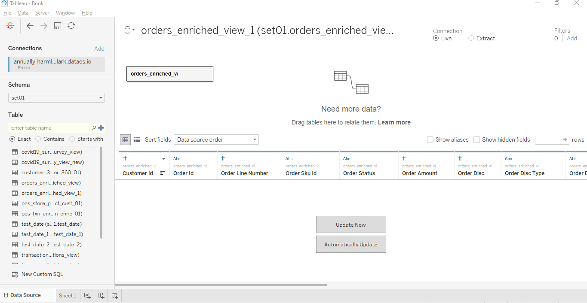
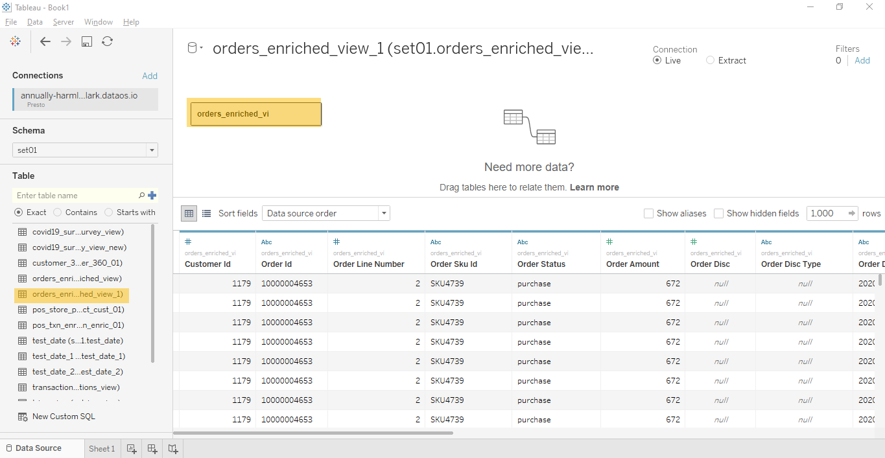
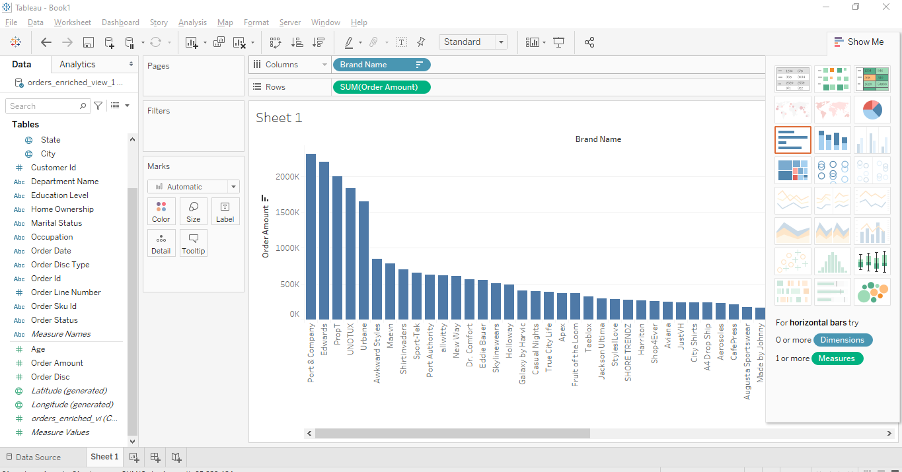

# Integrate with Tableau

### Purpose

Tableau is one of the most commonly used tools across organisations, to extract business insights and gauge intended traction. The visualizations it offers make it one of the most popular tools as well.

With this in mind, the following text has been designed to make integrating with Tableau simple and straightforward. 

### Connector driver required: 

`Simba Presto 1.1.pkg` or the latest one according to your system configurations. If driver is not downloaded or installed in your computer, download and install it from the following link:
https://www.tableau.com/support/drivers?__full-version=20204.21.0114.0916#presto

### Install driver and setup connection for the Tableau

a) Double-click on downloaded `Simba Presto ODBC Driver` installer file and follow the instructions. 

b) Open Tableau desktop application, in the `Connect` section under the `To a Server` area, select `More` option

c) Fill the dialogue box with the relevant information and click `Sign In`.

#### Information required: 

- `Server`: Name of the server that hosts the database you want to connect to e.g annually-harmless-lark.dataos.io
- `Port`: e.g 7432
- `Catalog`: e.g hive
- `Schema`: an optional field
- `Authentication`: Select authentication method as Username and enter the same in the next field.

#### --- How to generate Username/Password key ---
Coming soon..........

d) On successful connection, Tableau desktop will open with the relevant connection details showing in the left panel. 

If you encounter any error in setting up the connection, please check your credentials and try again or contact your administrator.

e) In the left panel, search and select the relevant schema.

f) Now search and select the relevant schema table. 

g) Now click `Upload now` to load data to preview.

h) The data is now available for visualization.

