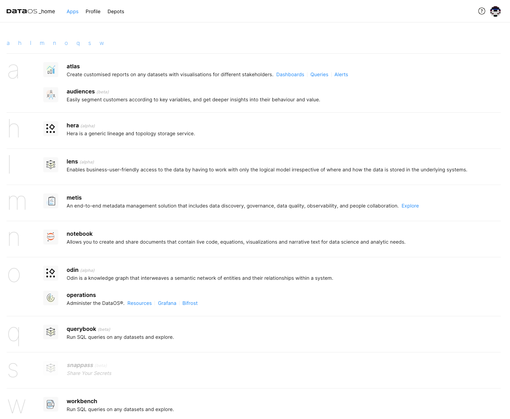
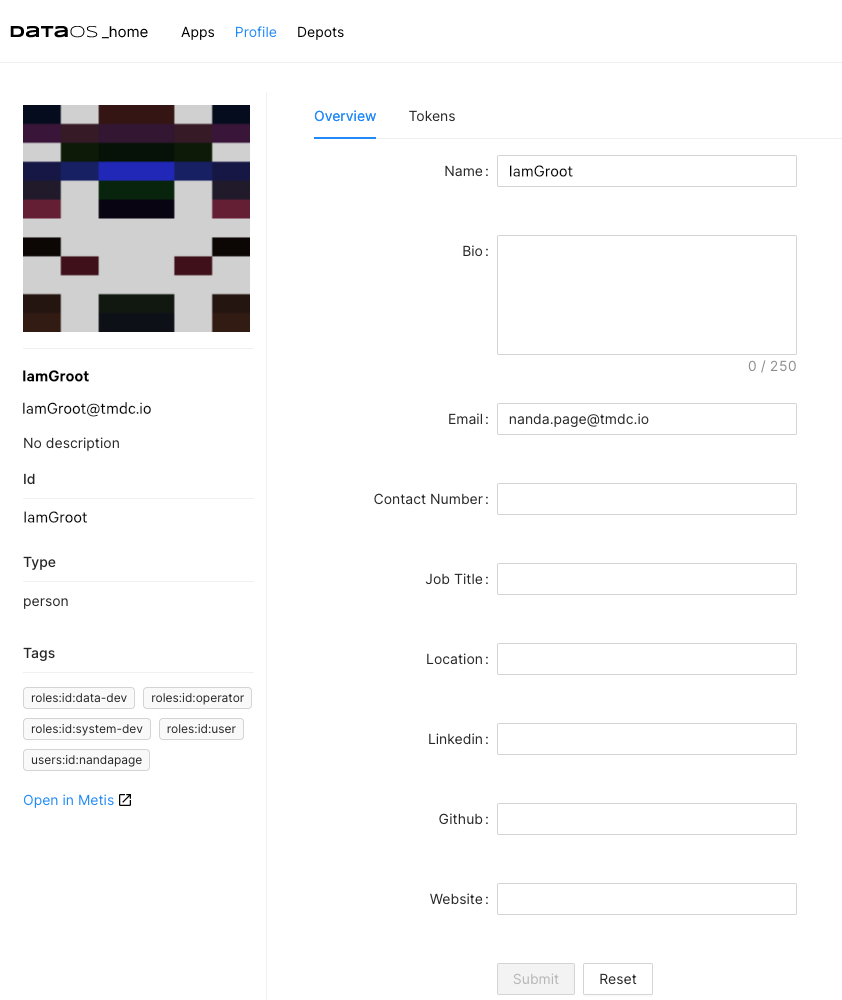
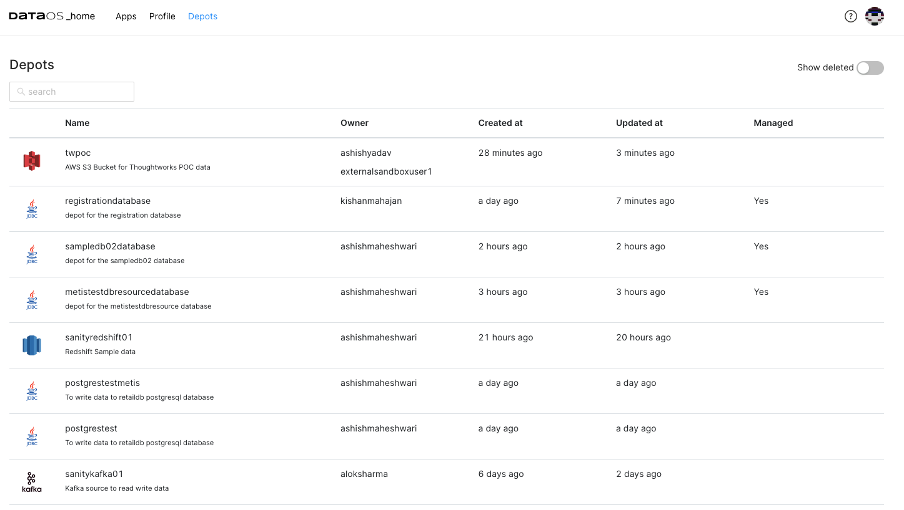

Interfaces in DataOS serve as vital points of communication and interaction between different components. They facilitate seamless collaboration and independent functionality within DataOS. These interfaces provide powerful tools for efficient data operations,  and control over various activities. Whether you prefer the flexibility of the API, the command-driven power of the CLI, or the intuitive experience of the GUI, DataOS interfaces enable self-service data management. Let's explore these interfaces and their capabilities.
## Application Programming Interface (API)

The Application Programming Interface (API) in DataOS provides a way to interact with the core components, libraries, and services. APIs act as intermediaries, allowing users/applications to access DataOS functionality and resources. They encapsulate complex operations, providing engineers, users, and developers with pre-built functions and modules that abstract the underlying implementation details. APIs also enable the exposure of outputs /outcomes from complex operations, which can be leveraged by external tools. APIs empower data  developers to create diverse applications and services, leveraging the full functionality of DataOS.

## Command-Line Interface (CLI)

The DataOS CLI provides a command-line environment for efficient and streamlined data operations. It offers quick access to system functionality with flexibility and control making it ideal for data engineers or system administrators. They can interact with DataOS instance through text-based commands, create and manage resources, and perform various data management tasks.  Effective utilization of CLI may require familiarity with the system and its underlying commands. To learn more, refer to the CLI section. 

## Graphical User Interface (GUI)

The Graphical User Interface offers an intuitive and visually engaging way to interact with DataOS and its components.  This makes DataOS accessible to users with varying technical expertise, enhancing user experience and usability. For example, applications like Atlas and Lens Explorer provide graphical user interfaces for tasks such as creating visualizations, building dashboards, and interacting with the semantic layer.

The choice of interface depends on factors such as specific applications, user requirements, and the capabilities of individual components. By leveraging these interfaces effectively, users can navigate their data journey within DataOS and unlock its full potential.

From the DataOS UI, you can access the unique capabilities of the components and apps.

**Atlas**

An in-built BI solution to create visualizations, reports, and dashboards for powerful data storytelling and actionable insights. From the Atlas interface, you can manage queries, create snippets, set up alerts, and more.

**Audience**

Understand your customers by leveraging semantic data models built via Lens for customer segmentation and data-driven decisions using Audience UI.

**Bifrost**

Take control of access policies for applications, services, people, and datasets to ensure secure and compliant data access. Bifrost leverages the governance engine of DataOS, Heimdall, to ensure secure and compliant data access through ABAC policies,  giving users fine-grained control over the data and resources.

**Lens**

Access and explore all the Lenses that are created to model data from diverse sources, create meaningful relationships between business concepts, define measures, and KPIs for data-informed decision-making.

**Metis**

Discover, catalog, and observe enterprise data with comprehensive metadata management, providing technical and business context. Metis powers its UI by making the metadata available for users to explore and discover assets.

**Notebook**

Leverage the power of Jupyter Notebook on DataOS for data science projects, coding, analysis, and communication of insights.

**Operations**

With Operations UI, monitor and administer DataOS platform activity, gaining real-time visibility into resource utilization, cluster performance, and user activities. Keep your data ecosystem running smoothly and optimize resource allocation.

**Workbench**

Explore and query your data assets using SQL with Workbench. Powered by the Minerva query engine (built on top of Trino), Workbench supports both simple and complex queries across a large variety of data sources, including traditional relational databases (Oracle, PostgreSQL, Redshift, etc.) as well as other data sources such as S3, Kafka, and Pulsar. You can query and explore data from these data sources without bringing it to DataOS.

From the DataOS UI, you can also manage your profile, access tokens, and view all the depots that exist within the DataOS instance for accessing data.

### **Manage Profile**

### **Create Tokens**

API keys/tokens are used to authenticate requests to  DataOS resources. For example, when calling a service endpoint, you need to supply a valid API token in the HTTP `Authorization` header, with a valid token specified as the header value. You can generate API keys/tokens from DataOS UI as well as using DataOS CLI commands.

To learn more, refer to [Creating API Keys and Token](interfaces/create_token.md)

### **View Depots**

