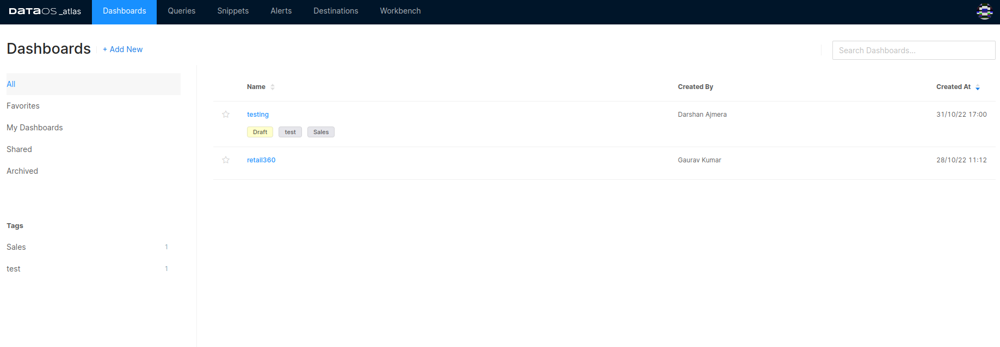

# Atlas

Atlas is a built-in business intelligence (BI) solution within DataOS that allows you to create customized reports/dashboards. By selecting appropriate visualizations offered by DataOS, complex data can be effectively represented and consumed for valuable insights and informed decision-making.

## Highlights

- Create 20+ different visualization types, including Sankey, Sunburst, Map Choropleth, Cohort, etc.
- Create unlimited shareable dashboards
- One responsive dashboard for all screen sizes
- Share your dashboards with multiple users ; you can allow public access to everyone.
- Create deterministic alerts and send notifications to 10+ destinations, including Slack, MS teams, Pager Duty, etc.

<aside class="callout">🗣 In addition to Atlas, DataOS integrates with various other BI tools, enhancing the capabilities and functionality of your data analysis. To explore further information about these tools and their benefits, you can refer to [Integration with other BI tools](atlas/bi_tools.md).</aside>

## Launching Atlas

On the DataOS home page, click on **Atlas**.

<figcaption align = "center">Atlas interface</figcaption>

On the app’s landing screen, you can do the following:

### **Design and Manage Dashboards**

On the landing page of the Atlas app, dashboard names are listed along with tags, creator, and time of creation. It also lists dashboards that have been shared with you. Atlas provides the ability to enhance the discoverability of your dashboards by adding tags. These tags serve as descriptive labels that help categorize and organize your dashboards. Additionally, you can mark certain dashboards as favorites, enabling quick access to your most frequently used or important dashboards.

To learn more about the process of creating and publishing dashboards, click **here**.

[Dashboards](atlas/dashboards.md)

### **Manage** **Queries**

Atlas shows all the queries you have written while exploring data and saved them for creating visualizations. You can also view the queries shared with you. To learn more about how to access and manage queries, click here.

[Queries](atlas/queries.md)

### **Create Snippets**

Query snippets are reusable segments of pre-written queries that save you time and effort by eliminating the need to start from scratch. These snippets can be complete queries or portions of queries that you frequently use. With the help of auto-complete functionality, you can easily trigger and insert these snippets into your queries. To learn more, click here.

[Snippet](atlas/snippet.md)

### **Set up** **Alerts**

Alerts notify you when a field returned by a query meets a threshold (set as a criterion or a set of criteria). Use alerts to monitor your important business KPIs or integrate them with tools to start getting notifications. Alerts complement scheduled queries, but their criteria are checked after every execution. On Atlas interface you can view all the alerts created and their states. To know more, refer to [Manage Alerts](atlas/alerts.md).

To learn more about creating alerts, refer to [Setting up Dashboard Alerts](/dataos_alerts/dashboard_alerts/).

<aside class="callout">DataOS comes equipped with a wide array of integrated alert mechanisms with a strong focus on observability and  active monitoring.  To learn more about them, refer to <a href="/dataos_alerts/">DataOS Alerts.</a></aside>

### **Destinations**

Atlas allows you to set up destinations separately, which you can use while configuring your alerts for sending notifications. To learn more about configuring alerts, click here.

[Destinations](atlas/destinations.md)

### **Navigate to Workbench**

Atlas provides an option to seamlessly switch from the current interface to the Workbench interface.